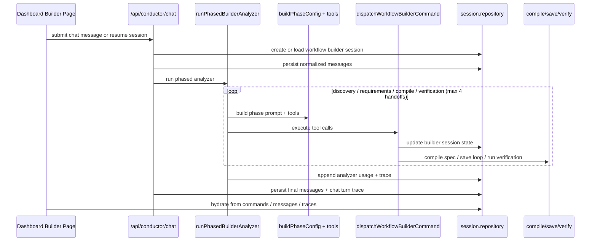

# Builder Flow Documentation

This document traces the loop builder end-to-end:

1. The dashboard page starts or resumes a builder session.
2. The chat route runs the phased analyzer (`runPhasedBuilderAnalyzer`).
3. Each analyzer phase exposes a small toolset with a declarative system prompt.
4. Tool calls are dispatched to backend commands via `dispatchWorkflowBuilderCommand`.
5. Session state, traces, messages, artifacts, spec snapshots, and connector configs are persisted.
6. The saved workflow is verified and activated.

All paths are under `src/services/conductor/`.

---

## High-Level Flow



---

## Phase Architecture

The analyzer phases (defined in `phases/`) are declarative — each prompt states **what to achieve**, not a procedural tool sequence.

### Phase Order

```
discovery → requirements → compile → verification
```

Enforced by `canAutoAdvancePhase` (handoff.ts:84-87) — forward-only, no skipping.

### Phase Mapping

Session phase → analyzer phase (handoff.ts `resolveAnalyzerPhase`):

| Session Phase | Analyzer Phase |
|---|---|
| `new`, `analyzing`, `needs_clarification`, `failed` | `discovery` |
| `resolving_requirements` | `requirements` |
| `intent_resolved`, `spec_drafted`, `spec_approved` | `compile` |
| `saved` | `verification` |

### Phase Prompts (New Declarative Versions)

#### Discovery (`discovery-tools.ts`)
Clarify intent, recommend apps, discover available tools. Tools: `interactivePrompt`, `appSelection`, `getAvailableTools`. No procedural steps — just goal orientation.

#### Requirements (`requirements-tools.ts`)
Resolve connector auth, schedule/trigger, stable inputs, grounding, artifact contracts, and **Tallei Channels** (runtime input mechanism for values that change between runs). Tools: `resolveBuildRequirement`, `connectorSetup`, `scheduleSetup`, `knowledgeBaseSetup`, `renderType`, `artifactSetup`, `requirementSetup`.

#### Compile (`compile-tools.ts`)
Preview the specialist agent plan, then choose: `saveLoop`, or refine via conversation, or cancel. Tools: `interactivePrompt`, `previewAgentPlan`, `saveLoop`.

#### Verification (`verification-tools.ts`)
Run test data through the saved loop, surface CRITICAL/WARNING/PASS results, and `confirmActivation`. Tools: `interactivePrompt`, `runBuilderTest`, `runVerification`, `confirmActivation`.

### Step Limits (index.ts)

Each phase has a max tool-call step limit before the phase auto-advances:

| Phase | Max Steps |
|---|---|
| discovery | 10 |
| requirements | 20 |
| compile | 5 |
| verification | 8 |

### Client UI Tools

`connectorSetup` is a **client UI tool** (orchestrator.ts:31-40 `CLIENT_UI_TOOLS`). When called, the orchestrator loop breaks and yields to the client. The backend has no handler — complex connector configuration must flow through a sub-agent pattern or client-side handling.

---

## Session State Machine

### Session Schema (`session.repository.ts`)

```ts
{
  id: string;                    // UUID
  userId: string;
  phase: WorkflowBuilderPhase;   // current session phase
  title: string;
  goal: string;                  // original user prompt
  resolvedIntent: LoopIntentContext | null;  // from discovery
  discoveredToolContracts: ToolContract[];
  buildContract: LoopBuildContract | null;
  artifactBundleJson: unknown | null;        // email template payload
  connectorSetupJson: unknown | null;        // connector sub-agent output
  specId: string | null;
  workflowId: string | null;
  phaseRevisionCount: number;
  error: string | null;
}
```

### State Transitions

```
new → analyzing → resolving_requirements → spec_drafted → spec_approved → saved (→ verification)
```

The `phase` field tracks which analyzer step the session is in. The orchestrator reads `session.phase` at each turm to determine which phase config to load.

### Connector Setup JSON

The `connector_setup_json` column holds structured connector configuration from the Requirements phase. Currently always `null` — the connector sub-agent pattern (discover schema → configure auth → configure ops → test → PASS/retry) does not yet write to this field. When populated, it feeds the spec compiler with operation-level configs so `planDeterministic` has tool-level planner roles instead of lumping all write tools into a single Publisher agent.

---

## Repository Layer

### `data/session.repository.ts`
- `createSession(auth, goal)` — creates a new builder session
- `requireSession(auth, sessionId)` — loads session with all fields
- `updateSession(auth, sessionId, patch)` — partial update with field-level write logic
- `appendTrace(auth, sessionId, entries)` — appends to the trace array
- `recordPhaseTrace(auth, sessionId, input)` — records a phase entry
- `recordChatTurnTrace(auth, sessionId, input)` — records a full turn
- `saveAnalyzerUsage(auth, sessionId, usage)` — saves token usage
- `replaceMessages(auth, sessionId, messages)` — replaces the full message list
- `listMessages(auth, sessionId)` — lists persisted messages

### `data/spec.repository.ts`
- `upsertApprovedLoopSpecRow(auth, snapshot)` — persists the approved spec
- `listSpecs(auth)` — lists all specs
- `getSpec(auth, specId)` — loads a single spec

---

## Compile Pipeline

### Flow

```
Build Contract (from intent + tools)
  │
  ▼
buildPlanContext (connector-tools.ts)
  └─ partitions tools into intakeRefs / mutateRefs
  └─ resolves connector agent plan
  └─ builds availableTools array + outputContract
  │
  ▼
planAgents / planDeterministic (spec-compiler.ts)
  └─ allocates role-based agents: Coordinator, Researcher, Classifier, Writer, Publisher
  └─ assigns tools based on plannerRole (read/draft/publish)
  └─ sets handoff bindings between sequential agents
  └─ sets guardrails, doneWhen, failureModes
  │
  ▼
assembleSpec (assemble.ts)
  └─ wraps agents into NoSlopSpec
  └─ computes schedule, delivery, connectorPolicy
  └─ computes inputRequirements from stable inputs
  │
  ▼
buildRunnerSpecFromBuildContract (runner.ts)
  └─ normalizes through noSlopSpecDraftSchema
```

### Agent Allocation (planDeterministic)

The deterministic planner reads `PlanContext` and produces agents by role:

| Role | Condition | Tool Domain |
|---|---|---|
| Coordinator | If trigger_schedule requirement exists | coordinate |
| Researcher | If intakeRefs > 0 | read |
| Classifier | If classification/triage keywords detected | classify |
| Writer | If draftRefs > 0 OR artifact exists | draft |
| Publisher | If publishRefs > 0 | deliver |

**Important**: Roles are allocation-time and deterministic. The LLM (`planWithLlm` is deprecated) no longer guesses agent boundaries — the planner enforces exactly one responsibility per agent.

### Intent Structure Gap

`PlanContext` carries `intentContext` with:
- `analysis.normalizedIntent.outcome` — the desired end state
- `analysis.normalizedIntent.approvalModel` — automatic, draft_review, full_approval, operator_gate
- `analysis.normalizedIntent.runtimeInputs` — values that change between runs (e.g., email recipient)
- `analysis.normalizedIntent.toolCategories` — category hints

These fields are **available but underutilized** in `planDeterministic`:
- `outcome` is used in `needsClassification` detection but not in agent goals
- `approvalModel` is not used — publisher agent always gets `requiresPreSendApproval: true`
- `runtimeInputs` is not surfaced as input requirements or coordinator goals

---

## Avatar / Persona Allocation

### Agent Persona Catalog (`services/personas/agent-personas.ts`)

9 pre-defined roles with display names, avatar seeds, and badge styles:
- researcher, analyst, classifier, marketer, writer, engineer, reviewer, publisher, coordinator

### Enrichment (`services/personas/enrichment.ts`)

- `enrichSpecAgentsWithPersonas(input)` — attaches personas to spec agents post-planning
- `bindLoopSpecAgentAvatars(auth, snapshot)` — binds selected avatars to persisted spec agents

**Key design issue**: Avatar assignment is post-hoc keyword matching against agent name/goal, not structural. The role key IS set at allocation time (in `compileAgentPlan`), but the avatar display name and icon are matched later. This means avatar binding is cosmetic, not a structural influence on agent behavior.

### Allocation Endpoint

```
POST /agent-avatars/allocate → returns persona suggestions per agent
POST /agent-avatars/:avatarId/bind → persists the binding
```

---

## Session Message Flow

1. UI sends user message to `/api/conductor/chat`
2. Route normalizes messages, creates session if new
3. `runPhasedBuilderAnalyzer` builds phase config, calls LLM with phase prompt + tool definitions
4. LLM responds with tool calls or narration text
5. Tool calls are dispatched via `runBuilderDispatcherTool` → `dispatchWorkflowBuilderCommand`
6. Commands are queued, executed sequentially, and polled until completion
7. Streamed output (phase progress, tool results, agent plan preview) is merged into the response stream
8. After the phase loop ends, messages and traces are persisted
9. UI hydrates from persisted commands + messages on reconnect

### Message Persistence

- Messages are normalized (stripped of internal tool payloads, large artifacts) before saving
- `persistLoopBuilderChatMessages` handles the save
- Recovery path uses `hydrateBuilderMessagesFromCommands` to patch completed tool results into the transcript

---

## Module Layout

| Path | Purpose |
|------|---------|
| `orchestrator.ts` | Main analyzer loop runner |
| `phases/index.ts` | Phase config hub: prompt selection, tool registry, step limits |
| `phases/discovery-tools.ts` | Discovery tools + declarative prompt |
| `phases/requirements-tools.ts` | Requirement resolution tools + Tallei Channels |
| `phases/compile-tools.ts` | Preview → 3-option choice → save |
| `phases/verification-tools.ts` | Test → CRITICAL/WARNING/PASS → activate |
| `phases/handoff.ts` | Phase resolution, auto-advance, handoff ledger |
| `phases/graph.ts` | Phase regression rules (canRegressPhase) |
| `commands/dispatcher.ts` | Command router: getAvailableTools, resolveBuildRequirement, previewAgentPlan, saveLoop, etc. |
| `plan/spec-compiler.ts` | Agent planning: planDeterministic, compileAgentPlan, buildConnectorPolicy |
| `plan/connector-tools.ts` | buildPlanContext, resolveConnectorToolRefs |
| `compile/runner.ts` | buildRunnerSpecFromBuildContract (orchestrates plan → assemble → normalize) |
| `compile/assemble.ts` | assembleSpec: wraps agents into NoSlopSpec |
| `compile/snapshot.ts` | compileEnrichedRuntimeSpecSnapshot (entry point for snapshots) |
| `data/session.repository.ts` | Session CRUD |
| `data/spec.repository.ts` | Spec CRUD |
| `services/personas/agent-personas.ts` | Role catalog, dicebear avatars, display name generation |
| `services/personas/enrichment.ts` | Post-hoc persona binding to spec agents |
| `contracts/intent-context.ts` | LoopIntentAnalysis, LoopIntentContext, revision intent |
| `contracts/spec-contracts.ts` | NoSlopSpec, agent schema, connector policy |
| `contracts/connector-setup.ts` | ConnectorAgentPlan schema |
| `contracts/builder-types.ts` | BuilderToolName union |
| `contracts/builder-trace.ts` | Trace types |
| `contracts/phase-history.ts` | Phase history types |
| `contracts/input-surfaces.ts` | Data input/review surface schemas |
| `domain/build-contract.ts` | Build contract schemas, selectors, resolver |
| `domain/tool-roles.ts` | Tool contract → planner role mapping |
| `domain/schedule-cron.ts` | Cron validation |
| `runtime/spec-run-agent-runner.ts` | Runtime agent execution |

---

## Key Data Types

### NoSlopSpec (`contracts/spec-contracts.ts`)

```ts
{
  purpose: string;
  agents: Agent[];
  guardrails: string[];
  successCriteria: string[];
  failureModes: string[];
  schedule: { description, cron?, timezone? };
  delivery: { provider, description };
  connectorPolicy: { allowedReadActions, allowedWriteActions };
  inputRequirements: InputRequirement[];
  buildContract?: LoopBuildContract;
}
```

### Agent (`noSlopSpecAgentSchema`)

```ts
{
  name: string;
  roleKey?: AgentPersonaRoleKey;   // researcher | writer | publisher | coordinator | etc.
  toolDomain?: AgentToolDomain;     // read | draft | deliver | coordinate | etc.
  allocationReason?: string;
  goal: string;
  tools: string[];                  // tool refs (e.g., composio.gmail.action.send_email)
  guardrails: string[];
  doneWhen: string[];
  handoffBindings: HandoffBinding[];
  gate?: ApprovalGate | InputGate;
  persona?: AgentPersona;
}
```

### PlanContext (`plan/types.ts`)

```ts
{
  purpose: string;
  intentContext?: LoopIntentContext;
  buildContract: LoopBuildContract;
  availableTools: SpecAvailableTool[];
  intakeRefs: string[];
  mutateRefs: string[];
  connectorAgentPlan?: ConnectorAgentPlan | null;
  artifactStructure?: string;
  outputContract: DataContract;
}
```

---

## Known Gaps & Design Issues

### 1. Intent Structure Destruction Between Phases
`resolvedIntent.analysis.normalizedIntent.approvalModel`, `runtimeInputs`, and `outcome` are available in Discovery but never passed to `planDeterministic` agent goals. Compile receives only flat tool ref lists + purpose string.

**Fix**: Surface these fields in agent goals and guardrails in `spec-compiler.ts`.

### 2. Connector Depth
`connectorSetup` is a client UI tool — the backend has no handler. Complex connectors (CRM with 20+ objects, field mapping, operation config) cannot be configured through the 4-phase loop. A connector sub-agent pattern (discover schema → configure auth → configure ops → test → PASS/retry) is needed, writing `connectorAgentPlan` to the session's `connector_setup_json` field.

### 3. Email: Draft ≠ Send
The email flow has three distinct phases: configure template (Requirements) → draft with no external mutation (Writer) → review gate → send only after approval (Publisher). Currently, `draft_email` mutates external state (creates Gmail draft) and one agent often gets both `draft_email` and `send_email`.

**Fix**: Tool-level `plannerRole` assignment must force `draft_email` → "draft" and `send_email` → "publish", separating them into different agents.

### 4. Artifact Template → Agent Input
The email template configured via `artifactSetup` in Requirements is saved as `artifactBundleJson` and hydrated into the build contract's `artifact_contract` value as `template`. But this template never flows into the compiled spec's `agent.inputContract` — the runtime agent can't see the template structure.

**Fix**: Add the artifact template as an `inputRequirement` in `assemble.ts`.

### 5. Avatar Binding Is Cosmetic
`enrichSpecAgentsWithPersonas` assigns avatars AFTER agent planning via keyword matching. The avatar/display name has no structural influence on agent behavior. To make persona assignment structural, the role key must drive tool allocation, handoff contracts, and output contract selection.

---

## Practical Reading Order

1. `phases/handoff.ts` — phase mapping & progression rules
2. `phases/index.ts` — phase config hub
3. `phases/discovery-tools.ts` — phase prompt (new declarative style)
4. `orchestrator.ts` — main analyzer loop
5. `commands/dispatcher.ts` — command routing
6. `domain/build-contract.ts` — contract schema & selectors
7. `plan/connector-tools.ts` — plan context builder
8. `plan/spec-compiler.ts` — agent planning (the main logic)
9. `compile/assemble.ts` — spec assembly
10. `compile/runner.ts` — spec compilation entry point
11. `services/personas/enrichment.ts` — avatar binding
12. `data/session.repository.ts` — session persistence
