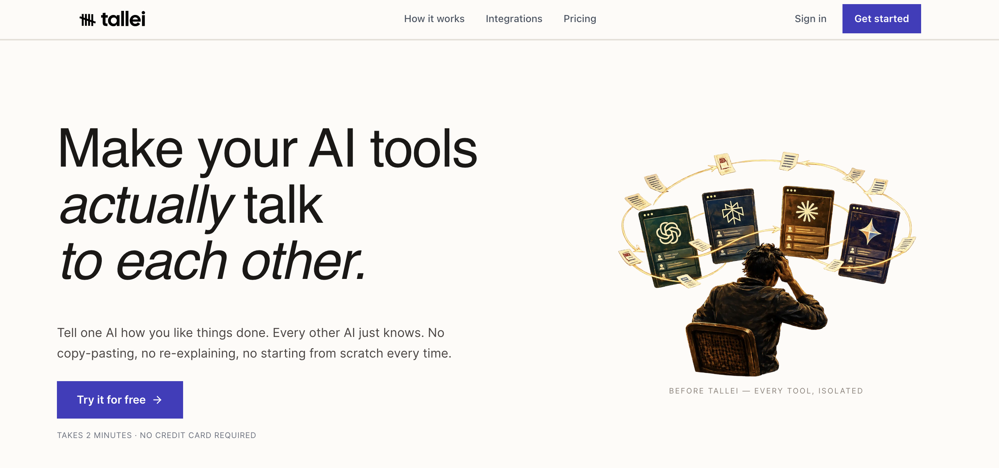

# Tallei AI

> A ghost memory system that lets Claude, ChatGPT, and Gemini actually remember stuff. Cross-AI, graph-aware, blazing fast.

Tallei's a memory layer for when you want your AI to not forget who you are. It remembers facts, preferences, and context across sessions and different AI platforms. The real differentiator? A graph layer that goes way beyond vector search—so it catches contradictions, shows you relationships between ideas, and doesn't slow down your workflow.



## What You Get

### The Basics
- **Share memories across Claude, ChatGPT, and Gemini** via OAuth. One memory graph, all your AIs.
- **Sub-10ms saves** — we return instantly, then do the heavy lifting in the background.
- **~5ms recall** on a warm cache (60s TTL). Cold cache is ~200ms, but you're hitting cache 95% of the time.
- **Smart summaries** — `gpt-4o-mini` pulls out titles, key points, and decisions without you asking.

### The Graph Layer (the cool part)
- **Auto-extract entities and relationships** from every memory using an LLM. Runs in the background, never blocks your workflow.
- **Two ways to recall**: Vector search for "find me stuff about X", or graph traversal for "show me X and everything connected to it".
- **Contradiction detection** — We'll tell you when you're saying conflicting things. Useful for catching when your preferences shift.
- **See your memory as a graph** — Interactive visualization showing which ideas relate to each other, which are outdated, which are your obsessions.
- **Insight engine** — Automatically flags stale decisions, high-impact connections, contradictions you probably didn't notice.

### The Dashboard
- **Clean UI** — light greenish-yellow and lime theme (because dark mode is boring).
- **Memory feed** — search, filter, all your saved stuff in one place.
- **Interactive graph explorer** — drag around entities, see relationships, get insights.
- **Setup wizards** — copy-paste to connect Claude, ChatGPT, Gemini. Takes 2 minutes.

## Stack

- **Backend:** Node.js, Express, MCP (talking to Claude/ChatGPT/Gemini)
- **Frontend:** Next.js, Tailwind CSS v4, React
- **Database:** Postgres + pgvector for vectors, plus native tables for the graph (entities, relations, mentions)
- **AI:** OpenAI embeddings, gpt-4o-mini for summaries, mem0ai SDK
- **Auth:** Google OAuth, JWT sessions
- **Workers:** In-process async job processor (no external queue, keep it simple)

## How It's Built

### Backend (`/src`)
The MCP server that Claude and friends talk to:
- **MCP tools** — save, recall, analyze memories. Around 10 of them.
- **Vector layer** — embeddings and semantic search via `mem0ai` + OpenAI
- **Graph layer** — Postgres stores entities and relationships. LLM extracts them automatically.
- **Async worker** — picks up extraction jobs in the background. Never blocks the response.
- **Dual recall modes** — vector search (fast, semantic) + graph traversal (slow, relational)
- **Insights** — watches for contradictions, stale decisions, your core interests
- **Caching** — tokens (10 min), recall results (60 sec). Keeps latency low.

### Frontend (`/dashboard`)
- **Memory feed** — browse what you've saved, search it, see where it came from
- **Memory graph** — see your ideas as a network. Click around, explore connections.
- **Setup wizard** — 4-step walk-through to connect Claude/ChatGPT/Gemini. Done in 2 min.
- **Dashboard** — sidebar nav, search bar, insight panels. Responsive, works on phone too.

## Technical Highlights: Graph-Aware Memory

### Why Graph Matters
Traditional vector-only memory systems excel at semantic similarity but miss relational insights. Tallei's graph layer reveals:
- **Entity relationships** across memories (e.g., "Which projects mention this tech stack?")
- **Decision context** by tracking mentions of choices and their outcomes
- **Contradictions** between stored facts (e.g., conflicting preferences)
- **Stale information** by detecting when decisions are no longer relevant

### The Async Extraction Pipeline
```
Memory Save (10ms)
    ↓
Fire-and-Forget Response
    ↓
Background Worker Picks Up Job
    ↓
LLM Extracts Entities & Relations
    ↓
Postgres Stores Graph Data (entities, mentions, relations)
    ↓
Insight Engine Analyzes Relationships
    ↓
Graph Available for Recall & Insights
```

Decoupling extraction from the critical path means MCP tools respond instantly while graph analysis happens in the background.

### Multi-Modal Recall
- **Vector Recall:** "Find memories about X" (semantic matching)
- **Graph Recall (v2):** "Show me X and everything related" (traversal + context)
- **Insight Recall:** "Detect contradictions in my memory" (relationship analysis)

### Native PostgreSQL Graph Storage
Rather than a separate graph DB, Tallei leverages PostgreSQL's JSON/array capabilities for:
- **Normalized entities and relations** (ACID guarantees)
- **Mention tracking** (which memory mentions which entity)
- **Fast path queries** (single DB connection for both vector and graph ops)
- **Simplified deployment** (one database, not three)

## Technical Documentation

For a deep dive into the graph architecture, extraction pipeline, and design decisions:

- **[Technical Architecture (ARCHITECTURE.md)](./ARCHITECTURE.md)** — Comprehensive guide to system design, async extraction, dual recall modes, insight engine
- **[Architecture Diagrams (docs/DIAGRAMS.md)](./docs/DIAGRAMS.md)** — Visual explanations with ASCII diagrams of all major flows

## Getting Started

To get Tallei running locally, check out our comprehensive setup guide:

**[Read the Setup Guide (setup.md)](./setup.md)**

## Deployment Docs

Production deployment and troubleshooting docs live under:

**[docs/README.md](./docs/README.md)**

## Why This Is Different

### The Graph Thing

Most AI memory systems are either:

1. **Vector-only** (Pinecone, traditional RAG):
   - Super fast searches
   - But can't tell you when you're contradicting yourself
   - Can't show you how ideas connect
   - Treats every memory like an island

2. **Separate graph DBs** (Neo4j, etc.):
   - Powerful relationship stuff
   - But requires another database, another set of infrastructure
   - Harder to deploy, more things to break
   - More expensive to run

I wanted something that works *with* Postgres, gives you relationships without the overhead.

**So Tallei does**: Lightweight graph layer on Postgres. You get:
- Fast recall (5ms warm cache)
- Relationship awareness (catch contradictions, find connections)
- Single database (keep it simple)
- Async extraction (doesn't slow down your AI)

### Fire-and-Forget: The Trick

The hack that makes this work:

```
save_memory() → queue extraction job → return immediately (15ms) ✅
                [background] LLM extracts graph, stores it
```

No waiting for extraction. You save, you get your response back instantly, then the heavy lifting happens while you're working. Graph shows up in your next recall, totally transparent.

Traditional approach: `save → extract → store → return (4.5s)`. Way too slow.

---

## What's Next

### Phase 1: Fish-Brain (What I'm Thinking About Lately)

The "recency and frequency" layer. I want to know what I've been obsessing over:

```
Your interests over time:
├── React (5 mentions this week, trending up)
├── Remote work (3 mentions, stable)
└── Kubernetes (1 mention, new interest?)
```

Real features:
- Hot topics widget (what's on your mind *right now*)
- Mention velocity (growing interest? losing interest?)
- Time-series graphs (are you still into this tech?)
- "Last touched" for decisions (which ones are stale?)
- Recency boost in recalls (recent memories ranked higher)

This is the "fish brain" thing—only remembers what matters *now*.

### Phase 2: Gemini Integration

Right now we support Claude (MCP) and ChatGPT (via OAuth). Adding Gemini next so it's truly cross-AI. Same setup, same memory, same graph.

### Phase 3: Memory Compression

Old memories stack up. Compress old clusters into summaries but keep the graph intact. So you can archive stuff without losing relationships.

### Phase 4: Better Relationship Queries

Multi-hop queries:
- "Show me all projects that use React and Python"
- "What contradicts my decision to go remote?"
- "Who/what am I most interested in?" (ego graphs)

### Phase 5: Custom Extraction Prompts

Let people define what they want extracted:
- "Find every business outcome I mention"
- "Extract technical decisions and their rationale"
- "Pull out all my complaints about X"

Domain-specific pipelines for power users.

### Phase 6: Smarter Cross-AI Fusion

Right now memories are separated by AI. Phase 6 is:
- Unified entity namespace across all platforms
- "You mentioned this in Claude and ChatGPT—consolidate?"
- Platform-specific insights ("You mostly code in ChatGPT")

---

## Memory Graph in Action

Go to `/dashboard/memory-graph` to see your memory as an interactive network. Drag stuff around, click entities to see all memories mentioning them, see the relationships at a glance.

```
       React
        /  \
   uses    prefer
      \    /
     Projects
      /    \
   uses    involve
      \    /
      Python
```

What's useful:
- Drag nodes around, see connections
- Click an entity to find every memory that mentions it
- See what contradicts what (when Tallei catches it)
- Spot which entities are "hot" (mentioned a lot recently)
- Find the core things you care about without having to search

The graph grows as you save more memories. Patterns show up over time.

---

## Contributing

Want to add stuff? Cool. Just remember: if it's gonna be slow, we need to cache it. If it talks to OpenAI or the database, cache the result. The whole point is to keep MCP tool latency under 100ms.

- Conventional commits: `feat:`, `fix:`, `refactor:`, `docs:`, `perf:`. Just keep it clear.
- After changing stuff in `/dashboard`, run `npx tsc --noEmit` so we don't ship TypeScript errors.

## 📄 License

MIT License.
