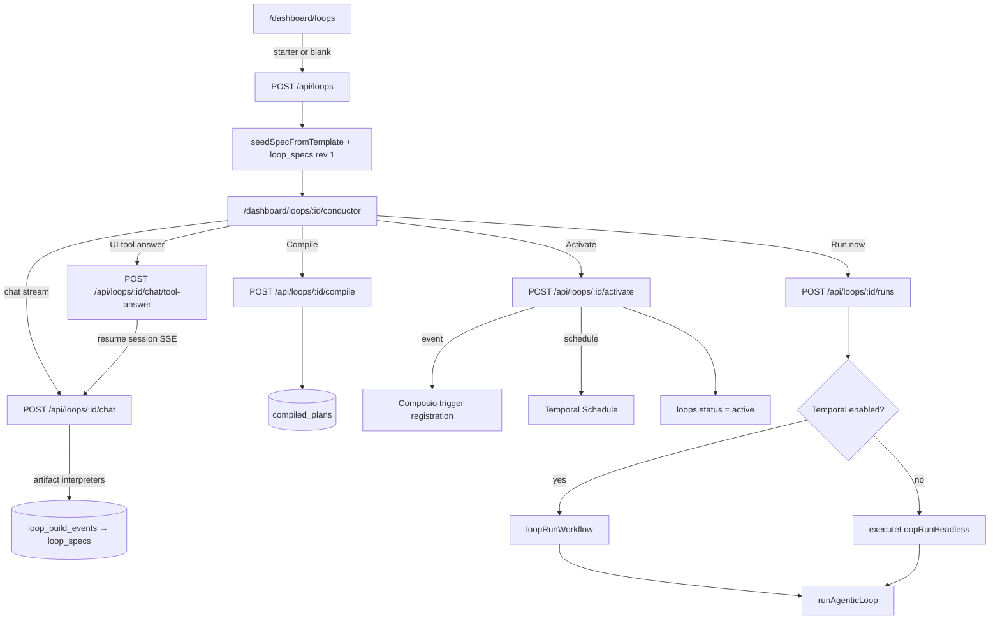

# Archived: Conductor + Loops Architecture

**Status:** Removed July 2026 ([ADR-014](../adr/014-loops-teardown.md))  
**Source snapshot:** commit `c73a4c8b` (last full Conductor implementation before teardown)  
**Purpose:** Historical reference for how Conductor, Loops, Temporal, Composio, and Loop Miner worked — including UI mapping and prompts.

---

## Executive summary

Tallei previously shipped a full **automation platform** on top of memory:


| Layer            | Role                                                                                |
| ---------------- | ----------------------------------------------------------------------------------- |
| **Conductor**    | Conversational loop builder — chat → 9-phase build → compile → test → activate      |
| **Loops engine** | Spec model, compiler, bindings, run lifecycle                                       |
| **Composio**     | OAuth connectors, action/trigger catalogues, webhook event triggers                 |
| **Temporal**     | Durable scheduling and `loopRunWorkflow` execution                                  |
| **Loop Miner**   | Background pipeline: events → episodes → loop candidates → workflow DNA suggestions |
| **Workspaces**   | Scoped isolation for loops, connectors, workspace memory, KB                        |


The product was repositioned to **memory-core only** in July 2026. This document preserves the prior design for rebuild or audit.

---


## System overview

```
┌─────────────────────────────────────────────────────────────────────────────┐
│                         Dashboard (Next.js :3001)                            │
│  /dashboard/loops  →  /loops/:id/conductor  →  runs / approvals             │
│  Proxies /api/loops/* with session auth → Express backend                    │
└───────────────────────────────────┬─────────────────────────────────────────┘
                                    │ HTTP + SSE
┌───────────────────────────────────▼─────────────────────────────────────────┐
│                    Express backend (:3000)                                   │
│  /api/loops/*        Conductor chat, compile, activate, runs                │
│  /api/connectors/*   Composio OAuth + catalogues                            │
│  /api/webhooks/composio   Event trigger fan-out                             │
│  /api/approvals/*    Human-in-the-loop for sensitive tool steps             │
└───────┬─────────────────┬──────────────────────┬────────────────────────────┘
        │                 │                      │
        ▼                 ▼                      ▼
  PostgreSQL         Composio API          Temporal worker
  (loop tables,      (OAuth, tools,         (loopRunWorkflow,
   build events,      triggers, webhooks)    schedules, approvals)
   runs, approvals)
```

**Key design principle:** Conductor **execution** lived on Express. Next.js was UI + auth proxy only — it never ran `pipeConductorSession` or persisted build events.

---


## Conductor: conversational loop builder


### What it was

**Conductor** guided non-technical users from natural-language intent to an **activated automation** (a "Loop"). The UI lived at:

```
/dashboard/loops/:loopId/conductor
```

Backend domain code: `src/loops/`  
Tool contracts: `packages/conductor-tools/`  
Shared phase types: `packages/shared/`

> `src/services/conductor/` was a **legacy stub** from an earlier spec-run stack. The active flow used `src/loops/` + `/api/loops/`*.


### Event-log-first build state

Conductor orchestration read a **single projection** from append-only `loop_build_events`. The event log was canonical; `loop_specs` revisions were derived from committed artifacts.


| Layer                      | Role                                                                                                                      |
| -------------------------- | ------------------------------------------------------------------------------------------------------------------------- |
| **Event log**              | Canonical timeline: messages, tool executions, artifacts, phase turns, handoffs                                           |
| `projectLoopBuild(events)` | Projects `LoopBuildState`, `LoopSpec`, transcript, `phaseProgress`, pending UI tools                                      |
| **Artifact chain**         | Immutable artifacts per phase: `intent`, `blueprint`, `connectors`, `bindings`, `review`, `compile`, `test`, `activation` |
| **Interpreters**           | Server functions derive artifacts from tool evidence (`interpretCompletedIntent`, `interpretConnectorSelections`, etc.)   |
| **Phase contracts**        | Each chat request = one bounded phase attempt with allowed-tool list and step budget                                      |
| **Session loop**           | `pipeConductorSession` auto-continues phase handoffs inside a single SSE response                                         |


### Nine build phases

```
intent → blueprint → connectors → bindings → review → compile → test → activation
```


| Phase        | Step limit | LLM tools                                                                                         | Server auto-commit                          |
| ------------ | ---------- | ------------------------------------------------------------------------------------------------- | ------------------------------------------- |
| `intent`     | 6          | `analyzeIntent`, `askQuestion`                                                                    | intent + blueprint after questions answered |
| `blueprint`  | 4          | *(none — wait)*                                                                                   | derived from `analyzeIntent.executionOrder` |
| `connectors` | 8          | `discoverConnectorsForBlueprint`, `pickConnectorApp`, `listWorkspaceConnectors`, `connectToolkit` | connectors when all roles picked            |
| `bindings`   | 12         | `discoverBindings`, `listTriggers`, `listActions`, `askQuestion`, `resolveBindings`               | bindings after successful `resolveBindings` |
| `review`     | 6          | `presentAgentTeam`, `confirmOutcomeBrief`                                                         | review after user confirms                  |
| `compile`    | 8          | `compileLoop` + discovery helpers on failure                                                      | compile artifact                            |
| `test`       | 6          | `testRunLoop`                                                                                     | test artifact                               |
| `activation` | 6          | `presentReplyOptions`, `activateLoop`                                                             | activation artifact                         |


**User-facing stages** (dashboard progress bar):


| Stage                 | Phases                |
| --------------------- | --------------------- |
| `understand`          | intent                |
| `design`              | blueprint             |
| `connect_tools`       | connectors + bindings |
| `review_and_activate` | review → activation   |


Mapped by `userFacingStageForPhase()`.

### End-to-end build flow




### Conductor tools (16 total)


| Tool                             | Server execute? | Phases              | Purpose                                                  |
| -------------------------------- | --------------- | ------------------- | -------------------------------------------------------- |
| `analyzeIntent`                  | yes             | intent              | Platform-neutral execution plan + 0–4 business questions |
| `askQuestion`                    | **UI-only**     | intent, bindings    | Business forks; forbidden for connector/API details      |
| `discoverConnectorsForBlueprint` | yes             | connectors          | Rank apps per blueprint outcome group                    |
| `pickConnectorApp`               | **UI-only**     | connectors          | User picks app per outcome role                          |
| `listWorkspaceConnectors`        | yes             | connectors, compile | Refresh connected-toolkit status                         |
| `connectToolkit`                 | yes             | connectors, compile | Start OAuth                                              |
| `discoverBindings`               | yes             | bindings, compile   | Rank Composio action candidates                          |
| `listTriggers` / `listActions`   | yes             | bindings, compile   | Provider catalogues                                      |
| `resolveBindings`                | yes             | bindings, compile   | Atomic binding resolver                                  |
| `presentAgentTeam`               | yes             | review              | Specialist roster from blueprint                         |
| `confirmOutcomeBrief`            | **UI-only**     | review              | Confirm/Change after roster                              |
| `compileLoop`                    | yes             | compile             | Freeze runnable plan                                     |
| `testRunLoop`                    | yes             | test                | Simulated smoke test                                     |
| `presentReplyOptions`            | **UI-only**     | activation          | Clickable approval chips                                 |
| `activateLoop`                   | yes             | activation          | Turn on automation                                       |


**UI-only tools** (`CONDUCTOR_UI_ONLY_TOOLS`): answered via `POST /api/loops/:id/chat/tool-answer`, then server resumes SSE session.

**Internal transcript tools** (collapsed in UI): `analyzeIntent`, `listWorkspaceConnectors`, `listTriggers`, `listActions`, `discoverBindings`, `resolveBindings`.

---


## Dashboard UI → backend mapping


### Routes & pages


| Dashboard route                    | Component            | Backend API                                           | Purpose                                   |
| ---------------------------------- | -------------------- | ----------------------------------------------------- | ----------------------------------------- |
| `/dashboard/loops`                 | `loops/page.tsx`     | `GET/POST /api/loops`                                 | List loops; create from starter templates |
| `/dashboard/loops/new`             | `loops/new/page.tsx` | `POST /api/loops`                                     | Blank loop → redirect to conductor        |
| `/dashboard/loops/:id/conductor`   | `ConductorBuilder`   | `POST …/chat`, `POST …/chat/tool-answer`, `GET …/:id` | Main builder chat                         |
| `/dashboard/loops/:id/builder`     | redirect/wrapper     | —                                                     | Legacy alias → conductor                  |
| `/dashboard/loops/:id/runs`        | runs list            | `GET …/runs`                                          | Run history                               |
| `/dashboard/loops/:id/runs/:runId` | run detail           | `GET …/runs/:runId`                                   | Run transcript + steps                    |
| `/dashboard/approvals`             | approvals page       | `GET/POST /api/approvals`                             | HITL decisions for sensitive tool steps   |
| `/dashboard/workspace/settings`    | workspace settings   | workspace APIs                                        | Workspace name, members                   |
| `/dashboard/workspace/memory`      | workspace memory     | workspace memory APIs                                 | Scoped memory (removed with teardown)     |
| `/dashboard/workspace/knowledge`   | knowledge bases      | KB APIs                                               | Workspace KB (removed)                    |
| `/dashboard/loops/developer`       | dev tools            | —                                                     | Live loops debug (developer nav)          |


**Starter templates** on `/dashboard/loops`:

- `research_digest`, `newsletter_loop`, `lead_scoring`, `support_auto_reply`, `smart_alerts`, `crm_sync`


### Layout & navigation

- **Sidebar:** Loops, Workspace Settings, Developer → Live Loops
- **Conductor routes** (`/loops/new`, `/loops/:id/conductor`) used a **full-width white layout** with `ConductorHeader` instead of the standard sidebar content area
- **WorkspaceSwitcher** in topbar — loops were workspace-scoped


### Proxy layer

```
Browser → dashboard/app/api/loops/[...path]/route.ts → Express BACKEND_URL
```

- Session cookie auth on Next.js side
- Forwards `X-Internal-Secret` + `X-User-Id` to backend
- **SSE passthrough** required for `/chat` and `/chat/tool-answer` (buffering breaks session resume)


### UI component → tool mapping


| Conductor tool          | Dashboard component               | File                                                           |
| ----------------------- | --------------------------------- | -------------------------------------------------------------- |
| `pickConnectorApp`      | App card picker                   | `builder-connector-prompt.tsx`                                 |
| `askQuestion`           | Interactive prompt menu           | `ai-elements/interactive-prompt-menu.tsx`                      |
| `presentAgentTeam`      | Specialist roster card            | `agent-team-roster.tsx`                                        |
| `confirmOutcomeBrief`   | Routing manifest + Confirm/Change | `builder-outcome-brief-prompt.tsx`, `outcome-brief-card.tsx`   |
| `presentReplyOptions`   | Suggestion chips                  | `loop-suggestion-cards.tsx`, `conductor-prompt-suggestions.ts` |
| `connectToolkit`        | OAuth connect card                | `builder-connect-toolkit-card.tsx`                             |
| `compileLoop`           | Collapsed tool summary            | `conductor-tool-part.tsx`                                      |
| `testRunLoop`           | Test run storyboard               | `test-run-storyboard-card.tsx`                                 |
| `activateLoop`          | Activation summary table          | `activation-summary-card.tsx`                                  |
| Spec sheet (side panel) | Loop spec + compile/run actions   | `conductor-spec-sheet.tsx`                                     |


**Core layout files:**


| File                           | Role                                                                  |
| ------------------------------ | --------------------------------------------------------------------- |
| `conductor-builder.tsx`        | `useChat` transport, hydration, `answerTool` → tool-answer            |
| `conductor-builder-layout.tsx` | Composer: pending question vs free-text vs thinking                   |
| `conductor-builder-chat.tsx`   | Transcript + tool part rendering                                      |
| `conductor-shared.ts`          | Pending UI detection, optimistic in-flight, Yes/No → app picker remap |
| `conductor-tool-part.tsx`      | Per-tool transcript rendering                                         |
| `conductor-spec-sheet.tsx`     | Live spec, missing slots, event trigger status                        |


### Chat transport behavior

**Server-owned continuation** — client never auto-POSTs empty messages.


| `continuationIntent.action`       | Behavior                                             |
| --------------------------------- | ---------------------------------------------------- |
| `auto_continue` + `phase_handoff` | Server continues in same SSE session                 |
| `wait_for_user`                   | Render pending UI tool; user answers via tool-answer |
| `wait`                            | Build terminal or idle — stop                        |
| `budget_exhausted`                | Show Continue chips; user explicitly resumes         |


### Landing / marketing

Public homepage included Loops narrative:

- `home-content-loops.tsx`, `how-loops-work-section.tsx`
- `loops-scroll-reveal.tsx`, `loops-approval-card.tsx`
- Images under `dashboard/public/loops/` (crm-sync, newsletter-hub, etc.)

---


## Loop spec model (`loop_spec_v1`)

Defined in `src/loops/spec.ts`.


| Area               | Fields                                                                         |
| ------------------ | ------------------------------------------------------------------------------ |
| **Intent**         | `goal`, optional `constraints`                                                 |
| **Trigger**        | `manual`, `schedule` (cron + timezone), or `event` (`source` + `composioSlug`) |
| **Profile**        | `agentic` (default), `monitor`, `sync`                                         |
| **Bindings**       | `{ connector, capability, role?, optional? }[]`                                |
| **Task blueprint** | `taskBlueprint` — outcome roles, connector candidates, user choices            |
| **Agent**          | `instructions`, `maxSteps`                                                     |
| **Approval**       | `mode`, `sensitiveCapabilities`, `onTimeout`                                   |
| **Output**         | `kind`, `target`                                                               |


**Execution order:** `analyzeIntent.executionOrder` → `taskBlueprint.outcomes` in same order. Roles: `trigger`, `source`, `transform`, `destination`.

---


## Compile → activate → run


### Compile (`POST /api/loops/:id/compile`)

`compileLoopSpec()` in `src/loops/compiler.ts`:

1. Validate spec
2. List connected Composio toolkits for workspace entity
3. Resolve Composio action slugs per binding
4. Build `toolCatalog` with required `plannerCard` per tool
5. Fetch Composio connector playbook (workflow steps, pitfalls)
6. Persist `compiled_plans` with content hash


### Activate (`POST /api/loops/:id/activate`)

1. **Event loops:** `provisionEventTrigger` → shared Composio trigger channel + loop subscription
2. Set `loops.active_plan_id`, `status = active`
3. **Schedule:** `upsertLoopSchedule()` via Temporal when enabled
4. **Manual:** no external registration

**Composio entity per workspace:**

```
tallei:{tenantId}:{userId}:{workspaceId}
```


### Run triggers


| Kind       | Source                                              |
| ---------- | --------------------------------------------------- |
| `manual`   | Conductor "Run now" or `POST /api/loops/:id/runs`   |
| `schedule` | Temporal Schedule on cron                           |
| `event`    | Composio webhook → `dispatchComposioTriggerToLoops` |


### Runtime execution


| Profile   | Runner                                                                  |
| --------- | ----------------------------------------------------------------------- |
| `agentic` | `runAgenticLoop` — planner → optional approval → tool execute → deliver |
| `monitor` | Rule evaluation on metric sample                                        |
| `sync`    | Preview read both sides (v2 planned)                                    |


**Temporal workflow:** `src/temporal/workflows/loop-run.workflow.ts`  
**Activities:** planner, Composio execute, approval create, deliver output  
**Headless fallback:** `executeLoopRunHeadless` when Temporal disabled

### Approvals (human-in-the-loop)

Sensitive tool steps created `approval_requests`. Users decided at `/dashboard/approvals`. Temporal workflow received signals on approve/reject.

---


## Composio integration

**Package:** `packages/composio-tools/`  
**Backend:** `src/integrations/composio/`


| Capability        | Implementation                                                     |
| ----------------- | ------------------------------------------------------------------ |
| OAuth             | `connectToolkit` → Composio session → `/connect/complete` callback |
| Action catalogue  | `listActions`, `discoverBindings`                                  |
| Trigger catalogue | `listTriggers`, event trigger provisioning                         |
| Webhooks          | `POST /api/webhooks/composio` → workspace fan-out                  |
| Tool execution    | Temporal `execute-tool` activity at runtime                        |


**Connectors API:**


| Endpoint                                    | Purpose                           |
| ------------------------------------------- | --------------------------------- |
| `GET /api/connectors`                       | List toolkits + connection status |
| `GET /api/connectors/:toolkit/triggers`     | Trigger catalogue                 |
| `GET /api/connectors/:toolkit/actions`      | Action catalogue                  |
| `POST /api/connectors/:toolkit/authorize`   | Start OAuth                       |
| `POST /api/connectors/authorize/:id/verify` | Poll until connected              |
| `DELETE /api/connectors/:toolkit`           | Disconnect                        |


**Event trigger architecture (3 layers):**

1. **Shape (sync)** — Zod rejects invalid `composioSlug` on spec
2. **Canonicalize (async)** — `resolveEventTriggerPatch()` on spec save
3. **Freeze (async)** — `validateEventTriggerForCompile()` on compile

**Channel model:** one Composio trigger instance per `(workspace, connected_account, composio_slug)`, ref-counted across loops.

---


## Temporal scheduling

**Docs:** `docs/temporal-loops.md`  
**Worker:** `npm run temporal:worker` (separate process)  
**Cloudflare workers:** `deploy/cloudflare/loop-scheduler-worker.ts`, `loop-heartbeat-worker.ts` (wake/heartbeat for schedules)

Env:

```env
TALLEI_TEMPORAL__ENABLED=true
TALLEI_TEMPORAL__ADDRESS=127.0.0.1:7233
TALLEI_TEMPORAL__TASK_QUEUE=loop-runs
TALLEI_CONDUCTOR__MODEL=gpt-5-mini
```

---


## Loop Miner (background intelligence)

**Status at teardown:** API stubbed (`queueLoopMinerRunForUser` threw "not available"); full implementation existed in earlier commits.

**Docs:** `docs/loop-miner-architecture.md`, `docs/flows/loop-miner-end-to-end.md`

### Pipeline

```
Events → Episodes → Loop Detector → Loop Evaluator → DNA Generator → Workflow Suggestions
```


| Stage               | Input                                                  | Output                                                |
| ------------------- | ------------------------------------------------------ | ----------------------------------------------------- |
| **Event ingest**    | `ai_activity_events`, `collab_tasks`, `memory_records` | Chronological event stream                            |
| **Episode builder** | Events (LLM or deterministic)                          | `episodes` + `episode_turns`                          |
| **Loop detector**   | Episodes                                               | `CandidateLoop[]` via structural + hybrid + LLM judge |
| **Loop evaluator**  | Candidates + episode context                           | `automate` / `monitor` / `discard`                    |
| **DNA generator**   | Qualified loops                                        | `WorkflowDNA` → persisted suggestions                 |


### Detection layers

1. **Structural matching** — exact artifact + action signature
2. **Hybrid similarity** — Jaccard + embedding + heuristic scoring
3. **LLM adversary + judge** — semantic sanity check

Suggestions deduplicated by DNA fingerprint; 60-day cooldown on dismissed suggestions.

### UI integration

Loop Miner suggestions could surface as **loop suggestion cards** in Conductor (`loop-suggestion-cards.tsx`) — pre-filled starters from discovered patterns.

---


## Database schema (loop engine)

Key tables in `src/infrastructure/db/loop-engine-schema.ts`:


| Table                          | Purpose                                       |
| ------------------------------ | --------------------------------------------- |
| `loop_workspaces`              | Workspace isolation                           |
| `workspace_memberships`        | Multi-user workspaces                         |
| `loops`                        | Loop metadata + status                        |
| `loop_specs`                   | Versioned spec drafts                         |
| `loop_build_events`            | Append-only Conductor event log               |
| `loop_chat_threads`            | Build + run transcripts (`kind=build          |
| `compiled_plans`               | Frozen runnable plans                         |
| `loop_runs` / `loop_run_steps` | Execution history                             |
| `approval_requests`            | HITL gates                                    |
| `workspace_trigger_channels`   | Shared Composio trigger instances             |
| `loop_trigger_subscriptions`   | Loop ↔ channel mapping                        |
| `webhook_event_deliveries`     | Idempotent webhook dedup                      |
| `connector_connections`        | OAuth connection state                        |
| `workspace_memory_records`     | Workspace-scoped memory                       |
| Loop miner tables              | `episodes`, workflow suggestions, run records |


**Boot teardown (current):** `REMOVED_AUTOMATION_TABLES` drops these on migrate.

---


## Packages (removed)


| Package                   | Purpose                                                                  |
| ------------------------- | ------------------------------------------------------------------------ |
| `@tallei/conductor-tools` | Tool names, schemas, descriptions, phase metadata                        |
| `@tallei/composio-tools`  | Composio schema normalization, planner cards, trigger fields             |
| `@tallei/tallei-tools`    | Cron/schedule helpers for loops                                          |
| `@tallei/shared`          | Conductor phase handoff, activation confirm, stall recovery, turn budget |
| `@tallei/mcp-tools`       | **Kept** — memory MCP only                                               |


---


## Prompts reference


### 1. Conductor system prompt (`buildConductorSystemPrompt`)

**File:** `src/loops/planning-agent.ts`  
**Rebuilt:** every `prepareStep` from current spec + `phaseProgress` + `phaseContract`

**Structure (XML-tagged sections):**


| Section                 | Content                                                          |
| ----------------------- | ---------------------------------------------------------------- |
| `<role>`                | Tallei Conductor; plain-language outcomes; use interactive tools |
| `<capabilities>`        | Core rules, tool ownership index, allowed tools list             |
| `<workflow>`            | 6-step artifact build order, execution order rules               |
| `<guidelines>`          | User-facing glossary, read-before-write rules                    |
| `<hard_stops>`          | No connector/binding work during intent; no double analyzeIntent |
| `<safety>`              | Sensitive actions need review-first approval                     |
| `<specialist_review>`   | presentAgentTeam grouping rules                                  |
| `<activation_complete>` | Post-activate: one sentence max, no recap                        |
| `<examples>`            | Few-shot turn patterns                                           |
| `<response_format>`     | Markdown for config; no slugs/hashes to user                     |
| **Dynamic tail**        | Workspace, blockers, phase contract, Next hint, `Spec JSON`      |


**Model routing:** `modelGateway.resolveStreaming("conductor")`  

- OpenAI: `gpt-5-nano` for low reasoning effort, else `TALLEI_CONDUCTOR__MODEL` (default `gpt-5-mini`)
- OpenCode: `TALLEI_CONDUCTOR__MODEL` / `TALLEI_LLM__OPENCODE_MODEL`


### 2. Conductor tool descriptions

**File:** `packages/conductor-tools/conductor-tool-descriptions.ts`

Each tool had a detailed model-facing description (see git `c73a4c8b`). Key themes:

- **analyzeIntent:** platform-neutral; zero–four business questions; never ask about apps
- **discoverConnectorsForBlueprint:** auto-resolve prior picks; narrate reuse
- **pickConnectorApp:** server owns question/options; never expose internal terms
- **resolveBindings:** atomic; reproduce `pendingQuestions` exactly via `askQuestion`
- **presentAgentTeam:** group adjacent outcomes; never cross approval boundary
- **confirmOutcomeBrief:** exactly two buttons — `confirm` and `other`
- **compileLoop:** recover to review if unconfirmed; rerun discovery on technical failures


### 3. Runtime planner prompt

**File:** `src/loops/planning-agent.ts` — `buildRuntimePlannerBody()`

Used during **live runs** and **test runs** (not Conductor build chat).

**System:** `"You are Tallei's loop runtime planner. Reply with a single JSON object only."`

**Body includes:**

- Outcome, operational brief, success criteria
- Connector playbook (workflow steps, pitfalls from compile)
- Available tools (summarized planner cards)
- Run history (compacted)
- Trigger context (event runs)
- Workspace memory (optional)

**Output shapes:**

```json
{"kind":"tool_call","toolId":"...","args":{},"reasoning":"..."}
{"kind":"tool_call","toolId":"...","args":{},"finishOnSuccess":true,"completionSummary":"..."}
{"kind":"finish","summary":"..."}
```

**Rules (**`RUNTIME_PLANNER_RULES`**):**

- Only call tools in catalog
- Follow `behaviorInstructions` and `modifiedInputSchema`
- Reuse prior successful results with same args
- Retry on missing fields or pick different tool
- `finishOnSuccess` when outcome satisfied

**Test run variant:** prefixed with `"TEST RUN — simulated execution only. No real side effects."`

### 4. Loop Miner prompts

**File:** `src/orchestration/loop-miner/core/loop-miner-prompts.ts` (commit `2b383893`)


| Prompt                        | Role                                                                                       |
| ----------------------------- | ------------------------------------------------------------------------------------------ |
| `EPISODE_BUILDER_PROMPT`      | Group events into work episodes; extract intent, output, upstream work, automation signals |
| `LOOP_DETECTOR_PROMPT`        | Pattern-first: repeated job + artifact + action, not topical similarity                    |
| `PATTERN_CONSOLIDATOR_PROMPT` | Name loop from hybrid similarity groups                                                    |
| `PATTERN_ADVERSARY_PROMPT`    | Challenge weak candidates                                                                  |
| `PATTERN_JUDGE_PROMPT`        | Final approve/reject with status enum                                                      |
| `LOOP_EVALUATOR_PROMPT`       | Qualify for automation: automate / monitor / discard                                       |
| `MEMORY_LOOP_DETECTOR_PROMPT` | Detect loops directly from saved memories (import batch rules)                             |
| `LLM_LOOP_DETECTOR_PROMPT`    | Episode-based detection with upstream_preparation layer                                    |
| `DNA_GENERATOR_PROMPT`        | Synthesize WorkflowDNA: trigger, steps, style, approval behavior                           |


All Loop Miner prompts requested **JSON-only** output with explicit schemas.

### 5. UI prompt suggestions (client-side heuristics)

**File:** `dashboard/src/lib/conductor-prompt-suggestions.ts`

Not LLM prompts — heuristic chips when no pending UI tool:


| State                    | Suggestions                                                        |
| ------------------------ | ------------------------------------------------------------------ |
| Post-review, pre-compile | "Yes, compile and test", "Make changes first", "Explain the setup" |
| Post-compile             | Test / activate variants                                           |
| Budget exhausted         | Continue chip with `CONDUCTOR_BUDGET_EXHAUSTED_QUESTION`           |
| `presentReplyOptions`    | Uses options from tool input                                       |


---


## HTTP API surface (removed)

Mounted under `src/transport/http/routes/`:


| Route file             | Endpoints                                  |
| ---------------------- | ------------------------------------------ |
| `loops.ts`             | Full Conductor + compile + activate + runs |
| `approvals.ts`         | Approval decisions                         |
| `connectors.ts`        | Composio OAuth + catalogues                |
| `workspaces.ts`        | Workspace CRUD                             |
| `workspace-memory.ts`  | Workspace memory                           |
| `knowledge-bases.ts`   | KB management                              |
| `webhooks/composio.ts` | Event trigger webhooks                     |


Dashboard proxies: `dashboard/app/api/loops/`, `dashboard/app/api/conductor/` (legacy).

---


## Environment variables (removed / loop-specific)

```env
# Conductor model
TALLEI_CONDUCTOR__MODEL=gpt-5-mini
TALLEI_CONDUCTOR__REASONING_EFFORT=high
TALLEI_CONDUCTOR__LOW_REASONING_MODEL=gpt-5-nano

# Planner (runtime)
TALLEI_PLANNER__REASONING_EFFORT=low

# Temporal
TALLEI_TEMPORAL__ENABLED=true
TALLEI_TEMPORAL__ADDRESS=127.0.0.1:7233
TALLEI_TEMPORAL__TASK_QUEUE=loop-runs

# Composio
TALLEI_CONNECTORS__COMPOSIO_API_KEY=...
TALLEI_CONNECTORS__COMPOSIO_WEBHOOK_SECRET=...
TALLEI_CONNECTORS__COMPOSIO_ENTITY_PREFIX=tallei

# Loop miner
TALLEI_LOOP_MINER__*  (model, budget, schedule)
```

---


## Evolution timeline


| Era                    | Characteristics                                                |
| ---------------------- | -------------------------------------------------------------- |
| **Loop builder v1**    | Early `/dashboard/loops` builder, Temporal integration started |
| **Conductor rename**   | `3d269d38` — loop builder → Conductor; event-log build state   |
| **Agent team UI**      | Specialist roster, outcome brief, test run storyboard          |
| **Collab removed**     | ADR-013 — Loops became sole multi-step automation surface      |
| **Loop Miner stubbed** | Background miner disabled; docs retained                       |
| **Teardown**           | ADR-014 — full removal July 2026                               |


---


## What was kept for future rebuild

Per [product-scope.md](../product-scope.md):

- `src/model/` — model registry, routing (`conductor` and `planner` purposes removed from active config)
- `src/resilience/` — retry, timeout, circuit breaker
- `dashboard/src/components/ai-elements/` — conversation, tool, reasoning, prompt UI kit
- `dashboard/src/components/ui/` — shadcn primitives

ADR-015 defines the **execution engine boundary** — operator scheduling is a future separate engine, not in-repo.

---


## Recovering source from git

```bash
# Last commit with full Conductor implementation
git show c73a4c8b:docs/conductor.md

# Full loops domain
git ls-tree -r --name-only c73a4c8b src/loops/

# Loop miner prompts (before stub)
git show 2b383893:src/orchestration/loop-miner/core/loop-miner-prompts.ts

# Dashboard conductor components
git ls-tree -r --name-only c73a4c8b dashboard/src/components/conductor/
```

---


## Related ADRs

- [ADR-013: Remove collab](../adr/013-remove-collab-and-developer-workflows.md) — Collab replaced by Loops
- [ADR-014: Loops teardown](../adr/014-loops-teardown.md) — Removal decision
- [ADR-015: Execution engine boundary](../adr/015-execution-engine-boundary.md) — Future operator engine

