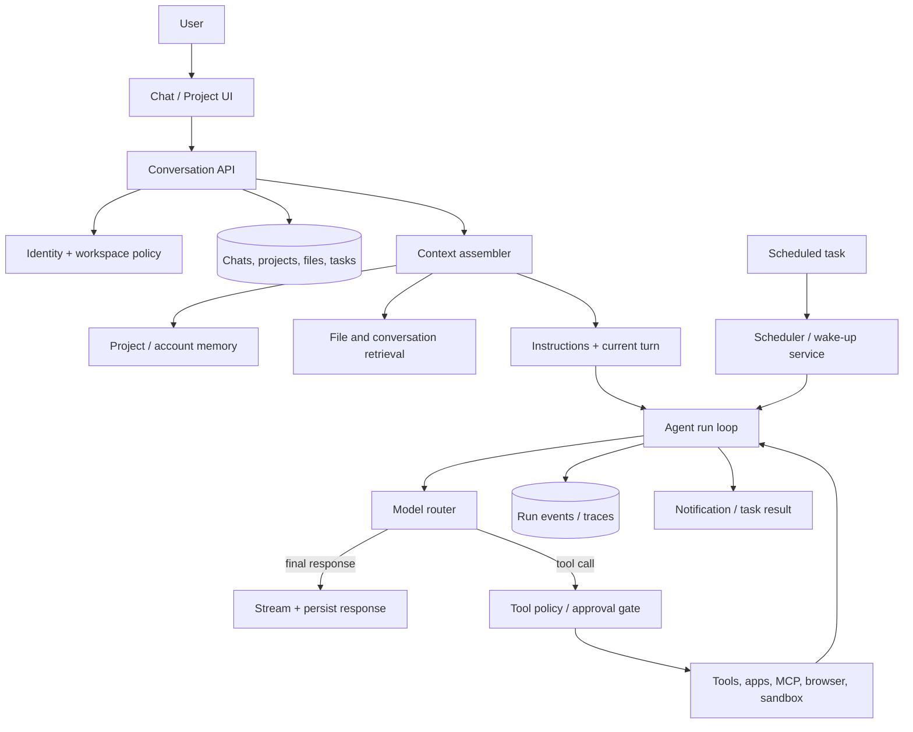

# ChatGPT-like Work Architecture

**Status:** Background research (non-canonical)  
**Date:** 2026-07-13  
**Scope:** A small architectural model for how ChatGPT-style work is likely organized, based on the public ChatGPT product model and OpenAI agent primitives.

> **Canonical Tallei plan:** [Tallei Work architecture (Stage 0)](tallei-work-architecture.md) and [ADR-016](adr/016-work-execution-engine.md). This note remains as competitive/public-behavior research only.

This is not a description of OpenAI's private internal implementation. It is an implementation-oriented inference from the public behavior of ChatGPT Projects, chats, memory, files, tools, and scheduled tasks.

## Executive summary

ChatGPT-style work is best understood as a **stateful workspace plus an agent runtime**, not as a fixed workflow compiler.

- A **Project** groups instructions, files, chats, and scoped memory.
- A **chat** is the user-facing durable thread and the natural unit for resuming work.
- A **turn/run** assembles context, calls the model, invokes tools when needed, and streams progress.
- A **tool layer** provides web search, file search, code execution, apps/connectors, browser/computer use, or domain functions.
- A **background task** is a separate durable run that wakes on a schedule, performs bounded work, and notifies the user.
- An **audit/trace layer** records model generations, tool calls, approvals, errors, and outputs.

The important product decision is that the user does not first design a workflow. They describe an outcome in a chat; the runtime decides the next action, while the product persists enough state to continue later.

## Conceptual system



## Interactive turn

```text
1. Persist the user's message in a chat thread.
2. Resolve the active project, workspace policy, and enabled capabilities.
3. Assemble a bounded context:
   project instructions + relevant memories + selected chat history + files + current turn.
4. Start an agent run with a model and an allowed tool set.
5. Stream text, reasoning/status events, and tool progress to the UI.
6. For each tool call:
   validate schema → apply policy/approval → execute → persist result → continue the run.
7. Stop at a final answer, a user decision, a budget limit, or a resumable wait state.
8. Persist the response, citations/artifacts, usage, and trace events.
```

The model is therefore not the system of record. The system of record is the combination of the chat/project state and the append-only run history. The model is a planner/transformer operating over a context assembled for one run.

## Core data model

| Object | Responsibility |
|---|---|
| `workspace` | Tenant, members, permissions, retention, enabled apps, policy |
| `project` | Long-running work boundary: instructions, files, chats, memory mode |
| `chat_thread` | Human-visible conversation and continuation point |
| `turn` | One user or assistant message, including streamed parts |
| `run` | One bounded agent execution for a turn or background task |
| `run_event` | Tool call, tool result, status, approval, error, handoff, artifact |
| `artifact` | Generated file, report, code change, citation set, or structured result |
| `memory` | Durable preference/fact/project context, separately governed from chat history |
| `task` | Durable instruction plus schedule, notification settings, and run policy |

`run_event` should be append-only. Current chat state, task status, and project summaries can be projections rebuilt from those events. This preserves the strongest part of the archived Conductor design without coupling the product to nine fixed phases.

## Background work

Scheduled work should not be implemented as an indefinitely open chat session. A task stores:

```text
task instruction + schedule + timezone + owner + project/workspace scope
notification policy + tool permissions + retry policy + last/next run
```

Each wake-up creates a new run with a fresh context snapshot. The run may complete, retry, wait for approval, or emit a notification. This makes cancellation, retries, idempotency, quotas, and inactivity limits explicit.

One observed product boundary is important: ChatGPT scheduled tasks created inside a project do not currently inherit that project's files. A Tallei implementation should therefore make task context an explicit, versioned input rather than silently assuming that all project context is available to background execution.

## Relationship to the archived Conductor

| Archived Conductor | ChatGPT-like replacement |
|---|---|
| Nine-phase builder | Open-ended conversational agent run |
| `loop_spec` + compile | Task/run definition, created only when durable work is requested |
| Phase handoff | Tool call, handoff, or resumable run state |
| `loop_build_events` | General `run_events` / conversation events |
| Compile then activate | Save task, permissions, schedule, and notification policy |
| Temporal loop execution | Separate execution engine boundary (already chosen in ADR-015) |
| Connector catalogue | Capability registry: MCP, apps, hosted tools, local tools |
| Approval requests | Tool policy and human approval gates per action |
| Loop run transcript | Run trace plus user-visible activity timeline |

The main architectural change is to move from **workflow-first** to **conversation-first**. Durable automation still needs a typed task and execution record, but the user should not have to build that graph before seeing useful work.

## Recommendation for Tallei

Keep Tallei as the control plane described in [ADR-015](adr/015-execution-engine-boundary.md): memory, documents, MCP, model routing, permissions, and audit. If ChatGPT-like work is rebuilt, add these small seams:

1. `ProjectContextResolver` — resolves project instructions, memory, documents, and chat references.
2. `AgentRunUseCase` — owns one bounded model/tool loop and emits typed run events.
3. `CapabilityRegistry` — returns only tools allowed for the current workspace and run.
4. `ArtifactRepository` — stores generated outputs independently of chat message text.
5. `TaskRepository` + external scheduler adapter — persists background tasks without bringing Temporal back into this repository.
6. `RunAuditRepository` — records tool calls, approvals, errors, latency, and usage.

Do not recreate the old Conductor compiler unless the product later needs deterministic, multi-step business workflows. For ChatGPT-like work, the durable boundary should be the **project/chat/run/task model**, with the execution engine remaining replaceable.

## Public references

- [Projects in ChatGPT](https://help.openai.com/en/articles/10169521-projects-in-chatgpt)
- [Memory in ChatGPT](https://help.openai.com/en/articles/8590148-memory-in-chatgpt-remembering-what-you-chat-about)
- [Scheduled Tasks in ChatGPT](https://help.openai.com/en/articles/10291617-tasks-in-chatgpt)
- [Conversation state](https://developers.openai.com/api/docs/guides/conversation-state)
- [Using tools](https://developers.openai.com/api/docs/guides/tools)
- [OpenAI Agents SDK](https://openai.github.io/openai-agents-python/)
