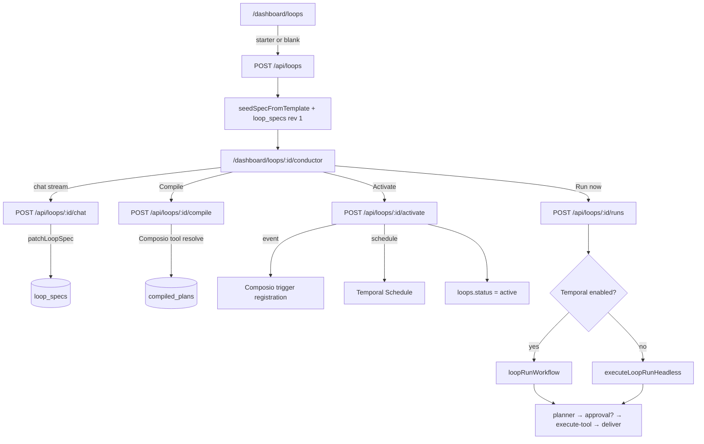

# Conductor — loop authoring & runtime

**Conductor** is Tallei's conversational loop engine: describe what you want in chat, patch a `loop_spec_v1`, compile to a runnable plan, activate triggers, and execute via Temporal (or inline headless).

The UI lives at `/dashboard/loops/:loopId/conductor`. Backend domain code is in `src/loops/`; connectors in `src/integrations/composio/`; durable execution in `src/temporal/`.

> **Note:** `src/services/conductor/` is a legacy stub from the pre–loop-engine spec-run stack. The active Conductor flow uses `src/loops/` + `/api/loops/*`, not `/api/conductor/*`.

---

## End-to-end flow



| Phase | What happens | Key tables |
|-------|----------------|------------|
| **Create** | Loop row + spec draft from template | `loops`, `loop_specs` |
| **Conductor chat** | LLM patches spec via tools | `loop_specs` (revision++) |
| **Compile** | Bind capabilities → Composio actions | `compiled_plans` |
| **Activate** | Mark plan active; register trigger/schedule | `loops`, `loop_trigger_registrations` |
| **Run** | Planner loop + tools + optional approval | `loop_runs`, `loop_run_steps`, `approval_requests` |

---

## Conductor chat

**Route:** `POST /api/loops/:loopId/chat` (SSE stream, proxied by `dashboard/app/api/loops/[...path]/route.ts`)

**Model:** `getStreamingLanguageModel("conductor")` → `TALLEI_CONDUCTOR__MODEL` (OpenCode Zen by default).

**System prompt:** `buildConductorSystemPrompt()` in `src/loops/planning-agent.ts` — includes current spec JSON, missing slots, connected toolkits.

**Tools exposed to the LLM:**

| Tool | Purpose |
|------|---------|
| `patchLoopSpec` | Apply a partial spec patch; saves draft; returns `missingSlots` |
| `listConnectors` | List workspace Composio connector status |
| `connectToolkit` | Start OAuth for a toolkit (returns redirect URL) |

The dashboard Conductor page (`useChat` + `DefaultChatTransport`) reads `patchLoopSpec` outputs to update the spec panel and missing-slot hints.

**Connectors in chat only** — the Conductor UI does not poll connectors separately; OAuth is initiated through `connectToolkit` in conversation.

---

## Loop spec (`loop_spec_v1`)

Defined in `src/loops/spec.ts`.

| Area | Fields |
|------|--------|
| **Intent** | `goal`, optional `constraints` |
| **Trigger** | `manual`, `schedule` (cron + timezone), or `event` (source + eventType) |
| **Profile** | `agentic` (default), `monitor`, `sync` |
| **Bindings** | `{ connector, capability, optional? }[]` |
| **Agent** | `instructions`, `maxSteps` |
| **Approval** | `mode`, `sensitiveCapabilities`, `onTimeout` |
| **Output** | `kind`, `target` |

**Starter templates** (`seedSpecFromTemplate` in `src/loops/patch.ts`): `research_digest`, `newsletter_loop`, `lead_scoring`, `support_auto_reply`, `smart_alerts`, `crm_sync`.

**Readiness:** `getMissingSlots()` — Conductor shows “Ready to compile” when empty.

---

## Compile

**Route:** `POST /api/loops/:loopId/compile`

`compileLoopSpec()` (`src/loops/compiler.ts`):

1. Validates spec (workspace, cron, profile-specific fields).
2. Lists connected Composio toolkits for the workspace entity.
3. For each binding, resolves a Composio action slug (static map → search → toolkit listing).
4. Builds `toolCatalog`: `{ id, capability, connector, actionSlug, credentialRef, sensitive, toolkitVersion? }`.
5. Persists `compiled_plans` with content hash.

Common errors: `CONNECTOR_NOT_CONNECTED`, `UNSUPPORTED_CAPABILITY`, `INVALID_CRON`.

---

## Activate

**Route:** `POST /api/loops/:id/activate` with `{ compiledPlanId }`

1. Supersedes prior active plan; sets `loops.active_plan_id`, `status = active`.
2. **Event trigger:** `registerLoopEventTrigger()` — Composio trigger instance → `loop_trigger_registrations`.
3. **Schedule trigger:** `upsertLoopSchedule()` when `TALLEI_TEMPORAL__ENABLED=true`.
4. **Manual trigger:** no external registration.

**Pause / resume** unregisters Composio triggers and pauses Temporal schedules.

---

## Run (runtime)

### Triggers

| Kind | Source |
|------|--------|
| `manual` | Conductor **Run now** or `POST /api/loops/:id/runs` |
| `schedule` | Temporal Schedule on cron |
| `event` | Composio webhook → `dispatchComposioTriggerToLoops` |

### Execution

- **Temporal on:** `startLoopRun` → `loopRunWorkflow` (`src/temporal/workflows/loop-run.workflow.ts`).
- **Temporal off:** fire-and-forget `executeLoopRunHeadless`.

**Agentic profile loop:**

1. `plannerActivity` — LLM returns `tool_call` or `finish` (text JSON + normalization for OpenCode models).
2. Sensitive tools or `approval.mode === "ask"` → `approval_requests` + workflow waits for `approvalDecision` signal.
3. `executeToolActivity` — Composio `executeComposioAction` with toolkit version resolution.
4. `deliverOutputActivity` — mark run completed, persist workspace memory.

**Run detail:** `/dashboard/loops/:loopId/runs/:runId` — steps timeline + inline approval when pending.

**Approval inbox:** `/dashboard/approvals` — `POST /api/approvals/:id/decide` signals the Temporal workflow.

### Profiles

| Profile | Runtime |
|---------|---------|
| `agentic` | Planner + tools + approvals |
| `monitor` | Rule evaluation on metric sample + optional notify |
| `sync` | Preview read both sides (full sync v2) |

---

## HTTP API summary

| Method | Path | Purpose |
|--------|------|---------|
| `GET` | `/api/loops` | List loops |
| `POST` | `/api/loops` | Create loop |
| `GET` | `/api/loops/:id` | Loop + latest spec |
| `POST` | `/api/loops/:id/chat` | **Conductor chat stream** |
| `POST` | `/api/loops/:id/compile` | Compile spec |
| `POST` | `/api/loops/:id/activate` | Activate plan |
| `POST` | `/api/loops/:id/pause` / `resume` | Lifecycle |
| `GET` | `/api/loops/:id/runs` | List runs |
| `GET` | `/api/loops/:id/runs/:runId` | Run + steps + pending approval |
| `POST` | `/api/loops/:id/runs` | Manual run |
| `GET` | `/api/connectors` | Workspace connector status |
| `GET` | `/api/approvals` | Pending approvals |
| `POST` | `/api/approvals/:id/decide` | Approve / reject / edit |

---

## Dashboard routes

| Path | Page |
|------|------|
| `/dashboard/loops` | Loop list + starter cards |
| `/dashboard/loops/new` | Blank loop |
| `/dashboard/loops/:loopId/conductor` | **Conductor** (chat + spec + compile/activate/run) |
| `/dashboard/loops/:loopId/runs` | Run history |
| `/dashboard/loops/:loopId/runs/:runId` | Run detail |
| `/dashboard/approvals` | Approval inbox |

`/dashboard/loops/:loopId/builder` redirects to `conductor` for old bookmarks.

---

## Environment variables

### Conductor & LLM

```env
TALLEI_LLM__PROVIDER=opencode
TALLEI_LLM__OPENCODE_API_KEY=...
TALLEI_LLM__OPENCODE_BASE_URL=https://opencode.ai/zen/v1
TALLEI_CONDUCTOR__MODEL=gpt-5.3-codex          # Conductor chat (tools + streaming)
TALLEI_LLM__OPENCODE_MODEL=deepseek-v4-flash   # Runtime planner
```

`TALLEI_CONDUCTOR__MODEL` falls back to legacy `TALLEI_LOOP_BUILDER__OPENAI_MODEL` if set.

### Temporal

```env
TALLEI_TEMPORAL__ENABLED=true
TALLEI_TEMPORAL__ADDRESS=127.0.0.1:7233
TALLEI_TEMPORAL__TASK_QUEUE=tallei-loops
```

### Composio

```env
TALLEI_CONNECTORS__COMPOSIO_API_KEY=...
TALLEI_CONNECTORS__COMPOSIO_WEBHOOK_SECRET=...
TALLEI_CONNECTORS__COMPOSIO_ENTITY_PREFIX=tallei
```

Entity ID format: `tallei:{tenantId}:{userId}:{workspaceId}`.

See also: [temporal-loops.md](./temporal-loops.md), [composio integration guide](../src/services/conductor/composio.md).

---

## Key source files

```
src/loops/
  spec.ts           LoopSpec, CompiledPlan, planner decision schemas
  patch.ts          applySpecPatch, templates, missing slots
  planning-agent.ts Conductor + runtime planner prompts
  compiler.ts       Spec → compiled plan + Composio resolution
  service.ts        create, compile, activate, run orchestration
  store.ts          Postgres CRUD

src/temporal/       loopRunWorkflow, activities, schedules, worker
src/integrations/composio/   connectors, tools, execute, triggers, webhooks
src/transport/http/routes/loops.ts

dashboard/app/dashboard/loops/[loopId]/conductor/page.tsx
dashboard/app/api/loops/
```

---

## Local dev quickstart

```bash
docker compose --profile temporal up -d   # optional
npm run dev                             # API :3000
npm run temporal:worker                 # if Temporal enabled
cd dashboard && npm run dev             # UI :3001
```

1. Open `/dashboard/loops` → pick a starter.
2. Conductor chat → connect Gmail via `connectToolkit` if needed.
3. **Compile** → **Activate** → **Run now**.
4. Watch run at `/dashboard/loops/:id/runs/:runId`; approve sensitive sends inline or in `/dashboard/approvals`.
