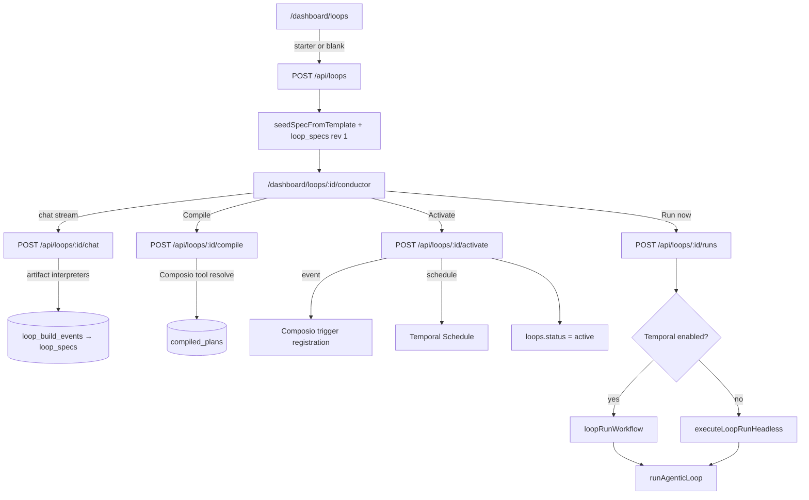
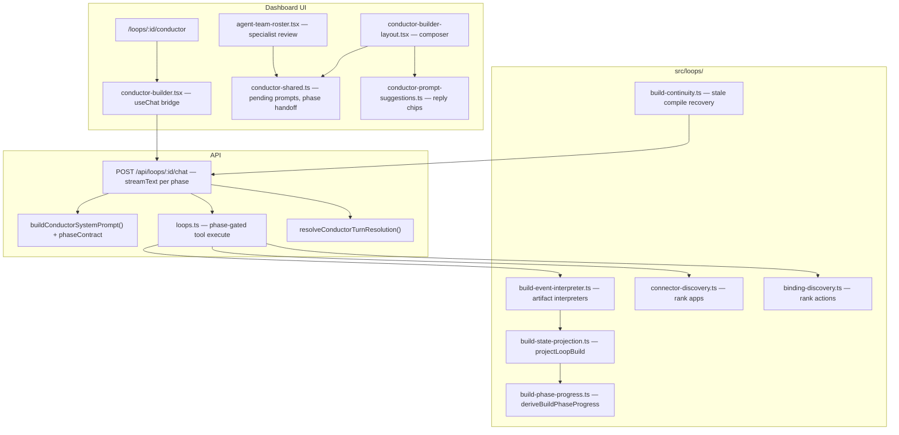
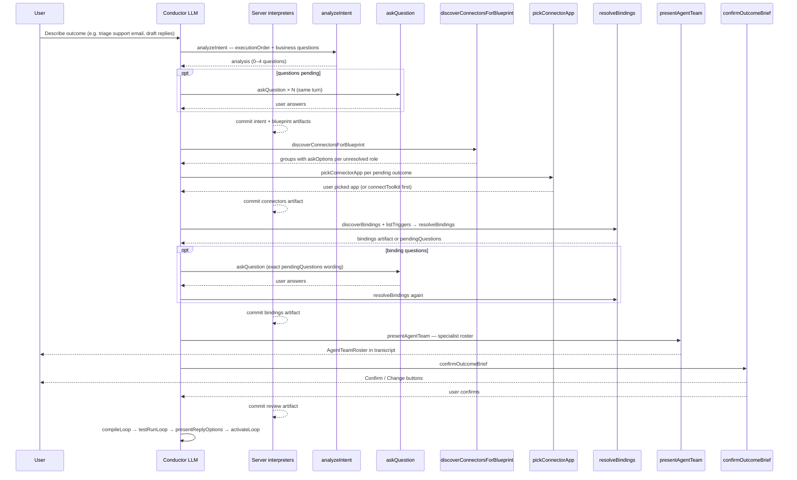
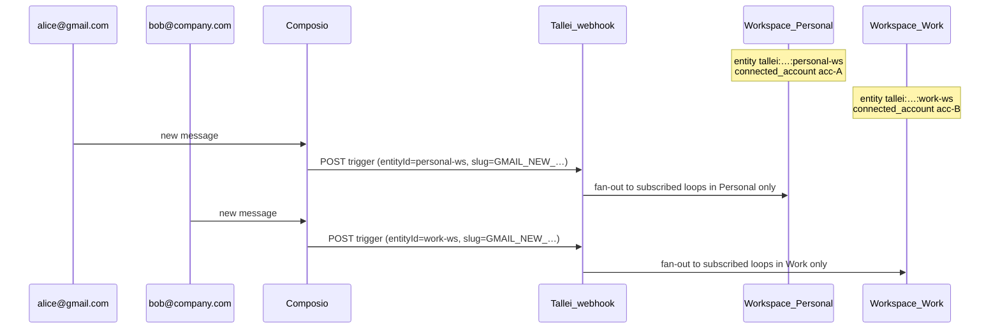

# Conductor — loop authoring & runtime

**Conductor** is Tallei's conversational loop engine: describe what you want in chat, walk through nine bounded build phases backed by an event log and artifact chain, compile to a runnable plan, activate triggers, and execute via Temporal or the same `runAgenticLoop` path inline when Temporal is off.

The UI lives at `/dashboard/loops/:loopId/conductor`. Backend domain code is in `src/loops/`; connectors in `src/integrations/composio/`; durable execution in `src/temporal/`.

> **Note:** `src/services/conductor/` is a legacy stub from the pre–loop-engine spec-run stack. The active Conductor flow uses `src/loops/` + `/api/loops/`*, not `/api/conductor/`*.

---

## Event-log-first build state

Conductor orchestration reads a **single projection** from the append-only `loop_build_events` table on every turn. The event log is canonical; `loop_specs` revisions are derived from committed artifacts, not patched directly by the model.

| Layer | Role |
| ----- | ---- |
| **Event log** | Canonical timeline: messages, tool executions, artifacts, phase turns, handoffs, recoveries |
| **`projectLoopBuild(events)`** | Projects `LoopBuildState`, `LoopSpec`, chat transcript, `phaseProgress`, pending UI tools, latest phase turn, consumed handoff IDs |
| **Artifact chain** | Each phase commits an immutable artifact (`intent`, `blueprint`, `connectors`, `bindings`, `review`, `compile`, `test`, `activation`) keyed by `artifactHash` with a `parentHash` link to the prior phase |
| **Interpreters** | Server-side functions (`interpretCompletedIntent`, `interpretConnectorSelections`, `interpretBindingDiscovery`, `interpretReviewConfirmation`) derive artifacts from tool evidence and commit them before the model's next step |
| **Phase contracts** | Each `POST /api/loops/:id/chat` request runs **one bounded phase attempt** with an allowed-tool list, optional `nextTool`, and a step budget (`CONDUCTOR_PHASE_STEP_LIMITS`) |
| **Turn resolution** | `resolveConductorTurnResolution()` decides whether the HTTP turn ends with `next_phase`, `continue_phase`, `wait_for_user`, `budget_exhausted`, or `build_complete` |
| **Tool evidence** | Server-executed tools append `tool_call.completed` events with execution metadata (`turnOutcome`, `continuation`, `handoffId`, `recoverToPhase`, `noProgressFingerprint`, …) |
| **Phase turns** | `phase_turn.completed` records terminal outcomes; `phase_handoff.consumed` marks client auto-continues |

**Nine phases:** `intent → blueprint → connectors → bindings → review → compile → test → activation`

| Phase | Step limit | LLM tools | Server auto-commit |
| ----- | ---------- | --------- | ------------------ |
| `intent` | 6 | `analyzeIntent`, `askQuestion` | intent + blueprint after all questions answered |
| `blueprint` | 4 | *(none — wait)* | derived from `analyzeIntent.executionOrder` |
| `connectors` | 8 | `discoverConnectorsForBlueprint`, `pickConnectorApp`, `listWorkspaceConnectors`, `connectToolkit` | connector selections when all roles picked and connected |
| `bindings` | 12 | `discoverBindings`, `listTriggers`, `listActions`, `askQuestion`, `resolveBindings` | bindings artifact after successful `resolveBindings` |
| `review` | 6 | `presentAgentTeam`, `confirmOutcomeBrief` | review artifact after user confirms |
| `compile` | 8 | `compileLoop` + discovery helpers on compile failure | compile artifact |
| `test` | 6 | `testRunLoop` | test artifact |
| `activation` | 6 | `presentReplyOptions`, `activateLoop` | activation artifact |

**User-facing stages** (dashboard progress): `understand` (intent) → `design` (blueprint) → `connect_tools` (connectors + bindings) → `review_and_activate` (review through activation). Mapped by `userFacingStageForPhase()`.

- `blueprint` is server-derived — the model must not call tools during this phase.
- Phase completion emits `continuation: next_phase` + `handoffId`; the dashboard auto-sends the next request via `shouldAutoSendConductorChat`.
- Mid-phase bridges (e.g. text after `analyzeIntent` before `askQuestion`) use `handoffPending` + `isPhaseHandoffPending` for the same auto-continue path.
- Recoverable failures set `recoverToPhase` / `recoveryPhase` and stop the HTTP turn; the next request resumes from persisted state.
- Budget exhaustion appends `phase_turn.completed` with `budget_exhausted` and surfaces `CONDUCTOR_BUDGET_EXHAUSTED_QUESTION` with Continue chips.
- **Build continuity:** `reconcileLoopBuildContinuity()` detects stale/missing compile artifacts during `test`/`activation` and can recover to `compile` via `phase.recovery_requested`.

Key files: `src/loops/build-state-projection.ts`, `src/loops/build-phase-progress.ts`, `src/loops/build-event-interpreter.ts`, `src/loops/build-events.ts`, `src/loops/conductor-turn-resolution.ts`, `src/loops/build-continuity.ts`, `src/transport/http/routes/loops.ts`.

---

## End-to-end flow




| Phase              | What happens                                                      | Key tables                                                                           |
| ------------------ | ----------------------------------------------------------------- | ------------------------------------------------------------------------------------ |
| **Create**         | Loop row + spec draft from template                               | `loops`, `loop_specs`, `loop_build_events` (seed state)                              |
| **Conductor chat** | LLM calls phase-scoped tools; server commits artifacts            | `loop_build_events`, `loop_specs` (derived), `loop_chat_threads` (`kind=build`)      |
| **Compile**        | Bind capabilities → Composio actions; freeze trigger slug on plan | `compiled_plans` (no Composio side effects)                                          |
| **Activate**       | Provision Composio trigger + subscribe loop; mark plan active     | `loops`, `workspace_trigger_channels`, `loop_trigger_subscriptions`                  |
| **Run**            | Planner loop + tools + optional approval                          | `loop_runs`, `loop_run_steps`, `loop_chat_threads` (`kind=run`), `approval_requests` |


---

## Conductor chat

**Route:** `POST /api/loops/:loopId/chat` (SSE stream, proxied by `dashboard/app/api/loops/[...path]/route.ts`)

**Model:** `getStreamingLanguageModel("conductor")` → `TALLEI_CONDUCTOR__MODEL` (OpenCode Zen by default). **One model, one stream** per phase attempt — there is no separate nested analyst, review summarizer, or planner pre-pass in build chat. The Conductor calls `analyzeIntent` as a tool to produce the execution plan; the server derives and commits intent/blueprint artifacts. Review content comes from `LoopSpec` + `presentAgentTeam`; the model only supplies interaction tools.

**System prompt:** `buildConductorSystemPrompt()` in `src/loops/planning-agent.ts` — rebuilt on every `prepareStep` from the current in-memory spec, `phaseProgress`, and `phaseContract`. Ownership-first: Conductor resolves compile blockers autonomously; interrupts the user only for material business forks.

**Tools exposed to the LLM (phase-scoped):**


| Tool                                           | Server execute?  | Phases | Purpose |
| ---------------------------------------------- | ---------------- | ------ | ------- |
| `analyzeIntent`                                | yes              | intent | Platform-neutral execution plan: `executionOrder`, scope, approval, 0–4 business questions. Zero questions is valid when behavior is already clear. |
| `askQuestion`                                  | **no** (UI-only) | intent, bindings | Business forks from `analyzeIntent` or `resolveBindings.pendingQuestions`. **Forbidden:** connector app choice, Yes/No to confirm a connected app, Composio/API details. |
| `discoverConnectorsForBlueprint`               | yes              | connectors | Rank apps per blueprint outcome group; may auto-resolve prior explicit choices. Returns `groups[]` with `askOptions` per unresolved role. |
| `pickConnectorApp`                             | **no** (UI-only) | connectors | User picks app per `outcomeId` + `role`; options come from discovery output. |
| `listWorkspaceConnectors`                      | yes              | connectors, compile | Refresh connected-toolkit status; connection ≠ app-selection consent. |
| `connectToolkit`                               | yes              | connectors, compile | Start OAuth for a toolkit |
| `discoverBindings`                             | yes              | bindings, compile | Search + rank Composio action candidates within a chosen connector |
| `listTriggers` / `listActions`                 | yes              | bindings, compile | Provider catalogues for binding resolution |
| `resolveBindings`                              | yes              | bindings, compile | Atomic binding resolver: returns `pendingQuestions` or commits validated trigger/bindings/output artifact |
| `presentAgentTeam`                             | yes              | review | Specialist roster grouped from blueprint outcomes; server normalizes titles and renders `AgentTeamRoster` |
| `confirmOutcomeBrief`                          | **no** (UI-only) | review | Confirm/Change buttons after roster. Receives server-computed `briefHash`. |
| `compileLoop` / `testRunLoop` / `activateLoop` | yes              | compile, test, activation | Go-live path |
| `presentReplyOptions`                          | **no** (UI-only) | activation | Clickable chips for explicit activation approval |

> **Legacy:** `patchLoopSpec` is no longer in the active Conductor tool set. Spec mutations flow through artifact interpreters. Old transcripts with `patchLoopSpec` parts remain readable.

The dashboard shows a **Loop spec** sheet (`ConductorSpecSheet`) when `spec.taskBlueprint` is set — outcome roles, connector choices, missing slots, compile/run actions.

---

## Conductor architecture (build chat)

### Layers




### Key UI files


| File                                                               | Role                                                                                                                  |
| ------------------------------------------------------------------ | --------------------------------------------------------------------------------------------------------------------- |
| `dashboard/src/components/conductor-builder.tsx`                   | `useChat` transport, phase handoff auto-send, spec meta sync                                                          |
| `dashboard/src/components/conductor/conductor-builder-layout.tsx`  | Composer: pending question vs free-text vs thinking indicator                                                         |
| `dashboard/src/components/conductor/conductor-builder-chat.tsx`    | Transcript + tool part rendering                                                                                      |
| `dashboard/src/components/conductor/conductor-shared.ts`           | `findPendingInteractivePrompt`, phase handoff detection, `shouldAutoSendConductorChat`, Yes/No → app picker remap     |
| `dashboard/src/components/conductor/agent-team-roster.tsx`         | Specialist team review card (`presentAgentTeam` output)                                                               |
| `dashboard/src/components/conductor/builder-connector-prompt.tsx`  | App card picker (`pickConnectorApp`)                                                                                  |
| `dashboard/src/components/ai-elements/interactive-prompt-menu.tsx` | Generic `askQuestion` / `confirmOutcomeBrief` answer UI                                                               |
| `dashboard/src/lib/conductor-prompt-suggestions.ts`                | Heuristic compile/test/activate chips; budget-exhausted Continue                                                      |
| `dashboard/src/lib/conductor-phase-handoff.ts`                     | Client mirror of `shared/conductor-phase-handoff.ts`                                                                  |
| `dashboard/src/lib/conductor-activation-confirm.ts`                | Activation reply token matching for stall Continue routing                                                            |
| `shared/conductor-phase-handoff.ts`                                | `isPhaseHandoffPending` — text-only bridge auto-continue gate                                                         |
| `shared/conductor-activation-confirm.ts`                           | `isActivationConfirmationReply`, `findActivationReplyOption`                                                          |
| `shared/conductor-stall-recovery.ts`                               | `isPhaseOpenForStallRecovery`, `isBuildTerminalForStall`                                                             |


### Chat transport behavior

- **`sendAutomaticallyWhen: shouldAutoSendConductorChat`** — continues the stream after:
  - User answers a UI tool (`pickConnectorApp`, `askQuestion`, `confirmOutcomeBrief`, `presentReplyOptions`)
  - A phase completes with `continuation: next_phase` (cross-phase handoff via `findPendingConductorPhaseHandoff`)
  - A mid-phase text-only bridge when `isPhaseHandoffPending` is true (e.g. prose after `analyzeIntent` before `askQuestion`)
- **Phase handoff consumption** — when the client auto-continues, the server appends `phase_handoff.consumed` for the carried `handoffId` before starting the next phase stream. Superseded handoffs return HTTP 409.
- **PUT `/api/loops/:id/chat`** — debounced transcript persistence (500ms); messages are also mirrored into `loop_build_events`.
- **GET `/api/loops/:id`** — hydrates `chatMessages`, `buildProgress.phaseProgress`, `buildProgress.latestPhaseTurn`, `buildPhase`, and latest spec on load (polled after each chat revision).

### Phase handoff & budget recovery

When Conductor ends a turn with **`continuation: next_phase`** or a text-only bridge with `handoffPending`, `shouldAutoSendConductorChat` triggers the next HTTP request without user input.

**Authority:** phase progress comes from `buildProgress.phaseProgress` on `GET /api/loops`, projected by `deriveBuildPhaseProgress()` from the event log. `isPhaseHandoffPending()` (`shared/conductor-phase-handoff.ts`) supplements `phaseProgress.handoffPending` with transcript-derived predicates per phase.

| Signal | Client behavior |
|--------|-----------------|
| `turnOutcome: phase_complete`, `continuation: next_phase` | Auto-send next phase (after `phase_handoff.consumed`) |
| `handoffPending: true` + text-only last message | Auto-send to invoke expected `nextTool` |
| `turnOutcome: budget_exhausted` | Show `CONDUCTOR_BUDGET_EXHAUSTED_QUESTION` + Continue chips |
| `turnOutcome: waiting_for_user` | Wait for UI tool answer |
| `turnOutcome: build_complete` or `loop.status === active` | No auto-continue |

**Budget exhaustion:** server appends `phase_turn.completed` with `outcome: budget_exhausted`. The dashboard surfaces Continue chips; the next request resumes from persisted `phaseProgress` and event-log state.

**Activation confirmation:** `isActivationConfirmationReply()` (`shared/conductor-activation-confirm.ts`) classifies `presentReplyOptions` replies by option id, label, and message tokens before `activateLoop` is authorized.

### UI-only tools (no server `execute`)

`pickConnectorApp`, `askQuestion`, `confirmOutcomeBrief`, and `presentReplyOptions` are **human-in-the-loop** tools:

1. Conductor calls the tool → part state `input-available`.
2. Dashboard renders the composer prompt (app picker, question menu, confirm buttons, or reply chips).
3. User selects → `addToolOutput` → stream auto-continues via `shouldAutoSendConductorChat`.
4. Conductor reads `output` on the next step and proceeds (or the server commits artifacts from the evidence).

**UI remap:** if Conductor wrongly calls `askQuestion` with Yes/No to confirm an app, the dashboard remaps it to the app card picker (`BuilderConnectorPrompt`) using discovery options — user still chooses explicitly.

---

## Ideal Conductor turn sequence

This is the **intended** behavior the system prompt enforces. Deviations (e.g. `askQuestion` with Yes/No to confirm Gmail) are bugs — the UI may auto-correct some of them.




### Outcome-first planning (unified Conductor)

1. **`analyzeIntent`** → platform-neutral `executionOrder`, scope, approval, and 0–4 business questions. Never ask which app/platform during intent.
2. **`askQuestion`** only for returned intent questions or `resolveBindings.pendingQuestions` — chiefly **draft vs send** when both appear without clear sequencing.
3. **Server** commits intent + blueprint from `deriveIntentAndBlueprint()` once questions are complete (or immediately when zero questions).
4. **`discoverConnectorsForBlueprint`** → **`pickConnectorApp`** per unresolved role (discovery may auto-resolve prior explicit choices).
5. **`discoverBindings` / `listTriggers` → `resolveBindings`** atomically commits trigger, bindings, and output. Reproduce `pendingQuestions` exactly with `askQuestion`, then call `resolveBindings` again.
6. **Review:** one short intro sentence → **`presentAgentTeam`** → **`confirmOutcomeBrief`**. The roster and routing manifest render from server-normalized spec; the model does not generate review summary fields.
7. **Compile path:** after review artifact committed → `compileLoop` → `testRunLoop` → `presentReplyOptions` → `activateLoop`.

**Activation sub-flow:** The `activation` phase requires explicit user approval via `presentReplyOptions`. `deriveActivationProgress()` and `isActivationConfirmationReply()` classify the chip reply before authorizing `activateLoop`. The handler also verifies a confirming `presentReplyOptions` completion exists in the event log.

**Default connector rule:** one app powers **trigger, receive, draft, and send** unless the user explicitly asked for **separate apps** for receive vs send. Discovery may reuse a prior explicit pick for later outcome roles in the same loop.

---

## System prompt (`buildConductorSystemPrompt`)

Rebuilt on **every** `prepareStep` from the current in-memory spec, `phaseProgress`, and `phaseContract`. Structured for clarity without blowing the context window.

The prompt includes: core rules, tool ownership index, blueprint & patch flow (artifact-based), execution-order rules, specialist team review guidance, phase goal/completion criteria, step budget, allowed tools, and a single compact `Spec JSON` line.

When bindings are committed and review is pending, the server computes `computeOutcomeBriefHash(spec)` and supplies it only as the internal `briefHash` for `confirmOutcomeBrief`.

### Specialist team review (`presentAgentTeam`)

The model groups adjacent blueprint outcomes into coherent specialist personas (trigger outcomes stay separate; never group across the approval boundary). The server normalizes job titles via `normalizeAgentTeam()` and renders `AgentTeamRoster` in the transcript. `OutcomeBriefCard` / routing manifest still project from `LoopSpec` for the confirmation step.

The routing manifest uses AI Elements `Canvas` with static edges: users can pan, zoom, select a stage, inspect its configured goal, and use a minimap on routes longer than six stages. Connector nodes use the Composio logo service; Tallei processing nodes use `/tallei.svg`; approval nodes show the signed-in user's avatar.

Tool input examples live only under `test/unit/loops/fixtures`. Production descriptions explain behavior and rely on the Zod `inputSchema` already supplied to the AI SDK.

### Confirmation integrity and invalidation

- The hash covers intent, trigger, blueprint, bindings, actions, output, approvals, and guardrails.
- A Confirm response echoes the internal hash; the server commits a `review` artifact with `confirmedByUser: true`.
- `isOutcomeBriefConfirmed()` recomputes the hash before compilation. A mismatch blocks compilation.
- Re-committing upstream artifacts (e.g. new bindings) invalidates review and requires a new `presentAgentTeam` + `confirmOutcomeBrief` cycle.

### Latency and legacy transcripts

The old flow called `reviewOutcomeBrief`, waited for a separate planner-model JSON summary, then resumed Conductor to call `confirmOutcomeBrief`. The current flow removes the nested model request. Review content comes from `LoopSpec` + `presentAgentTeam`; the model supplies only interaction tools.

Persisted transcripts remain compatible: completed legacy `reviewOutcomeBrief` and `patchLoopSpec` parts remain readable; unanswered legacy `confirmOutcomeBrief` calls remain resumable. New builds use `analyzeIntent` and artifact interpreters, not `patchLoopSpec` or `reviewOutcomeBrief`.


| Block                       | Purpose                                                               |
| --------------------------- | --------------------------------------------------------------------- |
| **Core rules**              | Event-log authority, analyzeIntent contract, no internal IDs exposed    |
| **Tool ownership**          | One-line index of every Conductor tool                                |
| **Blueprint & patch flow**  | Six-step artifact-based build order                                   |
| **Execution order**         | analyzeIntent.executionOrder → taskBlueprint.outcomes                 |
| **Specialist team review**  | presentAgentTeam grouping rules + confirmOutcomeBrief                   |
| **Dynamic tail**            | Workspace, blockers, phase contract, Next hint, Spec JSON once          |


**Why not spec twice?** The prompt includes **one** `Spec JSON:` line (full spec, compact stringify) — no duplicate `taskBlueprint` block.

**UI tools are not in the prompt as replacements for tool calls** — the prompt tells Conductor to invoke interactive tools directly. The dashboard renders them:

- **`pickConnectorApp`** → `BuilderConnectorPrompt` app cards (per `outcomeId` + `role`)
- **`askQuestion`** → `InteractivePromptMenu`
- **`presentAgentTeam`** → `AgentTeamRoster` in transcript
- **`confirmOutcomeBrief`** → routing manifest + Confirm/Change buttons in composer
- **`presentReplyOptions`** + **`deriveConductorPromptSuggestions`** → suggestion chips when no pending tool prompt

**Auto-resolve:** when discovery can reuse a prior explicit connector choice for a later outcome role, the server emits `connector.auto_resolved` events and may commit the connectors artifact without another picker round.

### When Conductor **should** interrupt the user


| Situation                                        | Tool                                      | Example                                                                        |
| ------------------------------------------------ | ----------------------------------------- | ------------------------------------------------------------------------------ |
| Draft vs send ambiguous                          | `askQuestion`                             | User said “draft and send replies” with no ordering                            |
| Connector choice (always)                        | `pickConnectorApp`                        | After discovery — show ranked app cards; user picks even if Gmail is connected |
| User picked unconnected app                      | `connectToolkit` + wait                   | Picker choice has “Needs connection”                                           |
| Binding fork (rare)                              | `askQuestion` with discovery `askOptions` | Send immediately vs save draft — plain-language labels only                    |
| Ready to go live                                 | `presentReplyOptions`                     | “Compile and test?” chips                                                      |
| Approval / schedule / unclear output destination | `askQuestion`                             | “Run daily at 9am?”                                                            |


### When Conductor **should not** interrupt (resolve autonomously)


| Situation                                   | What to do instead                                                              |
| ------------------------------------------- | ------------------------------------------------------------------------------- |
| Trigger type, Composio slug, fetch strategy | `listTriggers` + `discoverBindings` → `resolveBindings`                         |
| Agent instructions                          | Derived server-side from `analyzeIntent.executionOrder` in blueprint artifact   |
| Capability bundles (“Read & Send”)          | Infer from intent; `discoverBindings`                                           |
| Connected app is top-ranked                 | **Still show `pickConnectorApp`** for unresolved roles — auto-resolve only reuses prior explicit picks |


### Anti-patterns (do not do)

- **`askQuestion` with Yes/No to confirm a connected app** — use `pickConnectorApp`; UI remaps if model misbehaves.
- **Auto-selecting Gmail because it is connected** — user must pick via picker for unresolved roles.
- **Per-role connector options** (Trigger: Gmail, Send: Gmail) — one app per loop unless user asked for separate apps.
- **Hand-built connector option lists** — always use `discoverConnectorsForBlueprint` output.
- **Calling `patchLoopSpec`, `listTriggers`, or `resolveBindings` during intent** — phase contract blocks unauthorized tools.
- **Rerunning `analyzeIntent` after questions are emitted** — wait for answers; server commits artifacts automatically.
- **Summarizing the specialist team in prose instead of calling `presentAgentTeam`** — roster must come from the tool.

---

## Connector discovery

**Implementation:** `src/loops/connector-discovery.ts`

### `discoverConnectorsForBlueprint`

1. For each pending non-`transform` outcome, run `discoverConnectorsForOutcome` using Composio tool search and catalogue hints.
2. Return **`groups[]`** — one entry per unresolved outcome role with `outcomeId`, `role`, `askOptions`, and `recommendedOptionIds`.
3. Sort by capability score; connection state is a tie-breaker only.
4. **Auto-resolve** prior explicit user picks for later roles via `connector.auto_resolved` events when discovery confirms reuse.
5. **Always** follow with `pickConnectorApp` for remaining unresolved groups — connected status affects ranking, not consent.

### Default picker question

`connectorQuestionForOutcome()` derives the picker wording from the actual blueprint outcome. For example, `Detects when a new support ticket is submitted` becomes:

> Where should a new support ticket come from?

`DEFAULT_CONNECTOR_PICK_QUESTION` is used only as a missing-discovery fallback. The UI injects the outcome-specific question and full option catalogue from the **last** `discoverConnectorsForBlueprint` output in the transcript (`findLatestConnectorDiscovery`).

### Client-side prompt handling

`dashboard/src/components/conductor/conductor-shared.ts`:

- `findPendingInteractivePrompt(messages, spec)` — shows picker when blueprint still needs connectors; skips when all non-transform outcomes have `selectedConnector`.
- `isConnectorConfirmationQuestion` — detects mistaken Yes/No connector confirms; remaps to `BuilderConnectorPrompt` with discovery options so the user picks an app card instead.

### Stale discovery note

`findLatestConnectorDiscovery` scans **backward through all messages** for the most recent `discoverConnectorsForBlueprint` output. `blueprintNeedsConnectorPick(spec)` suppresses the picker once connectors are chosen on the spec.

---

## `taskBlueprint` & spec gates

### Execution order

**Primary:** `analyzeIntent` outputs `executionOrder` — the pipeline plan. Each step has a `role` (`trigger`, `source`, `transform`, `destination`) and a plain-language `description` in execution order.

`deriveIntentAndBlueprint()` maps `executionOrder` to `taskBlueprint.outcomes` in the **same order** when the server commits the blueprint artifact. Array order is execution order for the route diagram and `buildExecutionStrategy`.

**Fallback:** When `executionOrder` is missing (legacy specs) or blueprint outcomes diverge from it, the server may apply single-pass role bucket-sort (`trigger → source → transform → destination`) via `normalizeBlueprintOutcomeOrder()`. Multi-phase flows — where a `source` or `trigger` appears after a `destination` — are **never** reordered.

**Shape** (committed in blueprint artifact):

```json
{
  "version": 1,
  "summary": "Support email triage and reply drafting",
  "outcomes": [
    { "id": "…", "role": "trigger", "description": "…", "candidates": [], "status": "pending" },
    { "id": "…", "role": "source", "description": "…", "candidates": [], "status": "pending" },
    { "id": "…", "role": "transform", "description": "…", "candidates": [], "status": "pending" },
    { "id": "…", "role": "destination", "description": "…", "candidates": [], "status": "pending" }
  ]
}
```

After connector pick, outcomes get `selectedConnector` + `status: "chosen"` on the projected spec. `transform` outcomes do not require a connector.

**Gate:** bindings phase requires a committed `connectors` artifact. Unauthorized tools are blocked by the phase contract, not ad-hoc patch validation.

**Readiness:** `getMissingSlots()` on the projected `LoopSpec` — Conductor shows “Ready to compile” in the spec sheet when empty.

---

## Example: support ticket email loop (ideal path)

**User:** “Automatically classify incoming support tickets by priority and draft personalized replies for review.”


| Step | Conductor action                                                                                                               |
| ---- | ------------------------------------------------------------------------------------------------------------------------------ |
| 1    | `analyzeIntent` — `executionOrder` (trigger → source → transform → destination), approval                                    |
| 2    | No `askQuestion` — “draft for review” is clear (not send-immediately)                                                          |
| 3    | Server commits intent + blueprint artifacts                                                                                    |
| 4    | `discoverConnectorsForBlueprint` — Gmail connected, top ranked in group                                                        |
| 5    | `pickConnectorApp` — user confirms Gmail (or picks another app)                                                                |
| 6    | Server commits connectors artifact                                                                                             |
| 7    | `listTriggers` + `discoverBindings` → `resolveBindings` → bindings artifact                                                    |
| 8    | `presentAgentTeam` → `confirmOutcomeBrief` → review artifact                                                                   |
| 9    | `compileLoop` → `testRunLoop` → `presentReplyOptions` → `activateLoop`                                                         |


**User:** Same prompt but also says “and send the email” without sequencing.


| Step | Conductor action                                                                                     |
| ---- | ---------------------------------------------------------------------------------------------------- |
| 1    | `analyzeIntent` — provisional execution order + draft-vs-send question                             |
| 2    | **`askQuestion`** — “Should replies be sent automatically or saved as drafts for your review first?” |
| 3    | User answers → server re-derives intent artifact with resolved outcome                               |
| 4    | Continue connector discovery as above                                                                |


---

## Binding discovery

After connectors are chosen, `discoverBindings({ toolkit })` and `listTriggers({ toolkit })` gather deterministic candidates. The Conductor cannot submit workflow outcomes, action overrides, trigger slugs, or provider configuration.

`resolveBindings({})` derives canonical outcomes and catalogues from build state. If a business choice is missing, it returns server-authored `pendingQuestions` without invoking the resolver model. Once answers exist, the server constructs a strict runtime schema with fixed outcome properties, catalogue-limited action and trigger values, and only surfaced trigger fields such as `labelIds`. One dedicated structured-output call produces the complete artifact; the server validates it again and persists one `binding.resolved` event. Invalid output persists no binding evidence and returns `BINDING_RESOLUTION_FAILED`.

Historical `discoverBindings` and `setBindingConfig` evidence remains readable for existing build histories, but new builds use only the atomic resolver path.

**Connectors in chat only** — the Conductor UI does not poll connectors separately; OAuth is initiated through `connectToolkit` in conversation.

**API:** `GET /api/connectors/catalog` — merged catalogue for UI.

**Conductor ownership:** The model plans via `analyzeIntent`, discovers connectors/bindings, and presents review — but trigger slugs, binding artifacts, and output config are committed server-side through interpreters and `resolveBindings`, not authored freely in tool args.

### Chat persistence (`loop_chat_threads`)

Build and run transcripts share one table with two thread kinds:


| `kind`  | Scope                                       | Linked fields                                                      | Written by                                                                   |
| ------- | ------------------------------------------- | ------------------------------------------------------------------ | ---------------------------------------------------------------------------- |
| `build` | One row per `(loop_id, tenant_id, user_id)` | `spec_revision`, `compiled_plan_id` updated on spec save / compile | Conductor `POST`/`PUT` chat, `saveSpecDraft`, `saveCompiledPlan`             |
| `run`   | One row per `run_id`                        | `compiled_plan_id`                                                 | `createLoopRun`, `insertRunStep`, `deliverOutputActivity`, `failRunActivity` |


- **GET** `/api/loops/:id` returns `chatMessages`, `buildChat: { specRevision, compiledPlanId }`, `buildPhase`, and `buildProgress: { stage, phaseProgress, latestPhaseTurn }`.
- **GET** `/api/loops/:id/runs/:runId` returns `chatMessages` (run transcript).
- Run steps are mirrored into UIMessage-shaped JSON via `stepToChatMessages()` in `src/loops/loop-chat.ts`.

Legacy `loop_conductor_chats` rows migrate into `loop_chat_threads` on schema init.

---

## Loop spec (`loop_spec_v1`)

Defined in `src/loops/spec.ts`.


| Area               | Fields                                                                                                              |
| ------------------ | ------------------------------------------------------------------------------------------------------------------- |
| **Intent**         | `goal`, optional `constraints`                                                                                      |
| **Trigger**        | `manual`, `schedule` (cron + timezone), or `event` (`source` + required `composioSlug`, optional `eventType` label) |
| **Profile**        | `agentic` (default), `monitor`, `sync`                                                                              |
| **Bindings**       | `{ connector, capability, role?, optional? }[]`                                                                     |
| **Task blueprint** | `taskBlueprint` — outcome roles, connector candidates, user choices (Conductor working plan)                        |
| **Agent**          | `instructions`, `maxSteps`                                                                                          |
| **Approval**       | `mode`, `sensitiveCapabilities`, `onTimeout`                                                                        |
| **Output**         | `kind`, `target`                                                                                                    |


**Starter templates** (`seedSpecFromTemplate` in `src/loops/patch.ts`): `research_digest`, `newsletter_loop`, `lead_scoring`, `support_auto_reply`, `smart_alerts`, `crm_sync`.

**Readiness:** `getMissingSlots()` — Conductor shows “Ready to compile” when empty.

---

## Compile

**Route:** `POST /api/loops/:loopId/compile`

`compileLoopSpec()` (`src/loops/compiler.ts`):

1. Validates spec (workspace, cron, profile-specific fields).
2. Lists connected Composio toolkits for the workspace entity.
3. For each binding, resolves a Composio action slug (static map → search → toolkit listing).
4. Builds `toolCatalog`: `{ id, capability, connector, actionSlug, credentialRef, sensitive, toolkitVersion?, plannerCard, outputSchema? }`. Every tool **must** have a `plannerCard` (no field-name-only fallback).
5. Runs one Composio session search at compile (`fetchConnectorPlaybook`) — **required** for agentic loops with bound tools. Failures surface as compile errors (`COMPOSIO_NOT_CONFIGURED`, `PLAYBOOK_SEARCH_FAILED`, `PLAYBOOK_SCHEMA_MISSING`). Snapshots `connectorPlaybook` (workflow steps, pitfalls) on the plan. May auto-add related prerequisite tools (e.g. `email.get` when `email.read` is bound).
6. Persists `compiled_plans` with content hash.

**Recompile required** after playbook changes. Plans without `connectorPlaybook` / per-tool `plannerCard` are rejected at parse and runtime.

Event runs use the frozen playbook at runtime plus per-run trigger context from the webhook payload — no Composio search on each run.

Common errors: `CONNECTOR_NOT_CONNECTED`, `UNSUPPORTED_CAPABILITY`, `INVALID_CRON`, `INVALID_TRIGGER_SLUG`.

### Event triggers (architecture)

Two fields, two meanings — enforced in `src/loops/event-trigger.ts`:


| Field                  | Meaning                    | Example                   |
| ---------------------- | -------------------------- | ------------------------- |
| `trigger.source`       | Connector / toolkit        | `gmail`                   |
| `trigger.composioSlug` | Composio trigger type slug | `GMAIL_NEW_GMAIL_MESSAGE` |


**Three layers (defense in depth):**

1. **Shape (sync)** — Zod on `loop_spec_v1` rejects lowercase toolkit names in `composioSlug`. `getMissingSlots()` requires a valid-shaped slug, not just non-empty.
2. **Canonicalize (async, on patch)** — `resolveEventTriggerPatch()` resolves hints via Composio catalogue before saving the spec draft.
3. **Freeze (async, on compile)** — `validateEventTriggerForCompile()` verifies the slug exists; the canonical value is stored on `compiled_plans`. **Compile does not provision Composio** — no webhook instances are created until activate.

Do not rely on Conductor prompts alone — invalid states are rejected at the domain boundary.

**Built ≠ listening:** A loop can be compiled (and even show `compiledPlanId` in the UI) while Composio has zero trigger instances. The Conductor spec sheet shows provisioning status: compiled → activate → listening.

---

## Activate

**Route:** `POST /api/loops/:id/activate` with `{ compiledPlanId }`

**Order (event loops):** `provisionEventTrigger` (resolve slug → upsert Composio instance → subscribe) → `activateCompiledPlan` → Temporal schedule. On failure after provision starts, `unregisterLoopEventTrigger` rolls back.

1. **Event trigger:** `registerLoopEventTrigger()` → `provisionEventTrigger()` — resolves `composioSlug` or `eventType`, ensures one shared Composio trigger instance per `(workspace, connected_account, composio_slug)` in `workspace_trigger_channels` (ref-counted; recreates instance when `composio_instance_id` is null after pause), subscribes the loop in `loop_trigger_subscriptions`. Returns `eventTrigger: { subscribed, composioTriggerSlug, composioInstanceId }`.
2. Sets `loops.active_plan_id`, `status = active`.
3. **Schedule trigger:** `upsertLoopSchedule()` when `TALLEI_TEMPORAL__ENABLED=true`.
4. **Manual trigger:** no external registration.

There is **no repair/sync endpoint** — pause → activate re-runs provisioning idempotently.

**Pause / resume** unregisters Composio triggers and pauses Temporal schedules. Resume re-provisions event triggers.

---

## Event triggers & webhooks

Event loops use **shared trigger channels** inside each workspace. Composio delivers webhooks to a single Tallei URL; routing is by `entityId` (workspace) + `trigger_slug` + subscriptions.

### Composio entity per workspace

Each workspace gets its own Composio entity and OAuth connections:

```
tallei:{tenantId}:{userId}:{workspaceId}
```

Connectors are resolved against that entity (`getComposioEntityId` in `src/integrations/composio/client.ts`). **Personal** and **Work** therefore have separate `connected_account_id` values even for the same toolkit (e.g. Gmail).

### Channel key (one Composio instance per channel)

Table `workspace_trigger_channels` is unique on:

```
(workspace_id, connected_account_id, composio_trigger_slug)
```


| Layer            | Table                        | Role                                                                               |
| ---------------- | ---------------------------- | ---------------------------------------------------------------------------------- |
| **Channel**      | `workspace_trigger_channels` | One Composio `triggerInstances.upsert` per channel; `ref_count` tracks subscribers |
| **Subscription** | `loop_trigger_subscriptions` | Each active event loop points at a channel (`loop_id` unique)                      |
| **Idempotency**  | `webhook_event_deliveries`   | Skip duplicate runs for `(external_event_id, loop_id)` on Composio retries         |


**Activate** (`provisionEventTrigger`): creates or reuses a channel. If a channel row exists but `composio_instance_id` is null (e.g. after pause released the instance), Composio `triggerInstances.upsert` runs again. If the channel is healthy, increment `ref_count` only.

**Pause** (`unregisterLoopEventTrigger`): decrement `ref_count`; delete the Composio instance only when `ref_count` reaches 0.

### Two workspaces, two Gmail accounts

Typical case: different inboxes per workspace.




| Workspace | Composio entity suffix | Gmail account                             | Trigger instance | Webhook `entityId`        |
| --------- | ---------------------- | ----------------------------------------- | ---------------- | ------------------------- |
| Personal  | `…:personal-ws-id`     | [alice@gmail.com](mailto:alice@gmail.com) | Instance A       | `tallei:…:personal-ws-id` |
| Work      | `…:work-ws-id`         | [bob@company.com](mailto:bob@company.com) | Instance B       | `tallei:…:work-ws-id`     |


Both hit the **same** endpoint (`POST /api/webhooks/composio`), but Composio sends **separate events** per trigger instance / connected account. `dispatchComposioTriggerToLoops` resolves the workspace from `entityId` and only starts loops in that workspace.

### Multiple loops in one workspace

Two loops in **Personal** on the same Gmail account and same `composioSlug` (e.g. `GMAIL_NEW_GMAIL_MESSAGE`):

- **One** channel and **one** Composio trigger instance (`ref_count = 2`)
- **One** webhook per new email
- Fan-out to **both** loops (each run deduped by `webhook_event_deliveries`)

### Edge case: same Gmail in two workspaces

If the user connects the **same** Google account in both Personal and Work (two OAuth flows, two Composio entities):

- **Two** channels and **two** Composio trigger instances
- Each new email can produce **two** webhooks (one per workspace entity)

That is intentional: workspaces stay isolated. To avoid duplicate processing of one inbox, use a single workspace for that account.

### Webhook handler flow

1. Composio `POST` → `normalizeComposioWebhookPayload` (`src/integrations/composio/webhooks.ts`)
2. `dispatchComposioTriggerToLoops` (`src/integrations/composio/webhook-dispatch.ts`)
3. `buildAuthContextFromEntity(entityId)` → `workspaceId` (required)
4. `findActiveLoopsByComposioTriggerSlug(workspaceId, triggerSlug)` — joins `loop_trigger_subscriptions` + `workspace_trigger_channels`
5. For each loop: `claimWebhookEventDelivery` → `createLoopRun` → Temporal or headless execution

See [temporal-loops.md](./temporal-loops.md#webhooks) for endpoint URLs, signature headers, and env vars.

---

## Run (runtime)

### Triggers


| Kind       | Source                                                                                                                                              |
| ---------- | --------------------------------------------------------------------------------------------------------------------------------------------------- |
| `manual`   | Conductor **Run now** or `POST /api/loops/:id/runs`                                                                                                 |
| `schedule` | Temporal Schedule on cron                                                                                                                           |
| `event`    | Composio webhook → `dispatchComposioTriggerToLoops` (fan-out to subscribed loops in the **same workspace**; deduped via `webhook_event_deliveries`) |


### Execution

All profiles share the same entrypoint (`loopRunWorkflow` when Temporal is on, `executeLoopRunHeadless` when off).


| Profile   | Runner                                                                                                         |
| --------- | -------------------------------------------------------------------------------------------------------------- |
| `agentic` | `runAgenticLoop` (`src/loops/agentic-run.ts`) — planner → optional approval (DB poll) → tool execute → deliver |
| `monitor` | Rule evaluation on metric sample + optional notify                                                             |
| `sync`    | Preview read both sides (full sync v2)                                                                         |


**Agentic loop** (single implementation for Temporal and headless):

1. `plannerActivity` — LLM returns `tool_call` or `finish`. Prompt includes frozen `connectorPlaybook`, per-tool `plannerCard`, and event trigger context. Plans without playbook/cards fail fast.
2. Sensitive tools or `approval.mode === "ask"` → `approval_requests`; runner polls DB until decided or timeout.
3. `executeToolActivity` — Composio with runtime arg clamps (`include_payload: false`, list limits).
4. `deliverOutputActivity` — mark run completed, persist workspace memory.

Temporal workflows delegate agentic runs to `runAgenticLoopActivity` (no duplicate inline loop). Approval API still signals workflows when Temporal is on, but the runner resolves decisions via DB polling.

**Run detail:** `/dashboard/loops/:loopId/runs/:runId` — steps timeline + inline approval when pending.

**Approval inbox:** `/dashboard/approvals` — `POST /api/approvals/:id/decide` signals the Temporal workflow.

### Profiles


| Profile   | Runtime                                            |
| --------- | -------------------------------------------------- |
| `agentic` | Planner + tools + approvals                        |
| `monitor` | Rule evaluation on metric sample + optional notify |
| `sync`    | Preview read both sides (full sync v2)             |


---

## HTTP API summary


| Method | Path                                | Purpose                                                   |
| ------ | ----------------------------------- | --------------------------------------------------------- |
| `GET`  | `/api/loops`                        | List loops                                                |
| `POST` | `/api/loops`                        | Create loop                                               |
| `GET`  | `/api/loops/:id`                    | Loop + spec + `buildProgress` (phase progress, latest phase turn) |
| `POST` | `/api/loops/:id/chat`               | **Conductor chat stream** (persists transcript on finish) |
| `PUT`  | `/api/loops/:id/chat`               | Save Conductor chat messages                              |
| `POST` | `/api/loops/:id/compile`            | Compile spec                                              |
| `POST` | `/api/loops/:id/activate`           | Activate plan                                             |
| `POST` | `/api/loops/:id/pause` / `resume`   | Lifecycle                                                 |
| `GET`  | `/api/loops/:id/runs`               | List runs                                                 |
| `GET`  | `/api/loops/:id/runs/:runId`        | Run + steps + pending approval                            |
| `POST` | `/api/loops/:id/runs`               | Manual run                                                |
| `GET`  | `/api/connectors`                   | Workspace connector status                                |
| `GET`  | `/api/connectors/:toolkit/triggers` | Composio trigger catalogue for toolkit                    |
| `GET`  | `/api/connectors/:toolkit/actions`  | Composio action catalogue for toolkit                     |
| `GET`  | `/api/approvals`                    | Pending approvals                                         |
| `POST` | `/api/approvals/:id/decide`         | Approve / reject / edit                                   |


---

## Dashboard routes


| Path                                   | Page                                               |
| -------------------------------------- | -------------------------------------------------- |
| `/dashboard/loops`                     | Loop list + starter cards                          |
| `/dashboard/loops/new`                 | Blank loop                                         |
| `/dashboard/loops/:loopId/conductor`   | **Conductor** (chat + spec + compile/activate/run) |
| `/dashboard/loops/:loopId/runs`        | Run history                                        |
| `/dashboard/loops/:loopId/runs/:runId` | Run detail                                         |
| `/dashboard/approvals`                 | Approval inbox                                     |


`/dashboard/loops/:loopId/builder` redirects to `conductor` for old bookmarks.

---

## Environment variables

### Conductor & LLM

```env
TALLEI_LLM__PROVIDER=opencode
TALLEI_LLM__OPENCODE_API_KEY=...
TALLEI_LLM__OPENCODE_BASE_URL=https://opencode.ai/zen/v1
TALLEI_CONDUCTOR__MODEL=gpt-5.3-codex          # Conductor chat (tools + streaming)
TALLEI_BINDING_RESOLVER__MODEL=gpt-5.3-codex   # Strict binding structured output; defaults to Conductor
TALLEI_LLM__OPENCODE_MODEL=deepseek-v4-flash   # Runtime planner
```

`TALLEI_CONDUCTOR__MODEL` falls back to legacy `TALLEI_LOOP_BUILDER__OPENAI_MODEL` if set. `TALLEI_BINDING_RESOLVER__MODEL` defaults to the resolved Conductor model.

### Temporal

```env
TALLEI_TEMPORAL__ENABLED=true
TALLEI_TEMPORAL__ADDRESS=127.0.0.1:7233
TALLEI_TEMPORAL__TASK_QUEUE=tallei-loops
```

### Composio

```env
TALLEI_CONNECTORS__COMPOSIO_API_KEY=...
TALLEI_CONNECTORS__COMPOSIO_WEBHOOK_SECRET=...
TALLEI_CONNECTORS__COMPOSIO_ENTITY_PREFIX=tallei
```

Entity ID format: `tallei:{tenantId}:{userId}:{workspaceId}`.

See also: [temporal-loops.md](./temporal-loops.md), [composio integration guide](../src/services/conductor/composio.md).

---

## Key source files

```
src/loops/
  spec.ts                    LoopSpec, CompiledPlan, planner decision schemas
  build-state.ts             LoopBuildState, artifact schemas, commitLoopBuildArtifact
  build-state-projection.ts  projectLoopBuild — single read model from event log
  build-phase-progress.ts    deriveBuildPhaseProgress — phase contracts for prompt + UI
  build-event-interpreter.ts interpretCompletedIntent, interpretConnectorSelections, …
  build-events.ts            Event types, chat projection, tool execution dedup
  build-continuity.ts        Stale compile artifact detection during test/activation
  conductor-turn-resolution.ts  resolveConductorTurnResolution — turn outcomes
  conductor-tools.ts         Zod schemas + execution metadata for Conductor tools
  planning-agent.ts          buildConductorSystemPrompt + runtime planner prompts
  connector-discovery.ts     Blueprint app ranking, auto-resolve prior picks
  binding-discovery.ts       Composio action ranking for outcomes
  patch.ts                   applySpecPatch (legacy), templates, getMissingSlots
  compiler.ts                Spec → compiled plan + Composio resolution
  service.ts                 create, compile, activate, reconcileLoopBuildContinuity
  store.ts                   Postgres CRUD + loop_build_events

shared/
  conductor-phase-handoff.ts     isPhaseHandoffPending
  conductor-activation-confirm.ts isActivationConfirmationReply
  conductor-turn-budget.ts       CONDUCTOR_PHASE_STEP_LIMITS
  conductor-stall-recovery.ts    isBuildTerminalForStall

src/temporal/                  loopRunWorkflow, activities, schedules, worker
src/integrations/composio/     connectors, tools, execute, triggers, webhooks
src/transport/http/routes/loops.ts   Conductor chat stream + phase-gated tool handlers

dashboard/
  src/components/conductor-builder.tsx
  src/components/conductor/      layout, chat, shared, roster, connector picker, spec sheet
  src/lib/conductor-prompt-suggestions.ts
  src/lib/conductor-phase-handoff.ts
  app/dashboard/loops/[loopId]/conductor/page.tsx
  app/api/loops/
```

---

## Local dev quickstart

```bash
docker compose --profile temporal up -d   # optional
npm run dev                             # API :3000
npm run temporal:worker                 # if Temporal enabled
cd dashboard && npm run dev             # UI :3001
```

1. Open `/dashboard/loops` → pick a starter.
2. Conductor chat → connect Gmail via `connectToolkit` if needed.
3. **Compile** → **Activate** → **Run now**.
4. Watch run at `/dashboard/loops/:id/runs/:runId`; approve sensitive sends inline or in `/dashboard/approvals`.

