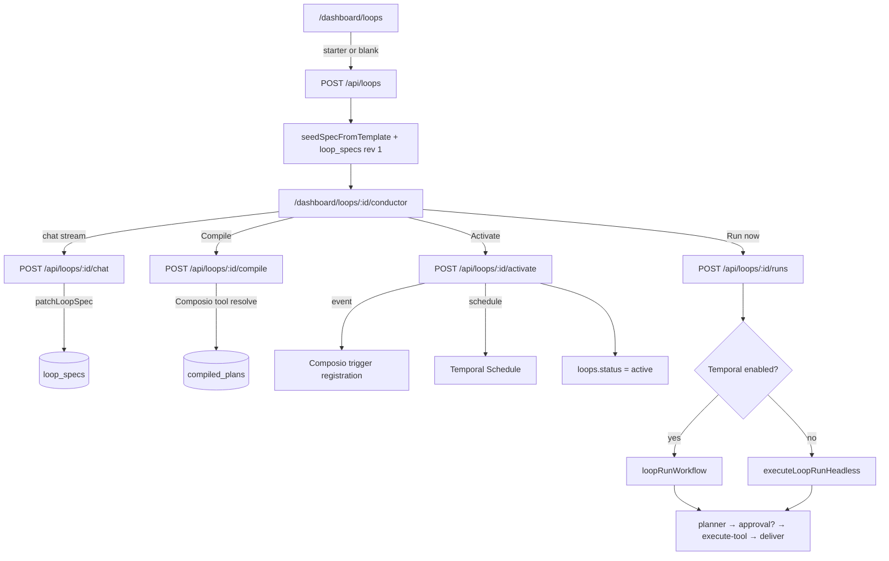
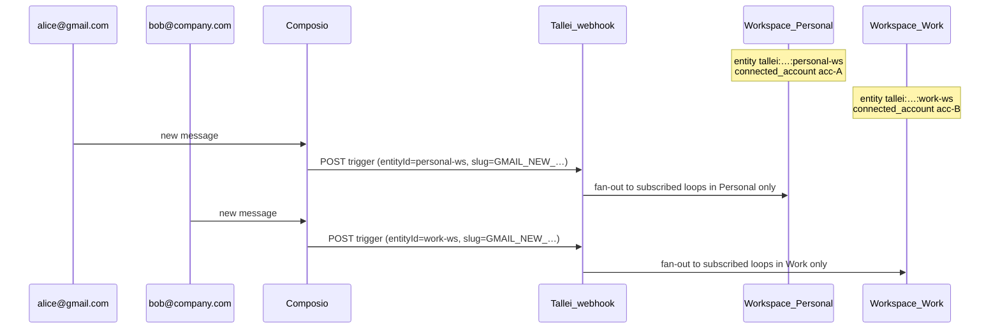

# Conductor — loop authoring & runtime

**Conductor** is Tallei's conversational loop engine: describe what you want in chat, patch a `loop_spec_v1`, compile to a runnable plan, activate triggers, and execute via Temporal (or inline headless).

The UI lives at `/dashboard/loops/:loopId/conductor`. Backend domain code is in `src/loops/`; connectors in `src/integrations/composio/`; durable execution in `src/temporal/`.

> **Note:** `src/services/conductor/` is a legacy stub from the pre–loop-engine spec-run stack. The active Conductor flow uses `src/loops/` + `/api/loops/*`, not `/api/conductor/*`.

---

## End-to-end flow



| Phase | What happens | Key tables |
|-------|----------------|------------|
| **Create** | Loop row + spec draft from template | `loops`, `loop_specs` |
| **Conductor chat** | LLM patches spec via tools | `loop_specs` (revision++), `loop_chat_threads` (`kind=build`) |
| **Compile** | Bind capabilities → Composio actions | `compiled_plans` (linked on build thread) |
| **Activate** | Mark plan active; register trigger/schedule | `loops`, `workspace_trigger_channels`, `loop_trigger_subscriptions` |
| **Run** | Planner loop + tools + optional approval | `loop_runs`, `loop_run_steps`, `loop_chat_threads` (`kind=run`), `approval_requests` |

---

## Conductor chat

**Route:** `POST /api/loops/:loopId/chat` (SSE stream, proxied by `dashboard/app/api/loops/[...path]/route.ts`)

**Model:** `getStreamingLanguageModel("conductor")` → `TALLEI_CONDUCTOR__MODEL` (OpenCode Zen by default).

**System prompt:** `buildConductorSystemPrompt()` in `src/loops/planning-agent.ts` — ownership-first: Conductor resolves compile blockers autonomously; `askQuestion` only when user preference or intent clarity is genuinely required.

**Tools exposed to the LLM:**

| Tool | Purpose |
|------|---------|
| `patchLoopSpec` | Apply a partial spec patch (`taskBlueprint`, bindings, trigger, output, agent); saves draft |
| `listConnectorCatalog` | **Full** Composio toolkit list + `connected` flag (connected apps sorted first) |
| `decomposeTask` | Break goal into outcome roles: `source`, `destination`, `trigger`, `transform` |
| `discoverConnectorsForOutcome` | Cross-toolkit search per outcome; connected-first scoring; `askOptions` for connector choice |
| `discoverBindings` | Search + rank Composio **actions** within a **chosen** connector |
| `listConnectors` | Limited session connector list (prefer `listConnectorCatalog`) |
| `listTriggers` | List Composio event triggers for a toolkit |
| `listActions` | Full action dump for one toolkit |
| `connectToolkit` | Start OAuth for a toolkit |
| `askQuestion` | Connector choice (`discoverConnectorsForOutcome.askOptions`), action ambiguity, or business forks |
| `compileLoop` / `testRunLoop` / `activateLoop` | Go-live path after spec is ready |

The dashboard shows a **Task blueprint** panel when `spec.taskBlueprint` is set (outcome roles, connector choices, connected badges).

**Outcome-first planning (unified Conductor):**

1. `decomposeTask` → outcome roles stored in `taskBlueprint` on the spec.
2. Per outcome: `discoverConnectorsForOutcome` searches the full catalogue — never assume Notion/Gmail/Mailchimp from intent alone.
3. `askQuestion` with `recommendedOptionIds` for connected apps when the user must pick a connector.
4. `discoverBindings` per chosen connector → `bindings[]` with optional `role`.
5. Compile still validates connections and resolves actions.

**API:** `GET /api/connectors/catalog` — merged catalogue for UI and `listConnectorCatalog`.

**Conductor ownership:** The model configures triggers, bindings, `agent.instructions`, and output from the user's goal — not a checklist of missing slots.

**Binding discovery:** After connectors are chosen, `discoverBindings` resolves actions. Action ambiguity uses outcome-framed `askOptions` — never invented capability bundles.

**Connectors in chat only** — the Conductor UI does not poll connectors separately; OAuth is initiated through `connectToolkit` in conversation.

### Chat persistence (`loop_chat_threads`)

Build and run transcripts share one table with two thread kinds:

| `kind` | Scope | Linked fields | Written by |
|--------|--------|---------------|------------|
| `build` | One row per `(loop_id, tenant_id, user_id)` | `spec_revision`, `compiled_plan_id` updated on spec save / compile | Conductor `POST`/`PUT` chat, `saveSpecDraft`, `saveCompiledPlan` |
| `run` | One row per `run_id` | `compiled_plan_id` | `createLoopRun`, `insertRunStep`, `deliverOutputActivity`, `failRunActivity` |

- **GET** `/api/loops/:id` returns `chatMessages` + `buildChat: { specRevision, compiledPlanId }`.
- **GET** `/api/loops/:id/runs/:runId` returns `chatMessages` (run transcript).
- Run steps are mirrored into UIMessage-shaped JSON via `stepToChatMessages()` in `src/loops/loop-chat.ts`.

Legacy `loop_conductor_chats` rows migrate into `loop_chat_threads` on schema init.

---

## Loop spec (`loop_spec_v1`)

Defined in `src/loops/spec.ts`.

| Area | Fields |
|------|--------|
| **Intent** | `goal`, optional `constraints` |
| **Trigger** | `manual`, `schedule` (cron + timezone), or `event` (`source` + required `composioSlug`, optional `eventType` label) |
| **Profile** | `agentic` (default), `monitor`, `sync` |
| **Bindings** | `{ connector, capability, role?, optional? }[]` |
| **Task blueprint** | `taskBlueprint` — outcome roles, connector candidates, user choices (Conductor working plan) |
| **Agent** | `instructions`, `maxSteps` |
| **Approval** | `mode`, `sensitiveCapabilities`, `onTimeout` |
| **Output** | `kind`, `target` |

**Starter templates** (`seedSpecFromTemplate` in `src/loops/patch.ts`): `research_digest`, `newsletter_loop`, `lead_scoring`, `support_auto_reply`, `smart_alerts`, `crm_sync`.

**Readiness:** `getMissingSlots()` — Conductor shows “Ready to compile” when empty.

---

## Compile

**Route:** `POST /api/loops/:loopId/compile`

`compileLoopSpec()` (`src/loops/compiler.ts`):

1. Validates spec (workspace, cron, profile-specific fields).
2. Lists connected Composio toolkits for the workspace entity.
3. For each binding, resolves a Composio action slug (static map → search → toolkit listing).
4. Builds `toolCatalog`: `{ id, capability, connector, actionSlug, credentialRef, sensitive, toolkitVersion? }`.
5. Persists `compiled_plans` with content hash.

Common errors: `CONNECTOR_NOT_CONNECTED`, `UNSUPPORTED_CAPABILITY`, `INVALID_CRON`.

---

## Activate

**Route:** `POST /api/loops/:id/activate` with `{ compiledPlanId }`

1. Supersedes prior active plan; sets `loops.active_plan_id`, `status = active`.
2. **Event trigger:** `registerLoopEventTrigger()` — one shared Composio trigger instance per `(workspace, connected_account, composio_slug)` in `workspace_trigger_channels` (ref-counted); each loop gets a row in `loop_trigger_subscriptions`. Each workspace has its own Composio entity and connected account IDs.
3. **Schedule trigger:** `upsertLoopSchedule()` when `TALLEI_TEMPORAL__ENABLED=true`.
4. **Manual trigger:** no external registration.

**Pause / resume** unregisters Composio triggers and pauses Temporal schedules.

---

## Event triggers & webhooks

Event loops use **shared trigger channels** inside each workspace. Composio delivers webhooks to a single Tallei URL; routing is by `entityId` (workspace) + `trigger_slug` + subscriptions.

### Composio entity per workspace

Each workspace gets its own Composio entity and OAuth connections:

```
tallei:{tenantId}:{userId}:{workspaceId}
```

Connectors are resolved against that entity (`getComposioEntityId` in `src/integrations/composio/client.ts`). **Personal** and **Work** therefore have separate `connected_account_id` values even for the same toolkit (e.g. Gmail).

### Channel key (one Composio instance per channel)

Table `workspace_trigger_channels` is unique on:

```
(workspace_id, connected_account_id, composio_trigger_slug)
```

| Layer | Table | Role |
|-------|--------|------|
| **Channel** | `workspace_trigger_channels` | One Composio `triggerInstances.upsert` per channel; `ref_count` tracks subscribers |
| **Subscription** | `loop_trigger_subscriptions` | Each active event loop points at a channel (`loop_id` unique) |
| **Idempotency** | `webhook_event_deliveries` | Skip duplicate runs for `(external_event_id, loop_id)` on Composio retries |

**Activate** (`registerLoopEventTrigger`): if the channel exists, increment `ref_count` only — no second Composio upsert.

**Pause** (`unregisterLoopEventTrigger`): decrement `ref_count`; delete the Composio instance only when `ref_count` reaches 0.

### Two workspaces, two Gmail accounts

Typical case: different inboxes per workspace.



| Workspace | Composio entity suffix | Gmail account | Trigger instance | Webhook `entityId` |
|-----------|------------------------|---------------|------------------|--------------------|
| Personal | `…:personal-ws-id` | alice@gmail.com | Instance A | `tallei:…:personal-ws-id` |
| Work | `…:work-ws-id` | bob@company.com | Instance B | `tallei:…:work-ws-id` |

Both hit the **same** endpoint (`POST /api/webhooks/composio`), but Composio sends **separate events** per trigger instance / connected account. `dispatchComposioTriggerToLoops` resolves the workspace from `entityId` and only starts loops in that workspace.

### Multiple loops in one workspace

Two loops in **Personal** on the same Gmail account and same `composioSlug` (e.g. `GMAIL_NEW_GMAIL_MESSAGE`):

- **One** channel and **one** Composio trigger instance (`ref_count = 2`)
- **One** webhook per new email
- Fan-out to **both** loops (each run deduped by `webhook_event_deliveries`)

### Edge case: same Gmail in two workspaces

If the user connects the **same** Google account in both Personal and Work (two OAuth flows, two Composio entities):

- **Two** channels and **two** Composio trigger instances
- Each new email can produce **two** webhooks (one per workspace entity)

That is intentional: workspaces stay isolated. To avoid duplicate processing of one inbox, use a single workspace for that account.

### Webhook handler flow

1. Composio `POST` → `normalizeComposioWebhookPayload` (`src/integrations/composio/webhooks.ts`)
2. `dispatchComposioTriggerToLoops` (`src/integrations/composio/webhook-dispatch.ts`)
3. `buildAuthContextFromEntity(entityId)` → `workspaceId` (required)
4. `findActiveLoopsByComposioTriggerSlug(workspaceId, triggerSlug)` — joins `loop_trigger_subscriptions` + `workspace_trigger_channels`
5. For each loop: `claimWebhookEventDelivery` → `createLoopRun` → Temporal or headless execution

See [temporal-loops.md](./temporal-loops.md#webhooks) for endpoint URLs, signature headers, and env vars.

---

## Run (runtime)

### Triggers

| Kind | Source |
|------|--------|
| `manual` | Conductor **Run now** or `POST /api/loops/:id/runs` |
| `schedule` | Temporal Schedule on cron |
| `event` | Composio webhook → `dispatchComposioTriggerToLoops` (fan-out to subscribed loops in the **same workspace**; deduped via `webhook_event_deliveries`) |

### Execution

- **Temporal on:** `startLoopRun` → `loopRunWorkflow` (`src/temporal/workflows/loop-run.workflow.ts`).
- **Temporal off:** fire-and-forget `executeLoopRunHeadless`.

**Agentic profile loop:**

1. `plannerActivity` — LLM returns `tool_call` or `finish` (text JSON + normalization for OpenCode models).
2. Sensitive tools or `approval.mode === "ask"` → `approval_requests` + workflow waits for `approvalDecision` signal.
3. `executeToolActivity` — Composio `executeComposioAction` with toolkit version resolution.
4. `deliverOutputActivity` — mark run completed, persist workspace memory.

**Run detail:** `/dashboard/loops/:loopId/runs/:runId` — steps timeline + inline approval when pending.

**Approval inbox:** `/dashboard/approvals` — `POST /api/approvals/:id/decide` signals the Temporal workflow.

### Profiles

| Profile | Runtime |
|---------|---------|
| `agentic` | Planner + tools + approvals |
| `monitor` | Rule evaluation on metric sample + optional notify |
| `sync` | Preview read both sides (full sync v2) |

---

## HTTP API summary

| Method | Path | Purpose |
|--------|------|---------|
| `GET` | `/api/loops` | List loops |
| `POST` | `/api/loops` | Create loop |
| `GET` | `/api/loops/:id` | Loop + latest spec |
| `POST` | `/api/loops/:id/chat` | **Conductor chat stream** (persists transcript on finish) |
| `PUT` | `/api/loops/:id/chat` | Save Conductor chat messages |
| `POST` | `/api/loops/:id/compile` | Compile spec |
| `POST` | `/api/loops/:id/activate` | Activate plan |
| `POST` | `/api/loops/:id/pause` / `resume` | Lifecycle |
| `GET` | `/api/loops/:id/runs` | List runs |
| `GET` | `/api/loops/:id/runs/:runId` | Run + steps + pending approval |
| `POST` | `/api/loops/:id/runs` | Manual run |
| `GET` | `/api/connectors` | Workspace connector status |
| `GET` | `/api/connectors/:toolkit/triggers` | Composio trigger catalogue for toolkit |
| `GET` | `/api/connectors/:toolkit/actions` | Composio action catalogue for toolkit |
| `GET` | `/api/approvals` | Pending approvals |
| `POST` | `/api/approvals/:id/decide` | Approve / reject / edit |

---

## Dashboard routes

| Path | Page |
|------|------|
| `/dashboard/loops` | Loop list + starter cards |
| `/dashboard/loops/new` | Blank loop |
| `/dashboard/loops/:loopId/conductor` | **Conductor** (chat + spec + compile/activate/run) |
| `/dashboard/loops/:loopId/runs` | Run history |
| `/dashboard/loops/:loopId/runs/:runId` | Run detail |
| `/dashboard/approvals` | Approval inbox |

`/dashboard/loops/:loopId/builder` redirects to `conductor` for old bookmarks.

---

## Environment variables

### Conductor & LLM

```env
TALLEI_LLM__PROVIDER=opencode
TALLEI_LLM__OPENCODE_API_KEY=...
TALLEI_LLM__OPENCODE_BASE_URL=https://opencode.ai/zen/v1
TALLEI_CONDUCTOR__MODEL=gpt-5.3-codex          # Conductor chat (tools + streaming)
TALLEI_LLM__OPENCODE_MODEL=deepseek-v4-flash   # Runtime planner
```

`TALLEI_CONDUCTOR__MODEL` falls back to legacy `TALLEI_LOOP_BUILDER__OPENAI_MODEL` if set.

### Temporal

```env
TALLEI_TEMPORAL__ENABLED=true
TALLEI_TEMPORAL__ADDRESS=127.0.0.1:7233
TALLEI_TEMPORAL__TASK_QUEUE=tallei-loops
```

### Composio

```env
TALLEI_CONNECTORS__COMPOSIO_API_KEY=...
TALLEI_CONNECTORS__COMPOSIO_WEBHOOK_SECRET=...
TALLEI_CONNECTORS__COMPOSIO_ENTITY_PREFIX=tallei
```

Entity ID format: `tallei:{tenantId}:{userId}:{workspaceId}`.

See also: [temporal-loops.md](./temporal-loops.md), [composio integration guide](../src/services/conductor/composio.md).

---

## Key source files

```
src/loops/
  spec.ts           LoopSpec, CompiledPlan, planner decision schemas
  patch.ts          applySpecPatch, templates, missing slots
  planning-agent.ts Conductor + runtime planner prompts
  compiler.ts       Spec → compiled plan + Composio resolution
  service.ts        create, compile, activate, run orchestration
  store.ts          Postgres CRUD

src/temporal/       loopRunWorkflow, activities, schedules, worker
src/integrations/composio/   connectors, tools, execute, triggers, webhooks
src/transport/http/routes/loops.ts

dashboard/app/dashboard/loops/[loopId]/conductor/page.tsx
dashboard/app/api/loops/
```

---

## Local dev quickstart

```bash
docker compose --profile temporal up -d   # optional
npm run dev                             # API :3000
npm run temporal:worker                 # if Temporal enabled
cd dashboard && npm run dev             # UI :3001
```

1. Open `/dashboard/loops` → pick a starter.
2. Conductor chat → connect Gmail via `connectToolkit` if needed.
3. **Compile** → **Activate** → **Run now**.
4. Watch run at `/dashboard/loops/:id/runs/:runId`; approve sensitive sends inline or in `/dashboard/approvals`.
