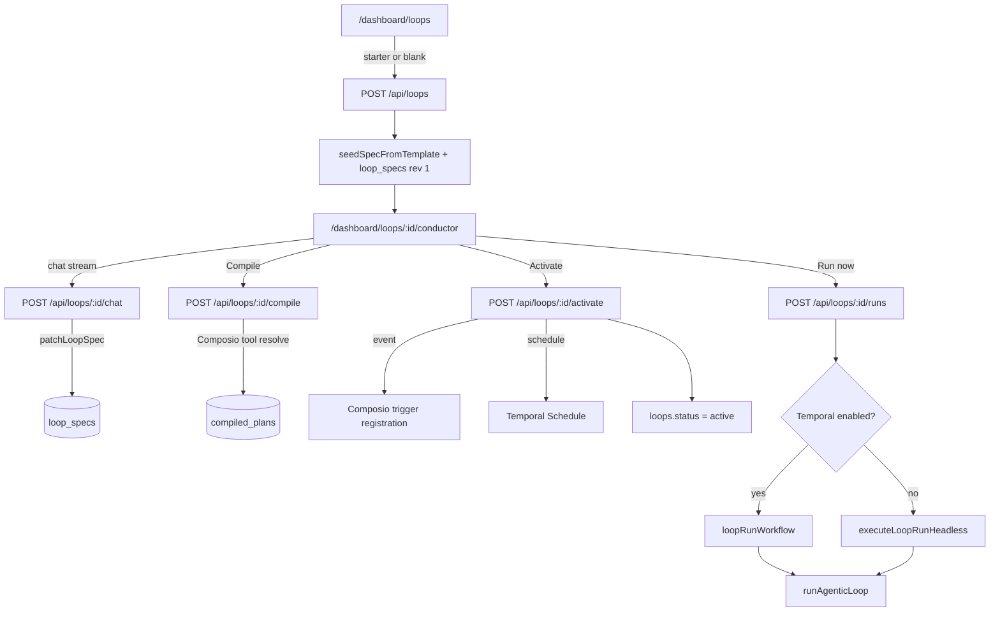
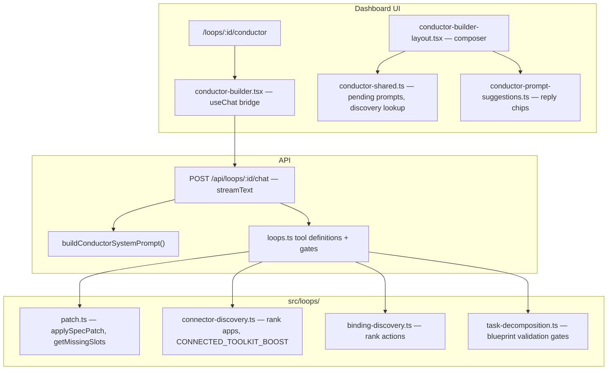
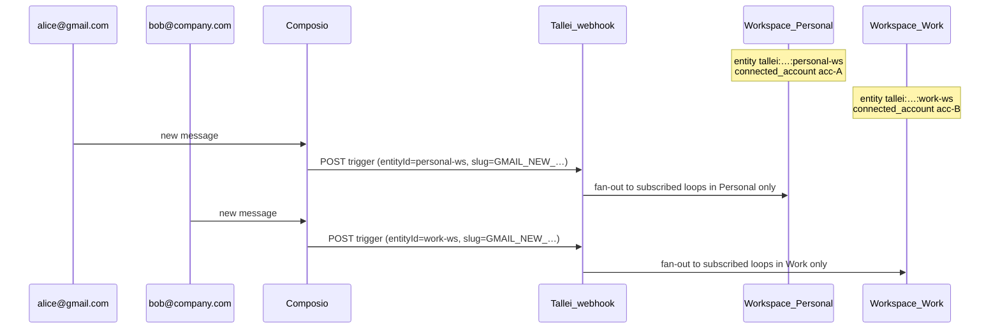

# Conductor — loop authoring & runtime

**Conductor** is Tallei's conversational loop engine: describe what you want in chat, patch a `loop_spec_v1`, compile to a runnable plan, activate triggers, and execute via Temporal or the same `runAgenticLoop` path inline when Temporal is off.

The UI lives at `/dashboard/loops/:loopId/conductor`. Backend domain code is in `src/loops/`; connectors in `src/integrations/composio/`; durable execution in `src/temporal/`.

> **Note:** `src/services/conductor/` is a legacy stub from the pre–loop-engine spec-run stack. The active Conductor flow uses `src/loops/` + `/api/loops/*`, not `/api/conductor/*`.

---

## End-to-end flow



| Phase | What happens | Key tables |
|-------|----------------|------------|
| **Create** | Loop row + spec draft from template | `loops`, `loop_specs` |
| **Conductor chat** | LLM patches spec via tools | `loop_specs` (revision++), `loop_chat_threads` (`kind=build`) |
| **Compile** | Bind capabilities → Composio actions; freeze trigger slug on plan | `compiled_plans` (no Composio side effects) |
| **Activate** | Provision Composio trigger + subscribe loop; mark plan active | `loops`, `workspace_trigger_channels`, `loop_trigger_subscriptions` |
| **Run** | Planner loop + tools + optional approval | `loop_runs`, `loop_run_steps`, `loop_chat_threads` (`kind=run`), `approval_requests` |

---

## Conductor chat

**Route:** `POST /api/loops/:loopId/chat` (SSE stream, proxied by `dashboard/app/api/loops/[...path]/route.ts`)

**Model:** `getStreamingLanguageModel("conductor")` → `TALLEI_CONDUCTOR__MODEL` (OpenCode Zen by default). **One model, one stream** — there is no separate “intent analyst” or planner pre-pass in the build chat. Conductor analyzes intent inline and patches the spec via `patchLoopSpec`.

**System prompt:** `buildConductorSystemPrompt()` in `src/loops/planning-agent.ts` — ownership-first: Conductor resolves compile blockers autonomously; interrupts the user only when a preference materially changes what the loop does.

**Tools exposed to the LLM:**

| Tool | Server execute? | Purpose |
|------|-----------------|--------|
| `patchLoopSpec` | yes | Apply a partial spec patch (`intent`, `taskBlueprint`, bindings, trigger, output, agent, approval). Gated: bindings/triggers/output.connector blocked until blueprint connectors are chosen. |
| `listConnectorCatalog` | yes | Scoped toolkit lookup when `toolkit` is passed; full catalogue only when browsing without a filter. Use `includeTriggers: true` for event slugs. |
| `discoverConnectorsForBlueprint` | yes | Rank apps for the whole blueprint (each app once). Returns `askOptions`, `recommendedOptionIds`, `defaultQuestion`. Connected apps get a ranking boost only — user always picks via `pickConnectorApp`. |
| `pickConnectorApp` | **no** (UI-only) | Present app picker; optional `question` text only — options come from the last discovery output in the transcript. |
| `discoverBindings` | yes | Search + rank Composio **actions** within a **chosen** connector |
| `listConnectors` | yes | Limited session connector list (prefer catalogue + discovery) |
| `listTriggers` | yes | List Composio event triggers for a toolkit |
| `listActions` | yes | Full action dump for one toolkit |
| `connectToolkit` | yes | Start OAuth for a toolkit |
| `askQuestion` | **no** (UI-only) | **Business forks only** — delivery mode, approval, schedule, ambiguous destination. **Forbidden:** connector app choice, Yes/No to confirm a connected app, Composio/API details. |
| `presentReplyOptions` | **no** (UI-only) | Clickable chips for compile / test / activate confirmations |
| `compileLoop` / `testRunLoop` / `activateLoop` | yes | Go-live path after spec is ready |

The dashboard shows a **Loop spec** sheet (`ConductorSpecSheet`) when `spec.taskBlueprint` is set — outcome roles, connector choices, missing slots, compile/run actions.

---

## Conductor architecture (build chat)

### Layers



### Key UI files

| File | Role |
|------|------|
| `dashboard/src/components/conductor-builder.tsx` | `useChat` transport, spec meta sync |
| `dashboard/src/components/conductor/conductor-builder-layout.tsx` | Composer: pending question vs free-text vs thinking indicator |
| `dashboard/src/components/conductor/conductor-builder-chat.tsx` | Transcript + tool part rendering |
| `dashboard/src/components/conductor/conductor-shared.ts` | `findPendingInteractivePrompt`, `findLatestConnectorDiscovery`, blueprint connector checks, Yes/No → app picker remap |
| `dashboard/src/components/conductor/builder-connector-prompt.tsx` | App card picker (`questionId: connector-app`) |
| `dashboard/src/components/ai-elements/interactive-prompt-menu.tsx` | Generic `askQuestion` / `pickConnectorApp` answer UI |
| `dashboard/src/lib/conductor-prompt-suggestions.ts` | Heuristic Yes/compile/test chips when no pending tool prompt |

### Chat transport behavior

- **`sendAutomaticallyWhen: lastAssistantMessageIsCompleteWithToolCalls`** — after the user answers a UI tool (`pickConnectorApp`, `askQuestion`, `presentReplyOptions`), the stream continues without an extra user message.
- **PUT `/api/loops/:id/chat`** — debounced transcript persistence (500ms).
- **GET `/api/loops/:id`** — hydrates `chatMessages` + latest spec on load.

### UI-only tools (no server `execute`)

`pickConnectorApp`, `askQuestion`, and `presentReplyOptions` are **human-in-the-loop** tools:

1. Conductor calls the tool → part state `input-available`.
2. Dashboard renders the composer prompt (app picker or question menu).
3. User selects → `addToolOutput` → stream auto-continues.
4. Conductor reads `output` on the next step and patches the spec or proceeds.

**UI remap:** if Conductor wrongly calls `askQuestion` with Yes/No to confirm an app, the dashboard remaps it to the app card picker (`BuilderConnectorPrompt`) using discovery options — user still chooses explicitly.

---

## Ideal Conductor turn sequence

This is the **intended** behavior the system prompt enforces. Deviations (e.g. `askQuestion` with Yes/No to confirm Gmail) are bugs — the UI may auto-correct some of them.

```mermaid
sequenceDiagram
  participant U as User
  participant C as Conductor LLM
  participant D as discoverConnectorsForBlueprint
  participant P as pickConnectorApp
  participant B as discoverBindings
  participant S as patchLoopSpec

  U->>C: Describe outcome (e.g. triage support email, draft replies)
  C->>S: patchLoopSpec — intent + taskBlueprint + agent.instructions
  Note over C: If draft AND send both mentioned with no sequence → askQuestion (delivery_mode) first

  C->>D: discoverConnectorsForBlueprint(outcomes)
  D-->>C: askOptions, recommendedOptionIds (connected apps ranked higher)

  C->>P: pickConnectorApp (optional question text)
  P-->>C: user picked app (or connectToolkit first if unconnected)
  C->>S: patchLoopSpec — selectedConnector on all pending non-transform outcomes

  C->>B: discoverBindings per connector
  B-->>C: suggestedBindings (auto-apply unless needsUserChoice)
  C->>S: patch bindings, event trigger, output, approval

  C->>U: Summarize choices; presentReplyOptions for compile/test when ready
```

### Outcome-first planning (unified Conductor)

1. **`patchLoopSpec`** → `intent` (`goal`, `outcome`, `successCriteria`) + `taskBlueprint` outcome roles on the first turn. Conductor derives these directly — no `decomposeTask` / nested analyst.
2. **`askQuestion`** only when a **business fork** is unresolved — chiefly **draft vs send** when both appear in the user message without clear sequencing.
3. **`discoverConnectorsForBlueprint`** once → **`pickConnectorApp`** always (user chooses; connected `*` is ranking hint only).
4. **`discoverBindings`** per chosen connector → `bindings[]` with optional `role`.
5. **`listTriggers`** + patch event trigger when the loop is event-driven.
6. **Compile path:** `compileLoop` → `testRunLoop` → `presentReplyOptions` → `activateLoop` after user confirms.

**Default connector rule:** one app powers **trigger, receive, draft, and send** unless the user explicitly asked for **separate apps** for receive vs send (e.g. “read from Zendesk, send via Gmail”). `applyPrimaryConnectorToBlueprint()` in `connector-discovery.ts` applies one slug to all pending non-`transform` outcomes.

---

## System prompt (`buildConductorSystemPrompt`)

Built fresh on **every** chat request. Structured for clarity without blowing the context window:

| Block | Purpose |
|-------|---------|
| **First principles** | Outcome-first, intent/blueprint, draft vs send fork |
| **Ownership** | Autonomous config, agent.instructions, bindings auto-apply |
| **Sequence** | 5-step build order |
| **Connectors & auto-apply** | `autoApplyConnector` fast path vs `pickConnectorApp` |
| **Tool playbook** | One-line tool index (UI tools included) |
| **Technical defaults** | Triggers, email.read |
| **Dynamic tail** | Workspace, connected `*`, blockers, **Next** hint, **Spec JSON once** |

**Why not spec twice?** An older prompt dumped `taskBlueprint` as its own JSON block *and* the full `LoopSpec` — duplicate tokens with no extra signal. Current prompt includes **one** `Spec JSON:` line (full spec, compact stringify).

**UI tools are not in the prompt as replacements for tool calls** — the prompt tells Conductor to invoke `pickConnectorApp`, `askQuestion`, and `presentReplyOptions` as tools. The dashboard renders those tools:

- **`pickConnectorApp`** → `BuilderConnectorPrompt` app cards
- **`askQuestion`** → `InteractivePromptMenu`
- **`presentReplyOptions`** + **`deriveConductorPromptSuggestions`** → suggestion chips above the composer when no pending tool prompt

**Auto-apply:** when `discoverConnectorsForBlueprint` returns `autoApplyConnector`, Conductor patches immediately; client may also auto-submit `pickConnectorApp` if the model called it anyway (`findAutoConnectorPromptTarget`).

### When Conductor **should** interrupt the user

| Situation | Tool | Example |
|-----------|------|---------|
| Draft vs send ambiguous | `askQuestion` | User said “draft and send replies” with no ordering |
| Connector choice (always) | `pickConnectorApp` | After discovery — show ranked app cards; user picks even if Gmail is connected |
| User picked unconnected app | `connectToolkit` + wait | Picker choice has “Needs connection” |
| Binding fork (rare) | `askQuestion` with discovery `askOptions` | Send immediately vs save draft — plain-language labels only |
| Ready to go live | `presentReplyOptions` | “Compile and test?” chips |
| Approval / schedule / unclear output destination | `askQuestion` | “Run daily at 9am?” |

### When Conductor **should not** interrupt (resolve autonomously)

| Situation | What to do instead |
|-----------|-------------------|
| Trigger type, Composio slug, fetch strategy | `listTriggers` + `discoverBindings` → patch |
| Agent instructions | Write operational brief from outcome + success criteria |
| Capability bundles (“Read & Send”) | Infer from intent; `discoverBindings` |
| Connected app is top-ranked | **Still show `pickConnectorApp`** — connected boosts rank, does not auto-select |

### Anti-patterns (do not do)

- **`askQuestion` with Yes/No to confirm a connected app** — use `pickConnectorApp`; UI remaps if model misbehaves.
- **Auto-selecting Gmail because it is connected** — user must always confirm via picker.
- **Per-role connector options** (Trigger: Gmail, Send: Gmail) — one app per loop in the picker.
- **Hand-built connector option lists** — always use `discoverConnectorsForBlueprint` output.
- **Patching bindings/triggers before blueprint connectors are chosen** — `validateConnectorChoicesBeforeSpecPatch` returns an error.

---

## Connector discovery

**Implementation:** `src/loops/connector-discovery.ts`

### `discoverConnectorsForBlueprint`

1. For each pending non-`transform` outcome, run `discoverConnectorsForOutcome` (Composio tool search + catalogue hints + `CONNECTED_TOOLKIT_BOOST = 4` for connected apps).
2. Merge candidates **by connector slug** (each app appears once).
3. Sort by score → `askOptions` + top-5 `recommendedOptionIds`.
4. **Always** follow with `pickConnectorApp` — connected status affects ranking only; the user chooses the app.

### Default picker question

Hardcoded constant `DEFAULT_CONNECTOR_PICK_QUESTION`:

> Which app should power this loop? Triggers and actions are configured automatically after you pick.

Conductor may pass a custom `question` string to `pickConnectorApp`. The UI injects options from the **last** `discoverConnectorsForBlueprint` output in the transcript (`findLatestConnectorDiscovery`).

### Client-side prompt handling

`dashboard/src/components/conductor/conductor-shared.ts`:

- `findPendingInteractivePrompt(messages, spec)` — shows picker when blueprint still needs connectors; skips when all non-transform outcomes have `selectedConnector`.
- `isConnectorConfirmationQuestion` — detects mistaken Yes/No connector confirms; remaps to `BuilderConnectorPrompt` with discovery options so the user picks an app card instead.

### Stale discovery note

`findLatestConnectorDiscovery` scans **backward through all messages** for the most recent `discoverConnectorsForBlueprint` output. `blueprintNeedsConnectorPick(spec)` suppresses the picker once connectors are chosen on the spec.

---

## `taskBlueprint` & spec gates

**Shape** (patched via `patchLoopSpec`):

```json
{
  "version": 1,
  "summary": "Support email triage and reply drafting",
  "outcomes": [
    { "id": "…", "role": "trigger", "description": "…", "candidates": [], "status": "pending" },
    { "id": "…", "role": "source", "description": "…", "candidates": [], "status": "pending" },
    { "id": "…", "role": "transform", "description": "…", "candidates": [], "status": "pending" },
    { "id": "…", "role": "destination", "description": "…", "candidates": [], "status": "pending" }
  ]
}
```

After connector pick, pending outcomes get `selectedConnector` + `status: "chosen"`. `transform` outcomes do not require a connector.

**Gate:** `validateConnectorChoicesBeforeSpecPatch()` in `task-decomposition.ts` blocks patches that touch `bindings`, `trigger` (event), or `output.connector` until every non-`transform` outcome is `chosen` or `skipped`.

**Readiness:** `getMissingSlots()` — Conductor shows “Ready to compile” in the spec sheet when empty.

---

## Example: support ticket email loop (ideal path)

**User:** “Automatically classify incoming support tickets by priority and draft personalized replies for review.”

| Step | Conductor action |
|------|------------------|
| 1 | `patchLoopSpec` — `intent.outcome` = classified tickets + drafts ready for review; `taskBlueprint` with trigger/source/transform/destination roles; `agent.instructions` operational brief |
| 2 | No `askQuestion` — “draft for review” is clear (not send-immediately) |
| 3 | `discoverConnectorsForBlueprint` — Gmail connected, top ranked |
| 4 | `pickConnectorApp` — user confirms Gmail (or picks another app) |
| 5 | `patchLoopSpec` — `selectedConnector: "gmail"` on trigger/source/destination outcomes |
| 6 | `listTriggers` + `discoverBindings` → patch bindings, event trigger, output, approval |
| 7 | Summarize; `presentReplyOptions` when compile blockers empty |
| 7 | Tell user what was configured; `presentReplyOptions` when compile blockers are empty |

**User:** Same prompt but also says “and send the email” without sequencing.

| Step | Conductor action |
|------|------------------|
| 1 | `patchLoopSpec` — provisional blueprint |
| 2 | **`askQuestion`** — “Should replies be sent automatically or saved as drafts for your review first?” |
| 3 | User answers → patch resolved `intent.outcome` |
| 4 | Continue connector discovery as above |

---

## Binding discovery

After connectors are chosen, `discoverBindings` resolves Composio actions. Returns `suggestedBindings` — Conductor should auto-apply them. `needsUserChoice` is rare (send vs draft forks only); use discovery’s plain-language `askOptions`, never invented capability bundles.

**Connectors in chat only** — the Conductor UI does not poll connectors separately; OAuth is initiated through `connectToolkit` in conversation.

**API:** `GET /api/connectors/catalog` — merged catalogue for UI and `listConnectorCatalog`.

**Conductor ownership:** The model configures triggers, bindings, `agent.instructions`, and output from the user's goal — not a checklist of missing slots.

### Chat persistence (`loop_chat_threads`)

Build and run transcripts share one table with two thread kinds:

| `kind` | Scope | Linked fields | Written by |
|--------|--------|---------------|------------|
| `build` | One row per `(loop_id, tenant_id, user_id)` | `spec_revision`, `compiled_plan_id` updated on spec save / compile | Conductor `POST`/`PUT` chat, `saveSpecDraft`, `saveCompiledPlan` |
| `run` | One row per `run_id` | `compiled_plan_id` | `createLoopRun`, `insertRunStep`, `deliverOutputActivity`, `failRunActivity` |

- **GET** `/api/loops/:id` returns `chatMessages` + `buildChat: { specRevision, compiledPlanId }`.
- **GET** `/api/loops/:id/runs/:runId` returns `chatMessages` (run transcript).
- Run steps are mirrored into UIMessage-shaped JSON via `stepToChatMessages()` in `src/loops/loop-chat.ts`.

Legacy `loop_conductor_chats` rows migrate into `loop_chat_threads` on schema init.

---

## Loop spec (`loop_spec_v1`)

Defined in `src/loops/spec.ts`.

| Area | Fields |
|------|--------|
| **Intent** | `goal`, optional `constraints` |
| **Trigger** | `manual`, `schedule` (cron + timezone), or `event` (`source` + required `composioSlug`, optional `eventType` label) |
| **Profile** | `agentic` (default), `monitor`, `sync` |
| **Bindings** | `{ connector, capability, role?, optional? }[]` |
| **Task blueprint** | `taskBlueprint` — outcome roles, connector candidates, user choices (Conductor working plan) |
| **Agent** | `instructions`, `maxSteps` |
| **Approval** | `mode`, `sensitiveCapabilities`, `onTimeout` |
| **Output** | `kind`, `target` |

**Starter templates** (`seedSpecFromTemplate` in `src/loops/patch.ts`): `research_digest`, `newsletter_loop`, `lead_scoring`, `support_auto_reply`, `smart_alerts`, `crm_sync`.

**Readiness:** `getMissingSlots()` — Conductor shows “Ready to compile” when empty.

---

## Compile

**Route:** `POST /api/loops/:loopId/compile`

`compileLoopSpec()` (`src/loops/compiler.ts`):

1. Validates spec (workspace, cron, profile-specific fields).
2. Lists connected Composio toolkits for the workspace entity.
3. For each binding, resolves a Composio action slug (static map → search → toolkit listing).
4. Builds `toolCatalog`: `{ id, capability, connector, actionSlug, credentialRef, sensitive, toolkitVersion?, plannerCard, outputSchema? }`. Every tool **must** have a `plannerCard` (no field-name-only fallback).
5. Runs one Composio session search at compile (`fetchConnectorPlaybook`) — **required** for agentic loops with bound tools. Failures surface as compile errors (`COMPOSIO_NOT_CONFIGURED`, `PLAYBOOK_SEARCH_FAILED`, `PLAYBOOK_SCHEMA_MISSING`). Snapshots `connectorPlaybook` (workflow steps, pitfalls) on the plan. May auto-add related prerequisite tools (e.g. `email.get` when `email.read` is bound).
6. Persists `compiled_plans` with content hash.

**Recompile required** after playbook changes. Plans without `connectorPlaybook` / per-tool `plannerCard` are rejected at parse and runtime.

Event runs use the frozen playbook at runtime plus per-run trigger context from the webhook payload — no Composio search on each run.

Common errors: `CONNECTOR_NOT_CONNECTED`, `UNSUPPORTED_CAPABILITY`, `INVALID_CRON`, `INVALID_TRIGGER_SLUG`.

### Event triggers (architecture)

Two fields, two meanings — enforced in `src/loops/event-trigger.ts`:

| Field | Meaning | Example |
|-------|---------|---------|
| `trigger.source` | Connector / toolkit | `gmail` |
| `trigger.composioSlug` | Composio trigger type slug | `GMAIL_NEW_GMAIL_MESSAGE` |

**Three layers (defense in depth):**

1. **Shape (sync)** — Zod on `loop_spec_v1` rejects lowercase toolkit names in `composioSlug`. `getMissingSlots()` requires a valid-shaped slug, not just non-empty.
2. **Canonicalize (async, on patch)** — `resolveEventTriggerPatch()` resolves hints via Composio catalogue before saving the spec draft.
3. **Freeze (async, on compile)** — `validateEventTriggerForCompile()` verifies the slug exists; the canonical value is stored on `compiled_plans`. **Compile does not provision Composio** — no webhook instances are created until activate.

Do not rely on Conductor prompts alone — invalid states are rejected at the domain boundary.

**Built ≠ listening:** A loop can be compiled (and even show `compiledPlanId` in the UI) while Composio has zero trigger instances. The Conductor spec sheet shows provisioning status: compiled → activate → listening.

---

## Activate

**Route:** `POST /api/loops/:id/activate` with `{ compiledPlanId }`

**Order (event loops):** `provisionEventTrigger` (resolve slug → upsert Composio instance → subscribe) → `activateCompiledPlan` → Temporal schedule. On failure after provision starts, `unregisterLoopEventTrigger` rolls back.

1. **Event trigger:** `registerLoopEventTrigger()` → `provisionEventTrigger()` — resolves `composioSlug` or `eventType`, ensures one shared Composio trigger instance per `(workspace, connected_account, composio_slug)` in `workspace_trigger_channels` (ref-counted; recreates instance when `composio_instance_id` is null after pause), subscribes the loop in `loop_trigger_subscriptions`. Returns `eventTrigger: { subscribed, composioTriggerSlug, composioInstanceId }`.
2. Sets `loops.active_plan_id`, `status = active`.
3. **Schedule trigger:** `upsertLoopSchedule()` when `TALLEI_TEMPORAL__ENABLED=true`.
4. **Manual trigger:** no external registration.

There is **no repair/sync endpoint** — pause → activate re-runs provisioning idempotently.

**Pause / resume** unregisters Composio triggers and pauses Temporal schedules. Resume re-provisions event triggers.

---

## Event triggers & webhooks

Event loops use **shared trigger channels** inside each workspace. Composio delivers webhooks to a single Tallei URL; routing is by `entityId` (workspace) + `trigger_slug` + subscriptions.

### Composio entity per workspace

Each workspace gets its own Composio entity and OAuth connections:

```
tallei:{tenantId}:{userId}:{workspaceId}
```

Connectors are resolved against that entity (`getComposioEntityId` in `src/integrations/composio/client.ts`). **Personal** and **Work** therefore have separate `connected_account_id` values even for the same toolkit (e.g. Gmail).

### Channel key (one Composio instance per channel)

Table `workspace_trigger_channels` is unique on:

```
(workspace_id, connected_account_id, composio_trigger_slug)
```

| Layer | Table | Role |
|-------|--------|------|
| **Channel** | `workspace_trigger_channels` | One Composio `triggerInstances.upsert` per channel; `ref_count` tracks subscribers |
| **Subscription** | `loop_trigger_subscriptions` | Each active event loop points at a channel (`loop_id` unique) |
| **Idempotency** | `webhook_event_deliveries` | Skip duplicate runs for `(external_event_id, loop_id)` on Composio retries |

**Activate** (`provisionEventTrigger`): creates or reuses a channel. If a channel row exists but `composio_instance_id` is null (e.g. after pause released the instance), Composio `triggerInstances.upsert` runs again. If the channel is healthy, increment `ref_count` only.

**Pause** (`unregisterLoopEventTrigger`): decrement `ref_count`; delete the Composio instance only when `ref_count` reaches 0.

### Two workspaces, two Gmail accounts

Typical case: different inboxes per workspace.



| Workspace | Composio entity suffix | Gmail account | Trigger instance | Webhook `entityId` |
|-----------|------------------------|---------------|------------------|--------------------|
| Personal | `…:personal-ws-id` | alice@gmail.com | Instance A | `tallei:…:personal-ws-id` |
| Work | `…:work-ws-id` | bob@company.com | Instance B | `tallei:…:work-ws-id` |

Both hit the **same** endpoint (`POST /api/webhooks/composio`), but Composio sends **separate events** per trigger instance / connected account. `dispatchComposioTriggerToLoops` resolves the workspace from `entityId` and only starts loops in that workspace.

### Multiple loops in one workspace

Two loops in **Personal** on the same Gmail account and same `composioSlug` (e.g. `GMAIL_NEW_GMAIL_MESSAGE`):

- **One** channel and **one** Composio trigger instance (`ref_count = 2`)
- **One** webhook per new email
- Fan-out to **both** loops (each run deduped by `webhook_event_deliveries`)

### Edge case: same Gmail in two workspaces

If the user connects the **same** Google account in both Personal and Work (two OAuth flows, two Composio entities):

- **Two** channels and **two** Composio trigger instances
- Each new email can produce **two** webhooks (one per workspace entity)

That is intentional: workspaces stay isolated. To avoid duplicate processing of one inbox, use a single workspace for that account.

### Webhook handler flow

1. Composio `POST` → `normalizeComposioWebhookPayload` (`src/integrations/composio/webhooks.ts`)
2. `dispatchComposioTriggerToLoops` (`src/integrations/composio/webhook-dispatch.ts`)
3. `buildAuthContextFromEntity(entityId)` → `workspaceId` (required)
4. `findActiveLoopsByComposioTriggerSlug(workspaceId, triggerSlug)` — joins `loop_trigger_subscriptions` + `workspace_trigger_channels`
5. For each loop: `claimWebhookEventDelivery` → `createLoopRun` → Temporal or headless execution

See [temporal-loops.md](./temporal-loops.md#webhooks) for endpoint URLs, signature headers, and env vars.

---

## Run (runtime)

### Triggers

| Kind | Source |
|------|--------|
| `manual` | Conductor **Run now** or `POST /api/loops/:id/runs` |
| `schedule` | Temporal Schedule on cron |
| `event` | Composio webhook → `dispatchComposioTriggerToLoops` (fan-out to subscribed loops in the **same workspace**; deduped via `webhook_event_deliveries`) |

### Execution

All profiles share the same entrypoint (`loopRunWorkflow` when Temporal is on, `executeLoopRunHeadless` when off).

| Profile | Runner |
|---------|--------|
| `agentic` | `runAgenticLoop` (`src/loops/agentic-run.ts`) — planner → optional approval (DB poll) → tool execute → deliver |
| `monitor` | Rule evaluation on metric sample + optional notify |
| `sync` | Preview read both sides (full sync v2) |

**Agentic loop** (single implementation for Temporal and headless):

1. `plannerActivity` — LLM returns `tool_call` or `finish`. Prompt includes frozen `connectorPlaybook`, per-tool `plannerCard`, and event trigger context. Plans without playbook/cards fail fast.
2. Sensitive tools or `approval.mode === "ask"` → `approval_requests`; runner polls DB until decided or timeout.
3. `executeToolActivity` — Composio with runtime arg clamps (`include_payload: false`, list limits).
4. `deliverOutputActivity` — mark run completed, persist workspace memory.

Temporal workflows delegate agentic runs to `runAgenticLoopActivity` (no duplicate inline loop). Approval API still signals workflows when Temporal is on, but the runner resolves decisions via DB polling.

**Run detail:** `/dashboard/loops/:loopId/runs/:runId` — steps timeline + inline approval when pending.

**Approval inbox:** `/dashboard/approvals` — `POST /api/approvals/:id/decide` signals the Temporal workflow.

### Profiles

| Profile | Runtime |
|---------|---------|
| `agentic` | Planner + tools + approvals |
| `monitor` | Rule evaluation on metric sample + optional notify |
| `sync` | Preview read both sides (full sync v2) |

---

## HTTP API summary

| Method | Path | Purpose |
|--------|------|---------|
| `GET` | `/api/loops` | List loops |
| `POST` | `/api/loops` | Create loop |
| `GET` | `/api/loops/:id` | Loop + latest spec |
| `POST` | `/api/loops/:id/chat` | **Conductor chat stream** (persists transcript on finish) |
| `PUT` | `/api/loops/:id/chat` | Save Conductor chat messages |
| `POST` | `/api/loops/:id/compile` | Compile spec |
| `POST` | `/api/loops/:id/activate` | Activate plan |
| `POST` | `/api/loops/:id/pause` / `resume` | Lifecycle |
| `GET` | `/api/loops/:id/runs` | List runs |
| `GET` | `/api/loops/:id/runs/:runId` | Run + steps + pending approval |
| `POST` | `/api/loops/:id/runs` | Manual run |
| `GET` | `/api/connectors` | Workspace connector status |
| `GET` | `/api/connectors/:toolkit/triggers` | Composio trigger catalogue for toolkit |
| `GET` | `/api/connectors/:toolkit/actions` | Composio action catalogue for toolkit |
| `GET` | `/api/approvals` | Pending approvals |
| `POST` | `/api/approvals/:id/decide` | Approve / reject / edit |

---

## Dashboard routes

| Path | Page |
|------|------|
| `/dashboard/loops` | Loop list + starter cards |
| `/dashboard/loops/new` | Blank loop |
| `/dashboard/loops/:loopId/conductor` | **Conductor** (chat + spec + compile/activate/run) |
| `/dashboard/loops/:loopId/runs` | Run history |
| `/dashboard/loops/:loopId/runs/:runId` | Run detail |
| `/dashboard/approvals` | Approval inbox |

`/dashboard/loops/:loopId/builder` redirects to `conductor` for old bookmarks.

---

## Environment variables

### Conductor & LLM

```env
TALLEI_LLM__PROVIDER=opencode
TALLEI_LLM__OPENCODE_API_KEY=...
TALLEI_LLM__OPENCODE_BASE_URL=https://opencode.ai/zen/v1
TALLEI_CONDUCTOR__MODEL=gpt-5.3-codex          # Conductor chat (tools + streaming)
TALLEI_LLM__OPENCODE_MODEL=deepseek-v4-flash   # Runtime planner
```

`TALLEI_CONDUCTOR__MODEL` falls back to legacy `TALLEI_LOOP_BUILDER__OPENAI_MODEL` if set.

### Temporal

```env
TALLEI_TEMPORAL__ENABLED=true
TALLEI_TEMPORAL__ADDRESS=127.0.0.1:7233
TALLEI_TEMPORAL__TASK_QUEUE=tallei-loops
```

### Composio

```env
TALLEI_CONNECTORS__COMPOSIO_API_KEY=...
TALLEI_CONNECTORS__COMPOSIO_WEBHOOK_SECRET=...
TALLEI_CONNECTORS__COMPOSIO_ENTITY_PREFIX=tallei
```

Entity ID format: `tallei:{tenantId}:{userId}:{workspaceId}`.

See also: [temporal-loops.md](./temporal-loops.md), [composio integration guide](../src/services/conductor/composio.md).

---

## Key source files

```
src/loops/
  spec.ts              LoopSpec, CompiledPlan, planner decision schemas
  patch.ts             applySpecPatch, templates, missing slots
  planning-agent.ts    buildConductorSystemPrompt + runtime planner prompts
  conductor-tools.ts   Zod schemas for Conductor tools (askQuestion, pickConnectorApp, …)
  connector-discovery.ts  Blueprint app ranking, applyPrimaryConnectorToBlueprint
  binding-discovery.ts Composio action ranking for outcomes
  task-decomposition.ts  Blueprint validation gates (validateConnectorChoicesBeforeSpecPatch)
  compiler.ts          Spec → compiled plan + Composio resolution
  service.ts           create, compile, activate, run orchestration
  store.ts             Postgres CRUD

src/temporal/            loopRunWorkflow, activities, schedules, worker
src/integrations/composio/   connectors, tools, execute, triggers, webhooks
src/transport/http/routes/loops.ts   Conductor chat stream + tool execute handlers

dashboard/
  src/components/conductor-builder.tsx
  src/components/conductor/   layout, chat, shared prompt logic, connector picker, spec sheet
  src/lib/conductor-prompt-suggestions.ts
  app/dashboard/loops/[loopId]/conductor/page.tsx
  app/api/loops/
```

---

## Local dev quickstart

```bash
docker compose --profile temporal up -d   # optional
npm run dev                             # API :3000
npm run temporal:worker                 # if Temporal enabled
cd dashboard && npm run dev             # UI :3001
```

1. Open `/dashboard/loops` → pick a starter.
2. Conductor chat → connect Gmail via `connectToolkit` if needed.
3. **Compile** → **Activate** → **Run now**.
4. Watch run at `/dashboard/loops/:id/runs/:runId`; approve sensitive sends inline or in `/dashboard/approvals`.
