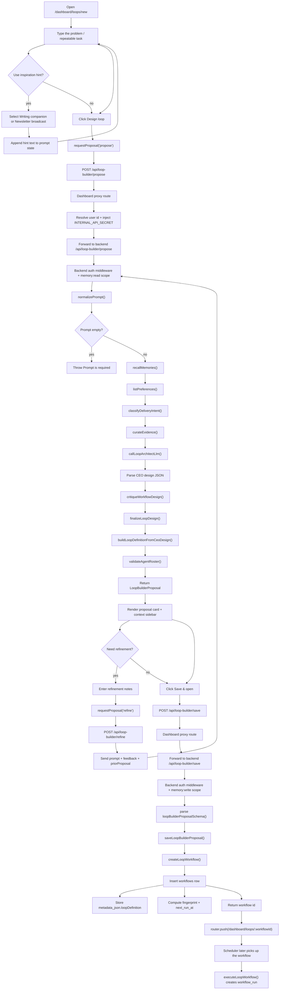

# `/dashboard/loops/new` Loop Builder Page

This page is the user-facing entry point for creating a new loop in the dashboard.

It is a client component that:

- collects the user prompt
- optionally appends an inspiration hint
- requests a loop proposal from the backend builder API
- lets the user refine the proposal
- saves the proposal as a workflow
- redirects to the new workflow detail page after save

Source file:

- [`dashboard/app/dashboard/loops/new/page.tsx`](/Users/dinudayaggahavita/Documents/work/tallei-ai/dashboard/app/dashboard/loops/new/page.tsx)

Proxy route used by the page:

- [`dashboard/app/api/loop-builder/[...path]/route.ts`](/Users/dinudayaggahavita/Documents/work/tallei-ai/dashboard/app/api/loop-builder/[...path]/route.ts)

## What The Page Contains

The page is organized into two columns:

- left column: prompt entry, design actions, inspiration, refinement notes, and the rendered proposal
- right column: builder context such as schedule, tools, channels, rationale, memory, and preferences

The page state is intentionally small:

- `prompt`
- `feedback`
- `templateHint`
- `inspirationOpen`
- `proposal`
- `busy`
- `error`

## Actual Creation Flow

## Step-by-Step Behavior

### 1. Prompt capture

The main textarea asks, "What should repeat?"

The user enters a natural-language description of the recurring work they want turned into a loop.

This value is stored in `prompt`.

### 2. Inspiration hints

The "Inspiration" panel is optional.

It offers two fixed starter patterns:

- Writing companion
- Newsletter broadcast

Clicking one:

- sets the `templateHint`
- appends the hint text to the current prompt

Important detail:

- the hint is only guidance
- the builder still designs a bespoke loop

### 3. Proposal request

When the user clicks **Design loop**, the page sends:

- `prompt`
- `templateId` only if the selected hint is not `custom`

to:

- `POST /api/loop-builder/propose`

The request is handled by the dashboard proxy route, which forwards it to the backend loop-builder API.

If the backend returns a validation error, the page surfaces the first detail message from the response.

If the proxy is misconfigured, unauthorized, or times out, the page shows the proxy error banner instead of a proposal.

### 4. Proposal rendering

Once a proposal comes back, the page renders:

- title
- summary
- agent count
- parent agent, if present
- each child agent and its tools
- schedule
- suggested tools
- suggested channels
- rationale
- memories
- preferences

The proposal card is read-only. It is a preview of the generated loop, not an editable form.

### 5. Refinement loop

After the first proposal, the user can enter refinement notes.

Clicking **Refine** sends:

- the current `prompt`
- the refinement `feedback`
- the current `proposal` as `priorProposal`

to:

- `POST /api/loop-builder/refine`

This lets the CEO builder reuse the prior proposal as context and revise the loop rather than starting from scratch.

### 6. Save and redirect

Clicking **Save & open** sends the proposal to:

- `POST /api/loop-builder/save`

If the backend returns a workflow id, the page redirects to:

- `/dashboard/loops/:workflowId`

That is the handoff from design mode to workflow detail mode.

## Stores And Persistence

| Store | What lives there | How this page uses it |
|---|---|---|
| Browser React state | `prompt`, `feedback`, `templateHint`, `proposal`, `busy`, `error` | Temporary UI state while the user designs the loop |
| Memory store | Relevant memories returned by `recallMemories()` | Evidence for the CEO architect |
| Preference store | Relevant saved preferences returned by `listPreferences()` | Evidence for tone, structure, and recurring choices |
| `workflows` table | Durable loop definition + schedule + metadata | Created when the proposal is saved |
| `workflow_runs` and runtime tables | Execution state, tasks, comments, events, artifacts, gates | Not touched by this page; they are filled later by the executor |

The important distinction is that the page never writes execution data directly. It only creates the workflow definition that the scheduler and executor will use later.

## Backend Handoff

The page does not call the backend executor directly.

It only speaks to the dashboard proxy route:

- [`dashboard/app/api/loop-builder/route.ts`](/Users/dinudayaggahavita/Documents/work/tallei-ai/dashboard/app/api/loop-builder/route.ts)
- [`dashboard/app/api/loop-builder/[...path]/route.ts`](/Users/dinudayaggahavita/Documents/work/tallei-ai/dashboard/app/api/loop-builder/[...path]/route.ts)

That proxy:

- resolves the authenticated dashboard user
- injects `X-Internal-Secret`
- forwards the request to the backend API
- returns the backend response as JSON

The backend route does the actual business logic:

- `POST /api/loop-builder/propose` returns a proposed loop
- `POST /api/loop-builder/refine` reuses the prior proposal and adjusts it
- `POST /api/loop-builder/save` persists the approved loop as a workflow

## UI Layout Map

| Area | Purpose |
|---|---|
| Header | Page title, subtitle, and back link |
| Prompt card | Main prompt textarea and action buttons |
| Inspiration card | Optional pattern hints that append to the prompt |
| Refinement card | Follow-up notes for iterative proposal updates |
| Proposal card | Generated loop preview, parent agent, and child agents |
| Context sidebar | Schedule, tools, channels, rationale, memory, preferences |

## State And Actions

| State | Used for |
|---|---|
| `prompt` | Raw user intent |
| `feedback` | Refinement notes |
| `templateHint` | Selected inspiration pattern |
| `inspirationOpen` | Collapsed/expanded inspiration panel |
| `proposal` | Current builder proposal |
| `busy` | Button loading state |
| `error` | Validation/backend error display |

## Important Files

- [`dashboard/app/dashboard/loops/new/page.tsx`](/Users/dinudayaggahavita/Documents/work/tallei-ai/dashboard/app/dashboard/loops/new/page.tsx)
- [`dashboard/app/api/loop-builder/route.ts`](/Users/dinudayaggahavita/Documents/work/tallei-ai/dashboard/app/api/loop-builder/route.ts)
- [`dashboard/app/api/loop-builder/[...path]/route.ts`](/Users/dinudayaggahavita/Documents/work/tallei-ai/dashboard/app/api/loop-builder/[...path]/route.ts)
- [`src/services/loop-builder/intent-resolver.ts`](/Users/dinudayaggahavita/Documents/work/tallei-ai/src/services/loop-builder/intent-resolver.ts)
- [`src/services/loop-builder/ceo-designer.ts`](/Users/dinudayaggahavita/Documents/work/tallei-ai/src/services/loop-builder/ceo-designer.ts)
- [`src/services/loop-executor/creator.ts`](/Users/dinudayaggahavita/Documents/work/tallei-ai/src/services/loop-executor/creator.ts)

## Relationship To The Broader Flow

Use this page doc when you want to understand the dashboard UX and request path.

Use [Loop Builder End-to-End](./loop-builder-end-to-end.md) when you want the full build-to-save-to-execute lifecycle.

Use [Loop Executor Architecture](../loop-executor-architecture.md) when you want the runtime side after save.
