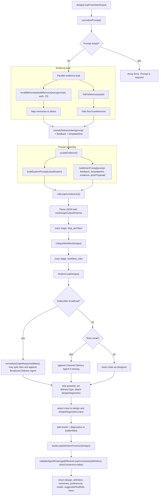

# Loop Builder CEO Designer

This document traces the internal architect stage that turns a raw loop prompt into a structured loop design and a persisted-ready `LoopDefinition`.

The file this page describes is:

- [`src/services/loop-builder/ceo-designer.ts`](../../src/services/loop-builder/ceo-designer.ts)

It is the module behind the loop-builder proposal path, but it is not the persistence layer itself. It:

- reads memory and preference evidence
- classifies the delivery shape
- asks the CEO architect LLM for a bespoke roster
- critiques the roster for structural problems
- normalizes the roster for delivery rules
- builds a definition that the workflow creator can persist
- returns a trace of every stage

What it does **not** do:

- it does not insert the workflow row
- it does not start execution
- it does not run the child agents
- it does not write the final output content

## Public Surface

The module exports two primary functions:

- `designLoopFromIntent()` - the full design pipeline
- `channelsFromDesign()` - a small fallback helper used by the proposal wrapper

It is called upstream by:

- [`resolveLoopBuilderIntent()`](../../src/services/loop-builder/intent-resolver.ts)
- [`refineLoopBuilderProposal()`](../../src/services/loop-builder/intent-resolver.ts)

It hands off downstream to:

- [`buildLoopDefinitionFromCeoDesign()`](../../src/services/loop-executor/creator.ts)
- [`validateAgentRoster()`](../../src/services/loop-executor/tool-catalog.ts)

## Data Contracts

This file defines the contracts that keep the builder structured:

- `CeoDesignOutput` - the LLM response shape before final persistence
- `LoopDeliveryClassification` - the deterministic delivery interpretation
- `WorkflowCriticResult` - the structural safety report
- `LoopBuilderTrace` - the staged audit trail
- `FinalizedLoopDesign` - the design after normalization and diagnostics are attached

The LLM is constrained to emit a strict JSON object that matches `ceoDesignOutputSchema`.

### CEO design response shape

The LLM is expected to produce:

- `title`
- `summary`
- `strategyText`
- `agentGraph`
- `schedule`
- optional `deliveryType`
- optional `presetId`
- `builderMeta` with `designedBy` and `preApproved`
- `rationale`
- `suggestedChannels`

Important detail:

- `sourceTemplateIds` are intentionally excluded from the LLM schema so the model does not label the result with template pattern metadata.

### Delivery classification shape

The deterministic classifier returns:

- `deliveryType` - `newsletter`, `plain`, or `none`
- `deliveryTarget` - `subscriber_list`, `team_email`, `operator`, or `none`
- `approvalChannels` - always initialized to `primary`
- `cadenceGuess` - a cron guess derived from words like `daily`, `weekly`, or `monthly`
- `externalActionRequired` - whether delivery leaves the system
- `subscriberBroadcastRequired` - whether the prompt implies an audience broadcast
- `explicitLegacyPresetRequested` - currently always `false`

### Critic shape

The critic reports:

- `pass`
- `riskLevel`
- `issues`
- `requiredFixes`
- `optionalImprovements`

Important detail:

- the critic is advisory in this code path; it does not automatically rewrite the roster
- the finalizer applies its own normalization, and roster validation is still the hard safety gate

### Trace shape

The trace is a list of stage records with:

- `stage`
- `model`
- `input`
- `output`

The stages are recorded in order and later attached to both the returned design and the proposal payload.

## Actual Flow

## Stage By Stage

### 1. Normalize the prompt

`normalizePrompt()` trims leading and trailing whitespace and collapses repeated whitespace into single spaces.

The public function fails immediately if the normalized prompt is empty.

### 2. Load memory and preference evidence

`designLoopFromIntent()` loads evidence in parallel:

- `recallMemories()` with a purpose-built query from `buildMemoryQuery()`
- `listPreferences()`

The memory query expands the user prompt with recurring builder keywords:

- writing style
- voice
- tone
- formatting
- audience
- editorial preferences
- prior work
- recurring content sections
- sign-off

The code then:

- maps memories into `{ id, text }`
- keeps at most 8 preferences
- maps preferences into `{ id, text, category }`

If either read fails, the module degrades to empty arrays instead of crashing the whole request.

### 3. Classify the delivery intent deterministically

`classifyDeliveryIntent()` is not LLM-driven.

It looks at the prompt, feedback, and template hint text and derives:

- newsletter delivery when the prompt looks like a subscriber broadcast
- plain delivery when the prompt looks like a direct report, personal digest, or internal email/inbox flow
- none when there is no clear delivery target

It also guesses a cadence:

- `monthly` -> `0 9 1 * *`
- `daily` -> `0 9 * * *`
- `friday` -> `0 9 * * 5`
- otherwise -> `0 9 * * 1`

This classifier feeds two things:

- the system prompt shown to the CEO architect LLM
- the finalizer rules that normalize the graph for delivery behavior

### 4. Curate evidence for the model

`curateEvidence()` packages the inputs the LLM is allowed to see:

- the raw memory list
- the raw preference list
- a formatted memory block
- a formatted preference block
- the template catalog
- the tool catalog

The formatted catalogs matter because the model is told to copy tool refs exactly as listed and to treat template hints as inspiration only.

### 5. Build the prompts

`buildSystemPrompt()` is the hard policy prompt.

It tells the model to:

- design original bespoke loops
- never mention pattern names, template IDs, or preset labels
- use exact tool refs from the catalog
- respect the delivery classification instead of reinterpreting it
- keep each child agent narrowly scoped
- use one job per child agent
- require concrete done criteria
- output JSON only

The delivery rules inside the system prompt are explicit:

- subscriber broadcasts become newsletter delivery with email build, approval, and broadcast-delivery roles separated
- social publishing uses connector tools and approval before posting
- direct reports or personal digests use approval only plus plain delivery
- team email uses approval plus a channel delivery agent
- draft-only loops use approval only and omit external delivery

`buildUserPrompt()` is the context prompt.

It includes, in order:

- user intent
- refinement feedback, if present
- template hint, if present
- user memories
- user preferences
- template catalog
- available tools
- prior proposal, if the request is a refinement

The prior proposal block includes only:

- title
- summary
- agentGraph
- rationale

It does not dump the entire definition or trace.

### 6. Call the CEO architect LLM

`callLoopArchitectLlm()` sends two messages:

- a system message from `buildSystemPrompt()`
- a user message from `buildUserPrompt()`

It requests:

- `responseFormat: "json_object"`
- `temperature: 1`
- `maxTokens: 4096`

The raw response is parsed as JSON, then validated against `ceoDesignOutputSchema`.

If the response is not valid JSON, the function throws `Loop builder returned invalid JSON`.

The trace stage recorded here is `loop_architect`.

It captures:

- the classification
- summarized evidence counts and ids
- the prompt text
- feedback and template hint
- prior proposal summary when present
- the raw model response
- the parsed design

### 7. Critique the draft

`critiqueWorkflowDesign()` checks the LLM graph for structural problems.

It looks for:

- approval combined with email build in one agent
- approval combined with delivery in one agent
- build combined with delivery in one agent
- missing broadcast delivery agent for subscriber flows
- missing email build agent for subscriber flows
- missing channel delivery agent for team email flows
- agents with more than two tools
- rosters larger than the preferred specialist range

The result is a `WorkflowCriticResult` with a `riskLevel` and explicit `requiredFixes`.

Important detail:

- the critic is not an auto-fixer in this file
- the pipeline proceeds into finalization and validation after the critic runs

### 8. Finalize the design

`finalizeLoopDesign()` applies the normalization rules that turn the raw design into the final design object.

It does three important things:

- removes `presetId` from the bespoke final design
- sets the final `deliveryType` from the classifier when available
- attaches `designDiagnostics` with the delivery classification and critic result

For newsletter / broadcast flows, it also calls `normalizeGraphResponsibilities()`.

That normalizer can:

- explode compound agents into separate responsibilities
- rewrite writer, email-build, approval, broadcast, and channel-delivery agents into narrow single-purpose agents
- dedupe duplicate responsibilities
- sort responsibilities into a stable order
- append a `Broadcast Delivery Agent` when a newsletter flow needs one and none exists

For team email flows, the finalizer ensures there is a `Channel Delivery Agent` with `composio.gmail.send_email` if the LLM did not create one.

The finalizer also extends `strategyText` for newsletter flows with an explicit responsibility split statement.

### 9. Attach trace and build the persisted definition

After finalization, `designLoopFromIntent()` assembles the complete trace:

1. `delivery_classification`
2. `evidence_curation`
3. `loop_architect`
4. `workflow_critic`
5. `loop_finalizer`

It then attaches that trace to both:

- `design.trace`
- `design.designDiagnostics.trace`

Before building the definition, it enriches `builderMeta` with:

- the selected model
- the design diagnostics

That metadata is what later survives into the persisted loop definition.

`buildLoopDefinitionFromCeoDesign()` then turns the design into a `LoopDefinition`.

That handoff matters because the persisted definition becomes the durable loop blueprint that the creator and executor understand.

### 10. Validate the roster

Before returning, the function validates the final roster with `validateAgentRoster()`.

It passes:

- the child agents from the final design
- `getEffectiveLoopConstraints(definition)`
- `strictConnectors: false`

This is the last hard gate in the builder path.

If validation fails, the design is rejected before it can be saved.

## What Gets Returned

`designLoopFromIntent()` returns:

- `design` - the finalized design object with diagnostics and trace
- `definition` - the persisted-ready `LoopDefinition`
- `memories` - the evidence that was fed into the prompt
- `preferences` - the preference evidence that was fed into the prompt
- `model` - the model name used by the architect call
- `suggestedToolRefs` - the child tool refs that matched the known tool catalog
- `trace` - the ordered audit trail

The helper `collectSuggestedToolRefs()` only returns refs that exist in the current tool catalog.

The helper `channelsFromDesign()` is simple:

- if the design specifies channels, it returns them
- otherwise it falls back to `primary`

## Stores And Handoff

This module reads from stores, but it does not write the durable workflow record itself.

### Read-only evidence stores

- `recallMemories()` supplies memory evidence
- `listPreferences()` supplies saved preference evidence

These are used only to design the loop.

### In-memory builder outputs

The trace and the finalized design live in the returned object for the current request.

### Durable persistence happens later

The definition is saved by the proposal save path in [`intent-resolver.ts`](../../src/services/loop-builder/intent-resolver.ts), which passes it to [`createLoopWorkflow()`](../../src/services/loop-executor/creator.ts).

That is where the loop becomes durable in the `workflows` table.

### What gets persisted

When the saved workflow is created, the definition is stored under:

- `workflows.metadata_json.loopDefinition`

Because the builder passes `builderMeta` through the definition, the saved workflow can carry:

- `designedBy`
- `preApproved`
- `model`
- `designDiagnostics`

That is how the design provenance survives beyond the request.

## How It Connects To The Rest Of The System

The CEO designer is the bridge between free-form user intent and the rest of the loop system.

1. The dashboard proposal route calls `resolveLoopBuilderIntent()`.
2. That wrapper calls `designLoopFromIntent()`.
3. The returned proposal is shown in the UI.
4. On save, `saveLoopBuilderProposal()` calls `createLoopWorkflow()`.
5. `createLoopWorkflow()` writes the definition into `workflows`.
6. The scheduler later picks up `next_run_at` and starts execution.
7. The executor reads the saved definition and turns it into a real run.

In other words:

- this file designs the loop
- `creator.ts` persists the loop
- the executor runs the loop

## Testing Hooks

`DesignerTestOverrides` exists so tests can swap in controlled implementations for:

- `chat`
- `recallMemories`
- `listPreferences`

That makes the design pipeline testable without relying on live memory, preference, or model calls.

## Related Code

- [`src/services/loop-builder/intent-resolver.ts`](../../src/services/loop-builder/intent-resolver.ts)
- [`src/services/loop-executor/creator.ts`](../../src/services/loop-executor/creator.ts)
- [`src/services/loop-executor/agent-responsibilities.ts`](../../src/services/loop-executor/agent-responsibilities.ts)
- [`src/services/loop-executor/types.ts`](../../src/services/loop-executor/types.ts)
- [`src/services/loop-executor/tool-catalog.ts`](../../src/services/loop-executor/tool-catalog.ts)
- [`src/services/memory.ts`](../../src/services/memory.ts)
