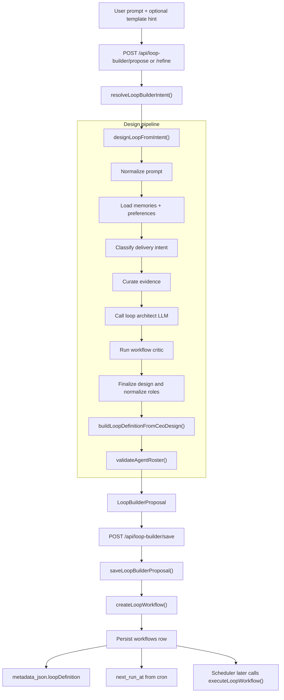
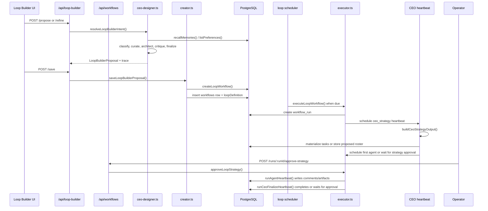

# Loop Builder End-to-End

This document traces the complete loop-builder path from a user prompt to a persisted workflow definition, then shows how that workflow is picked up by the executor later.

The important distinction is:

- the **loop builder** designs and saves the workflow definition
- the **loop executor** runs that definition on schedule

The architect stage inside the builder is documented separately in [Loop Builder CEO Designer](./loop-builder-ceo-designer.md).

Standalone Mermaid sources:

- [loop-builder-flow.mmd](./diagrams/loop-builder-flow.mmd)
- [loop-builder-sequence.mmd](./diagrams/loop-builder-sequence.mmd)

## What The Builder Does

The loop builder turns an intent prompt into a structured workflow proposal. It is responsible for:

- normalizing the prompt and optional template hint
- recalling memories and preferences
- classifying delivery intent
- generating an agent graph with the CEO architect LLM
- critiquing and normalizing that graph
- building a persisted `LoopDefinition`
- saving the proposal as a workflow

What it does **not** do:

- it does not start the run immediately
- it does not execute the agents
- it does not write the final delivery content itself

## Public Entry Points

### Proposal surface

- `POST /api/loop-builder/propose`
- `POST /api/loop-builder/refine`
- `POST /api/loop-builder/save`

These routes live in [`src/transport/http/routes/loopBuilder.ts`](../../src/transport/http/routes/loopBuilder.ts).

### Direct workflow creation

The builder eventually saves through [`createLoopWorkflow()`](../../src/services/loop-executor/creator.ts), which is also used by the broader workflow API in [`src/transport/http/routes/workflows.ts`](../../src/transport/http/routes/workflows.ts).

## Design-Time Flow

## Design Pipeline In Order

### 1. Normalize input

[`resolveLoopBuilderIntent()`](../../src/services/loop-builder/intent-resolver.ts) trims and validates the user prompt. If the prompt is empty, the request fails early.

The route also accepts:

- `templateId` as a UI hint
- `feedback` for iteration
- `priorProposal` for refinement

### 2. Pull evidence

[`designLoopFromIntent()`](../../src/services/loop-builder/ceo-designer.ts) loads:

- relevant memories via `recallMemories()`
- saved preferences via `listPreferences()`

That evidence is summarized for the model as:

- memory snippets
- preference snippets
- available template catalog
- available loop tool catalog

### 3. Classify delivery intent deterministically

Before the LLM runs, the builder classifies the request into one of these broad shapes:

- `newsletter`
- `plain`
- `none`

This matters because the builder treats delivery as a structural constraint, not a suggestion. If the prompt implies a subscriber broadcast, the builder will later enforce the writer / email-build / approval / broadcast split.

### 4. Ask the CEO architect LLM

The LLM produces:

- `title`
- `summary`
- `strategyText`
- `agentGraph`
- `schedule`
- optional `deliveryType`
- optional `presetId`
- `builderMeta`
- `rationale`
- `suggestedChannels`

The builder prompt is intentionally strict:

- tools must match the catalog exactly
- templates are inspiration only
- the model cannot invent preset labels for saved bespoke loops

### 5. Critique the draft

The workflow critic checks for structural issues such as:

- approval and email build combined in one agent
- approval and delivery combined in one agent
- missing broadcast delivery agent for subscriber loops
- missing channel delivery agent for team email loops
- agents carrying too many tools

This is not a style pass. It is a structural safety check.

### 6. Finalize the design

[`finalizeLoopDesign()`](../../src/services/loop-builder/ceo-designer.ts) applies the final normalization rules:

- keeps `presetId` out of the saved bespoke definition
- normalizes agent responsibilities
- appends a broadcast delivery agent when subscriber delivery is required
- appends a channel delivery agent when team inbox delivery is required
- stores diagnostics under `designDiagnostics`

The role split is the key rule here:

- writer writes only
- email build composes/renders only
- approval requests approval only
- broadcast delivery syncs recipients and sends the broadcast only
- channel delivery sends the approved internal email only

### 7. Build the persisted definition

[`buildLoopDefinitionFromCeoDesign()`](../../src/services/loop-executor/creator.ts) converts the final design into a `LoopDefinition`.

That definition is what gets stored on the workflow row.

Important nuance:

- builder-created loops usually carry an `agentGraph`
- they usually do **not** carry a dynamic `plan`
- the builder passes `builderMeta`, so `createLoopWorkflow()` does not auto-derive a plan from the graph

### 8. Validate the roster

The final design is validated with `validateAgentRoster()` against the effective loop constraints. That catches invalid tool refs or disallowed integrations before the workflow is saved.

## What Gets Returned

[`loopBuilderProposalSchema`](../../src/services/loop-builder/intent-resolver.ts) wraps the final output as a proposal:

- `title`
- `summary`
- `templateId`
- `definition`
- `suggestedChannels`
- `suggestedToolRefs`
- `memories`
- `preferences`
- `rationale`
- `designedBy`
- `model`
- `trace`

The `trace` is useful because it preserves the whole path:

- classification
- evidence curation
- architect LLM input/output
- critic output
- finalizer output

## Save And Persist

When the user saves the proposal:

1. `saveLoopBuilderProposal()` parses the proposal
2. it optionally overrides the cron/timezone
3. it passes the definition into `createLoopWorkflow()`
4. `createLoopWorkflow()` inserts a `workflows` row
5. the definition is serialized into `metadata_json.loopDefinition`
6. the next run time is computed from the cron expression

The workflow row is the durable handoff between design and execution.

## Runtime Handoff

Once saved, the scheduler and executor take over. Any operator interaction after save moves through the workflow API, not the loop-builder routes:

## How The Runtime Branches

### Builder-generated graph, already pre-approved

This is the common path for the loop builder.

- `builderMeta.preApproved` is `true`
- the definition has an `agentGraph.children` roster
- `runCeoStrategyHeartbeat()` materializes tasks immediately
- the run starts with the first agent heartbeat

### Builder-generated graph, but operator wants to edit it

If the run is waiting for strategy approval, the operator can:

- inspect the proposed roster
- edit the roster
- approve the strategy with `approveLoopStrategy()`

That approval materializes tasks and starts the run.

### Dynamic plan path

If a workflow is created with a `plan`, the executor switches to the plan flow:

- `agent` stages become tasks
- `approval_gate` stages pause the run
- `input_gate` stages pause the run and capture structured input
- `external_action` stages run through the external action registry

That path is implemented in [`run-plan-flow.ts`](../../src/services/loop-executor/run-plan-flow.ts) and [`gates.ts`](../../src/services/loop-executor/gates.ts).

## Delivery Branches

The builder can steer the run into one of a few delivery shapes:

- **Newsletter / subscriber broadcast**
  - adds Email Build Agent
  - adds Approval Agent
  - adds Broadcast Delivery Agent
  - requires recipient upload before sending

- **Team inbox / internal email**
  - adds Approval Agent
  - adds Channel Delivery Agent
  - sends through Gmail after approval

- **Draft only**
  - no external delivery agent
  - run stops at final approval or completion, depending on draft policy

The delivery logic is split between:

- [`agent-responsibilities.ts`](../../src/services/loop-executor/agent-responsibilities.ts)
- [`approval.ts`](../../src/services/loop-executor/approval.ts)
- [`distribution.ts`](../../src/services/loop-executor/distribution.ts)

## Data Model Map

The builder-to-executor path uses a small set of PostgreSQL tables:

| Table | Purpose |
|---|---|
| `workflows` | stores the saved loop definition and schedule |
| `workflow_runs` | stores one execution instance and its mutable state |
| `loop_run_tasks` | stores ordered agent checkpoints |
| `loop_run_comments` | stores the shared thread between agents and operators |
| `loop_run_events` | stores the audit trail |
| `loop_run_artifacts` | stores structured outputs for plan stages and delivery artifacts |
| `loop_run_gates` | stores approval and input-gate state |
| `loop_heartbeat_jobs` | stores durable heartbeat jobs |

The glue that ties most run-time state together is `workflow_runs.metadata_json.loop_executor`.

## Key Files

- [`src/transport/http/routes/loopBuilder.ts`](../../src/transport/http/routes/loopBuilder.ts)
- [`src/services/loop-builder/intent-resolver.ts`](../../src/services/loop-builder/intent-resolver.ts)
- [`src/services/loop-builder/ceo-designer.ts`](../../src/services/loop-builder/ceo-designer.ts)
- [`src/services/loop-executor/creator.ts`](../../src/services/loop-executor/creator.ts)
- [`src/services/loop-executor/executor.ts`](../../src/services/loop-executor/executor.ts)
- [`src/services/loop-executor/approval.ts`](../../src/services/loop-executor/approval.ts)
- [`src/services/loop-executor/distribution.ts`](../../src/services/loop-executor/distribution.ts)
- [`src/services/loop-executor/run-plan-flow.ts`](../../src/services/loop-executor/run-plan-flow.ts)
- [`src/services/loop-executor/gates.ts`](../../src/services/loop-executor/gates.ts)

## When To Edit What

- change prompt parsing or save payload shape in `intent-resolver.ts`
- change the design/critique/finalization rules in `ceo-designer.ts`
- change workflow persistence or definition shape in `creator.ts`
- change run startup, task materialization, or finalization in `executor.ts`
- change approval and recipient-upload behavior in `approval.ts`
- change broadcast delivery behavior in `distribution.ts`
- change plan gates and resumptions in `run-plan-flow.ts` and `gates.ts`
