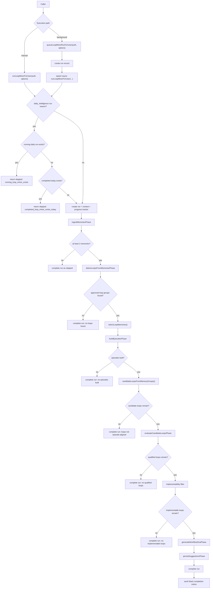
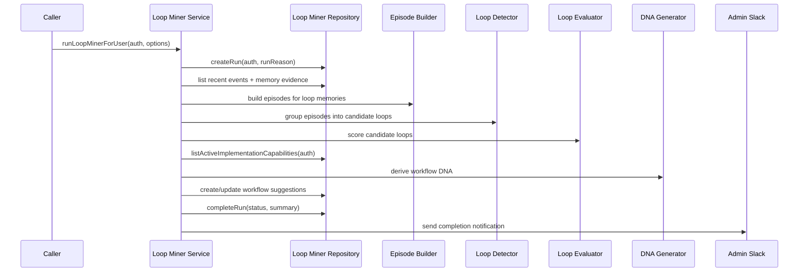

# Loop Miner End-to-End

This document traces the complete loop-miner path from a run request to persisted workflow suggestions.

It covers the live execution path, the run-status/embedding-map views, and the daily-intelligence interaction point.

Standalone Mermaid sources:

- [loop-miner-flow.mmd](./diagrams/loop-miner-flow.mmd)
- [loop-miner-sequence.mmd](./diagrams/loop-miner-sequence.mmd)

## What The Loop Miner Does

The loop miner analyzes a tenant's recent work history and tries to find recurring patterns that can become automations.

It turns:

- raw evidence events into normalized memory evidence
- evidence into episodes
- episodes into candidate loops
- candidate loops into workflow DNA
- workflow DNA into persisted workflow suggestions

## Entry Points

- `src/orchestration/loop-miner/loop-miner.ts`
  - `runLoopMinerForUser()`
  - `queueLoopMinerRunForUser()`
  - `getLoopMinerRunForUser()`
  - `getLoopMinerRunStatusForUser()`
  - `getLoopMinerRunEmbeddingMapForUser()`
- `src/infrastructure/repositories/loop-miner.repository.ts`
  - persistence and evidence selection
- `src/bootstrap/workers.ts`
  - worker bootstrap and scheduled background execution
- `src/services/workflow-automation.ts`
  - workflow-oriented orchestration that can call loop-miner paths

## End-To-End Flow

## Evidence Ingestion

Loop miner does not start from one table. It pulls a merged event view from the repository:

- `ai_activity_events`
- `collab_tasks`
- `memory_records`

The repository enriches those rows with importance and inclusion decisions so the detector sees a single ordered event stream.

Important behavior:

- fresh imported memories are favored
- low-signal bucketed memories are deprioritized
- fallback memory events are fabricated when a memory has no direct activity record
- the run summary includes a decision log so you can understand why a memory was included or excluded

## Episode Building

The episode builder has two paths:

- deterministic extraction for obvious recurring work memories
- batched LLM extraction for everything else

It also does:

- time-gap chunking
- memory compaction
- token-budget packing
- per-batch failure isolation

Output:

- normalized episode records
- episode turns
- summary counters and warnings

## Loop Detection

The detector uses a hybrid strategy:

1. structural matching
2. lexical and embedding similarity
3. LLM consolidation, adversary, and judge checks

This means the detector can still produce useful results when the LLM layer is degraded, but the judge step is what filters obvious topical similarity out of the final loop set.

## Evaluation And DNA Generation

Once candidate loops survive detection, the pipeline:

- evaluates whether the loop should be automated
- filters out non-implementable loops using currently available capabilities
- generates workflow DNA
- persists or updates workflow suggestions

The final summary includes:

- episodes built
- loops detected
- loops qualified
- suggestions created
- AI usage and phase timing

## Persistence And Views

The loop miner stores run state in PostgreSQL and exposes three read views:

- run detail
- run status
- episode embedding map

The episode embedding map is a visual/debugging view built from episode embeddings with a lexical fallback when embeddings are unavailable.

## Daily Intelligence Relationship

The daily intelligence pipeline currently keeps the loop miner disabled in the daily path.

That means:

- daily intelligence runs cleanup first
- daily intelligence may send memory-cleanup notifications
- the loop miner is not invoked in the current daily pass
- manual or background loop-miner runs still work independently

## Guardrails

- daily runs skip if a running daily loop-miner run already exists
- daily runs skip if one already completed today
- insufficient memory evidence stops the run early
- each phase updates progress so stalled phases are visible
- background completion also sends Slack status so failures are observable

## Code Map

- `src/orchestration/loop-miner/loop-miner.ts`
- `src/orchestration/loop-miner/episode-builder.usecase.ts`
- `src/orchestration/loop-miner/loop-detector.usecase.ts`
- `src/orchestration/loop-miner/loop-evaluator.usecase.ts`
- `src/orchestration/loop-miner/dna-generator.usecase.ts`
- `src/orchestration/loop-miner/implementability-filter.usecase.ts`
- `src/orchestration/loop-miner/episode-embedding-map.ts`
- `src/infrastructure/repositories/loop-miner.repository.ts`
- `src/services/workflow-automation.ts`
- `src/bootstrap/workers.ts`

## When To Edit What

- change evidence selection in the repository
- change episode semantics in `episode-builder.usecase.ts`
- change repeated-pattern scoring in `loop-detector.usecase.ts`
- change automation feasibility in `implementability-filter.usecase.ts`
- change workflow DNA shape in `dna-generator.usecase.ts`
- change persistence/summary view shape in `loop-miner.repository.ts`
