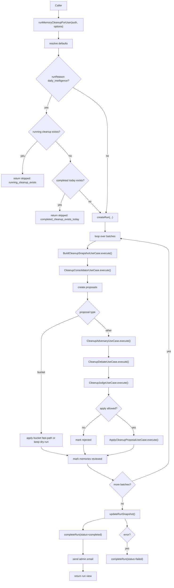
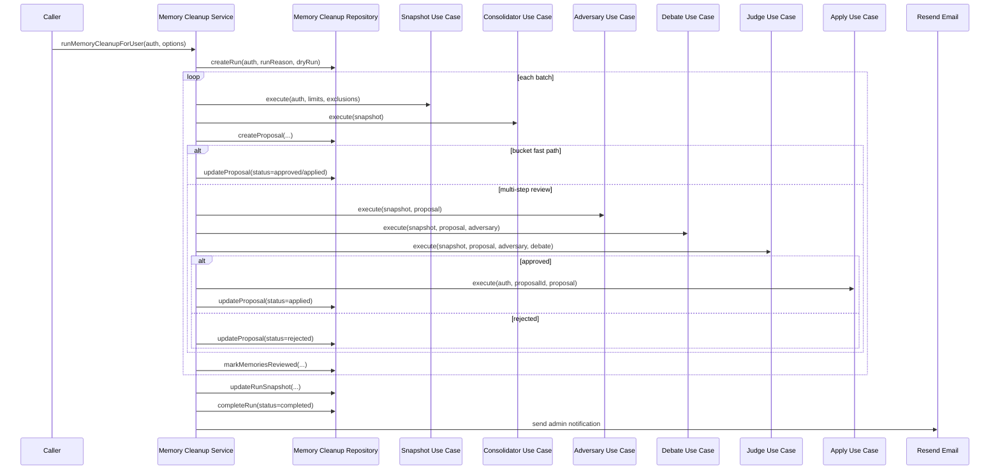

# Memory Cleanup End-To-End

This document traces the full memory-cleanup path from the service entrypoint through proposal generation, human-like review, persistence, and notification delivery.

It also shows how the daily intelligence pipeline wraps cleanup with stricter guardrails and reduced first-run batch sizes.

Standalone Mermaid sources:

- [memory-cleanup-flow.mmd](./diagrams/memory-cleanup-flow.mmd)
- [memory-cleanup-sequence.mmd](./diagrams/memory-cleanup-sequence.mmd)

## What Memory Cleanup Does

Memory cleanup takes a selected batch of memories and tries to:

- bucket them into short-term, long-term, or permanent retention
- merge duplicates and rewrite low-quality content
- prune stale or noisy memories
- preserve pinned, protected, and preference-sensitive records

The cleanup flow is intentionally conservative. It prefers to keep a memory unchanged rather than risk deleting something important.

## Entry Points

- `src/services/memory-cleanup.ts`
  - `runMemoryCleanupForUser()`
  - `listMemoryCleanupRunsForUser()`
  - `getMemoryCleanupRunForUser()`
  - `sendMemoryCleanupAdminEmail()`
  - `resetMemoryCleanupForUser()`
- `src/orchestration/memory-cleanup/`
  - snapshot, consolidator, adversary, debate, judge, and apply use cases
- `src/services/workflow-automation/daily-intelligence/pipeline.ts`
  - daily caller that chooses cleanup options and keeps loop miner disabled in the daily path

## End-To-End Flow

## Daily Guardrails

The daily cleanup path has extra protection:

- it skips if another daily cleanup is already running
- it skips if the user already had a completed daily cleanup today
- it uses `buildDailyCleanupOptions(firstProcessedRun)` to throttle the first successful pass
- it keeps loop miner out of the daily path for now

That last point matters because the daily intelligence pipeline currently wants a cleanup-first, loop-miner-disabled flow.

## Selection And Bucketing

`BuildCleanupSnapshotUseCase` is responsible for deciding what gets cleaned in the current batch.

It:

- loads candidate memories from the repository
- decrypts them
- detects protected content and protected categories
- classifies memories into buckets
- chooses a batch selection strategy
- computes duplicates, stale candidates, conflicts, and protected IDs

The current selection strategy can be:

- `current_priority`
- `newest_hybrid`

The first-run daily throttling uses a smaller batch size and a narrower selection window.

## Proposal Lifecycle

Each proposal goes through a strict lifecycle:

1. create proposal
2. adversary review
3. debate
4. judge
5. apply or reject
6. mark reviewed

Important behavior:

- dry runs still create proposal traces but do not modify memory rows
- bucket proposals can use a faster path when the bucket outcome is obvious
- human-like review is isolated per proposal so one failure does not abort the entire batch
- run summaries are updated after each batch and again when the run completes

## Summary And Notification

At completion, the service:

- finalizes the summary counters
- stores the run snapshot
- marks the run completed or failed
- sends the admin email with stats and links

If the admin email fails, the run itself still completes. Email is operational reporting, not the source of truth.

## Code Map

- `src/services/memory-cleanup.ts`
- `src/orchestration/memory-cleanup/snapshot.usecase.ts`
- `src/orchestration/memory-cleanup/consolidator.usecase.ts`
- `src/orchestration/memory-cleanup/adversary.usecase.ts`
- `src/orchestration/memory-cleanup/debate.usecase.ts`
- `src/orchestration/memory-cleanup/judge.usecase.ts`
- `src/orchestration/memory-cleanup/apply.usecase.ts`
- `src/orchestration/memory-cleanup/types.ts`
- `src/orchestration/memory-cleanup/usage.ts`
- `src/services/workflow-automation/daily-intelligence/pipeline.ts`

## When To Edit What

- change what gets selected in `snapshot.usecase.ts`
- change proposal generation in `consolidator.usecase.ts`
- change risk scoring in `adversary.usecase.ts`
- change dispute resolution in `debate.usecase.ts`
- change final approval policy in `judge.usecase.ts`
- change side effects on approved proposals in `apply.usecase.ts`
- change daily throttling in `src/services/workflow-automation/daily-intelligence/cleanup-policy.ts`
