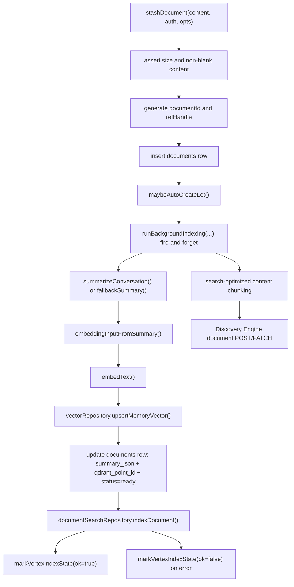
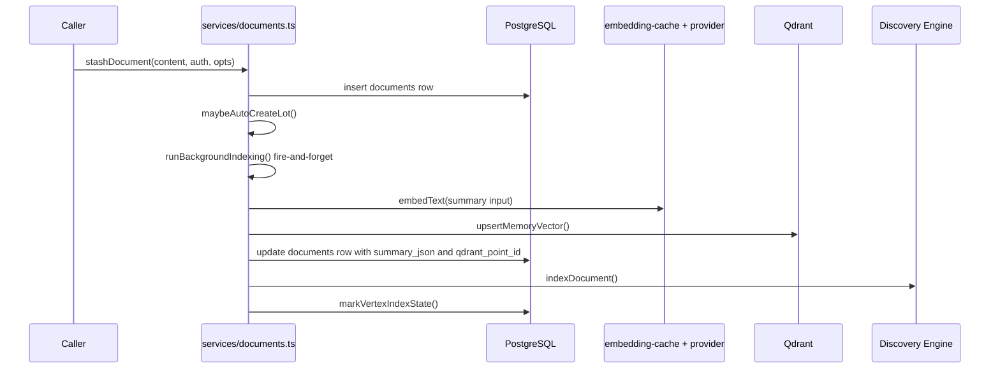
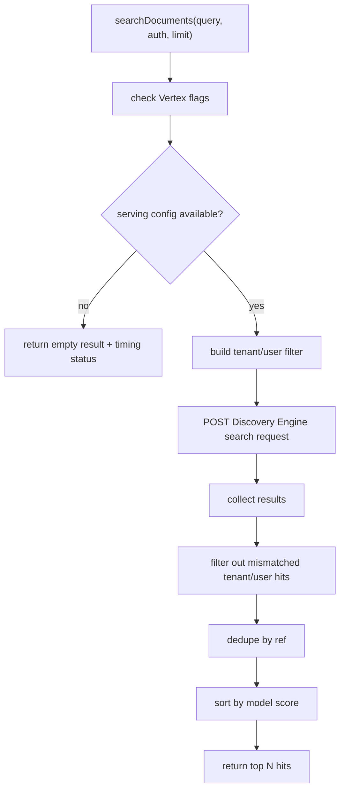
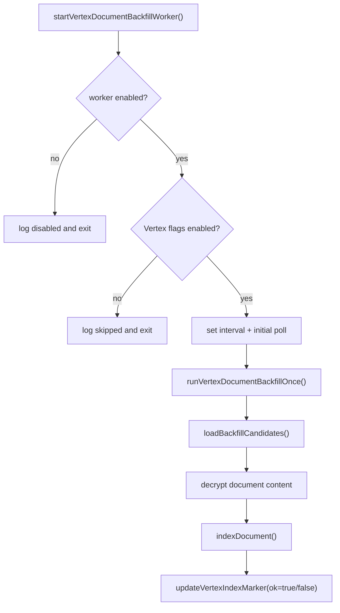

# Vertex Document Embeddings And Search

This document covers the document indexing path end-to-end.

It includes:

- the local document embedding path that stores vectors for document content
- the Vertex Discovery Engine indexing path that makes documents searchable
- the background backfill worker that catches up older documents

The important thing to keep in mind is that these are related but not identical systems.

- the local vector path uses `embedText()` and Qdrant
- the Vertex path chunks document text and indexes it into Discovery Engine

Standalone Mermaid sources:

- [vertex-document-save-flow.mmd](./diagrams/vertex-document-save-flow.mmd)
- [vertex-document-save-sequence.mmd](./diagrams/vertex-document-save-sequence.mmd)
- [vertex-document-search-flow.mmd](./diagrams/vertex-document-search-flow.mmd)
- [vertex-document-backfill-flow.mmd](./diagrams/vertex-document-backfill-flow.mmd)

## Entry Points

- `src/services/documents.ts`
  - `stashDocument()`
  - `searchDocuments()`
  - `markVertexIndexState()`
  - `runBackgroundIndexing()`
- `src/infrastructure/repositories/document-search.repository.ts`
  - `indexDocument()`
  - `searchDocuments()`
- `src/services/vertex-document-backfill.ts`
  - `runVertexDocumentBackfillOnce()`
  - `startVertexDocumentBackfillWorker()`
  - `stopVertexDocumentBackfillWorker()`

## Save And Index Flow

## What Gets Embedded

The local embedding path does not embed the raw full document by default.

It builds an embedding input from:

- the generated title
- the generated summary
- the summary key points

If that input is empty, it falls back to trimmed document content, then to `"document"`.

This keeps the vector representation compact and stable enough for recall while still being content-aware.

## Vertex Indexing Flow

`VertexDocumentSearchRepository.indexDocument()` is the second indexing plane.

It does all of this:

- checks that Vertex search is enabled
- normalizes the data store resource
- chunks the document body into search-sized chunks
- constructs Discovery Engine document payloads
- creates or updates each chunk document
- records request timing and verbose logs

Important implementation detail:

- each chunk becomes its own Discovery Engine document
- the chunk payload keeps tenant and user metadata
- search later filters by tenant/user at query time and again in result processing

## Search Flow

Vertex search is deliberately scoped twice:

1. the query request includes a tenant/user filter
2. returned results are filtered again before they reach callers

That double scoping keeps the service safe even if the backend search layer returns broader results than expected.

## Backfill Worker

Older documents may need indexing after the fact.

The backfill worker:

- wakes up on a timer when enabled
- skips if Vertex search is disabled
- skips if it is already running
- loads documents whose `vertex_indexed_at` marker is missing
- retries only up to `vertexDocumentBackfillMaxAttempts`
- indexes each candidate with the same repository used by the live path
- updates the document summary marker after each attempt

## Data Markers

The document summary JSON tracks the Vertex indexing state:

- `vertex_index_attempts`
- `vertex_index_last_attempt_at`
- `vertex_indexed_at`
- `vertex_index_last_error`
- `vertex_index_failed_at`

These markers let the backfill worker make idempotent progress without re-indexing the same document forever.

## Code Map

- `src/services/documents.ts`
- `src/infrastructure/repositories/document-search.repository.ts`
- `src/services/vertex-document-backfill.ts`
- `src/infrastructure/cache/embedding-cache.ts`
- `src/infrastructure/repositories/vector.repository.ts`
- `src/infrastructure/repositories/loop-episode-vector.repository.ts`

## When To Edit What

- change local embedding inputs in `embeddingInputFromSummary()`
- change document chunking or search payload shape in `document-search.repository.ts`
- change backfill retry policy in `vertex-document-backfill.ts`
- change timing/metrics fields in `documents.ts` and `document-search.repository.ts`
