# Loops, Agents, Runs, Approvals, and Connectors

This document describes the current loop workflow runtime after removing the legacy workflow automation service and builder flow.

The active backend is loop executor v2:

- `src/services/loop-executor/*`: loop creation, scheduling, strategy, agent tasks, gates, approvals, distribution, and run recovery.
- `src/services/approval-tokens.ts`: approval token creation, resolution, and consumption.
- `src/services/channels.ts`: email, Gmail, Telegram, and inbound approval/input handling.
- `src/services/connectors/composio.ts`: Composio auth, connector account listing, webhook handling, tool execution plumbing, and Resend connector setup.
- `src/transport/http/routes/workflows.ts`: loop and run HTTP API.
- `src/transport/http/routes/connectors.ts`: connector HTTP API.
- `src/transport/http/routes/channels.ts`: notification channel HTTP API and webhooks.

Removed legacy pieces:

- `src/services/workflow-automation.ts`
- `src/services/workflow-automation/workflow-builder.service.ts`
- `src/services/workflow-automation/daily-intelligence/*`
- `src/services/workflow-sdk-runtime.ts`
- `src/orchestration/workflows/definitions.ts`
- Dashboard `/dashboard/workflows/*` builder pages

## Whole System Flow

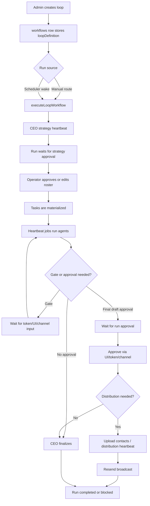

## Data Model

Core tables:

- `workflows`: saved loop definition, with `definition_version = "loop_executor_v2"`.
- `workflow_runs`: one run instance and run-level loop metadata.
- `loop_run_tasks`: materialized agent or external-action work.
- `loop_run_comments`: shared thread between CEO, agents, and operator.
- `loop_run_events`: audit/observability events.
- `loop_heartbeat_jobs`: durable queue for agents, finalization, and distribution.
- `loop_run_artifacts`: dynamic plan outputs.
- `loop_run_gates`: dynamic approval or input pauses.
- `loop_workspaces`: grouping for internal loops.
- `workflow_approval_tokens`: token-backed approvals for runs and gates.
- `connector_accounts`, `connector_auth_sessions`, `connector_action_events`: Composio/connector state and audit.

The canonical loop definition is stored at:

- `workflows.metadata_json.loopDefinition`

Run-local executor state is stored at:

- `workflow_runs.metadata_json.loop_executor`

Important run metadata keys:

- `proposedRoster`
- `approvedRoster`
- `strategyReadyAt`
- `rosterApprovedAt`
- `approvalRequest`
- `approvalDecision`
- `pendingInput`
- `artifactBody`
- `newsletterBody`
- `publicistApproval`
- `contactList`
- `distribution`
- `deliveryAction`
- `activeGateId`
- `activeGateStageId`

## Loop Creation

Loop creation is handled by `createLoopWorkflow()` in `src/services/loop-executor/creator.ts`.

HTTP route:

- `POST /api/workflows/internal/loops`

Simple flow:

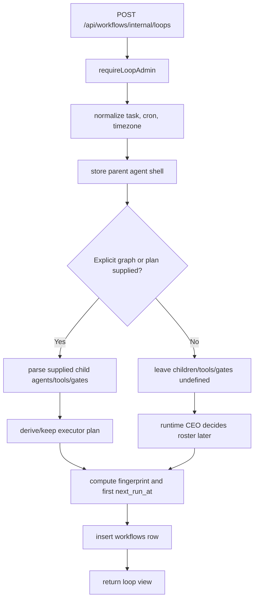

What gets created:

- A `workflows` row.
- `metadata_json.loopDefinition`.
- `loopDefinition.agentGraph.parent`.
- `loopDefinition.agentGraph.children` only when supplied by a planner/API caller.
- `loopDefinition.plan` only when supplied directly or derivable from supplied child agents.
- `next_run_at` for scheduling.
- Optional workspace assignment.

Intent detection is deliberately not part of creation right now. `parseLoopIntent()` still exists as a future hook, but `createLoopWorkflow()` no longer calls it.

## Scheduling

Scheduling lives in `src/services/loop-executor/scheduler.ts`.

Wake routes:

- `POST /api/workflows/internal/loops/scheduler/wake`
- `POST /api/workflows/internal/loops/heartbeat/dispatch`

Simple flow:

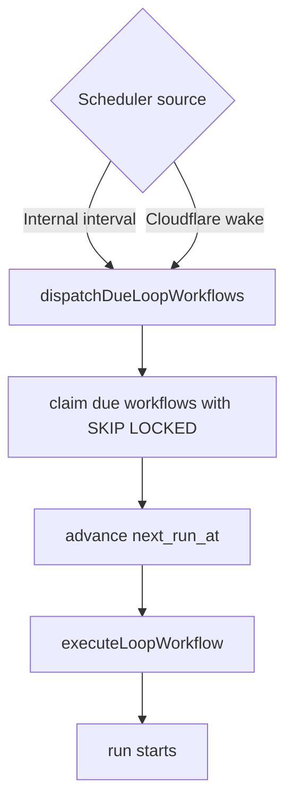

## Run Handling

Runs are created by `executeLoopWorkflow()` in `src/services/loop-executor/executor.ts`.

Manual run route:

- `POST /api/workflows/internal/loops/:workflowId/run`

Simple flow:

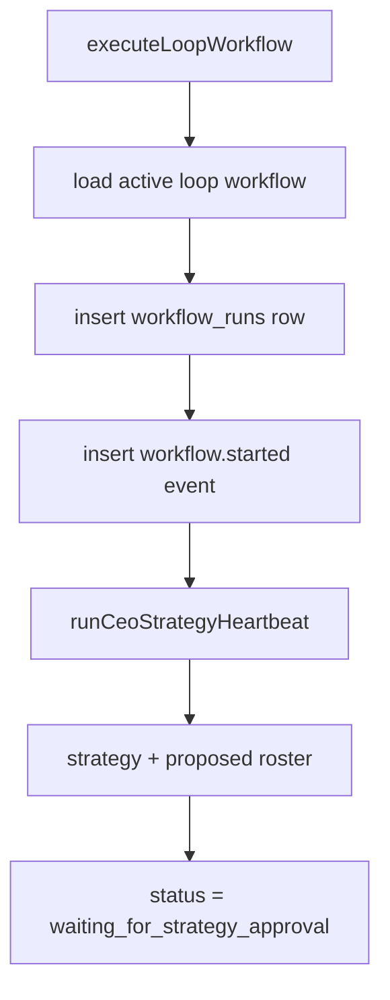

Status starts as `running`, then usually moves quickly to `waiting_for_strategy_approval`.

## Agent Creation and Spawning

Agents are not long-lived processes. Creator stores the parent-agent shell. Child agents, tools, approval gates, and done conditions must come from a later planner/API input or from runtime CEO roster generation.

Agent spec shape comes from `loopRunAgentSchema` in `src/services/loop-executor/types.ts`:

- `id`
- `name`
- `task`
- `tools`

Simple flow:

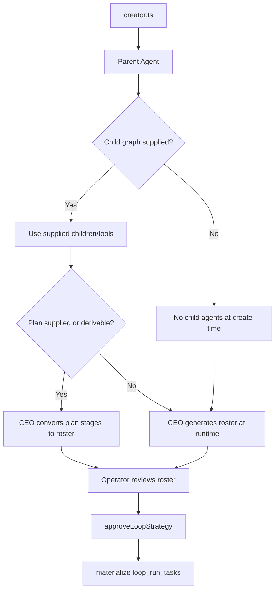

How agents are spawned:

1. Creator stores `agentGraph.parent`.
2. Creator stores `agentGraph.children` only if supplied.
3. Creator stores `plan.stages` only if supplied or derivable from supplied children.
4. If no plan exists, CEO strategy heartbeat dynamically generates `proposedRoster` from the goal and tool catalog.
5. Operator can edit the roster through:
   - `GET /api/workflows/runs/:runId/roster`
   - `PUT /api/workflows/runs/:runId/roster`
6. Operator approves strategy through:
   - `POST /api/workflows/runs/:runId/approve-strategy`
7. `approveLoopStrategy()` writes `approvedRoster`.
8. Tasks are inserted into `loop_run_tasks`.
9. Heartbeat jobs execute tasks one at a time.

## Agent Execution

Agent execution is handled by `runAgentHeartbeat(runId, taskId)`.

Simple flow:

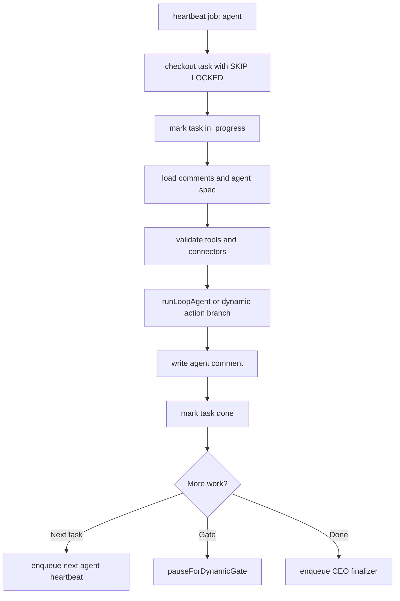

Failure behavior:

- Retryable errors reset the task to `todo` and let the heartbeat retry.
- Non-retryable errors mark the task `blocked`.
- Blocked runs get a CEO comment, `run_blocked` event, and status notification.

## Heartbeat Queue

Heartbeat jobs live in `loop_heartbeat_jobs`.

Job types:

- `agent`
- `ceo_finalize`
- `distribution`

Simple flow:

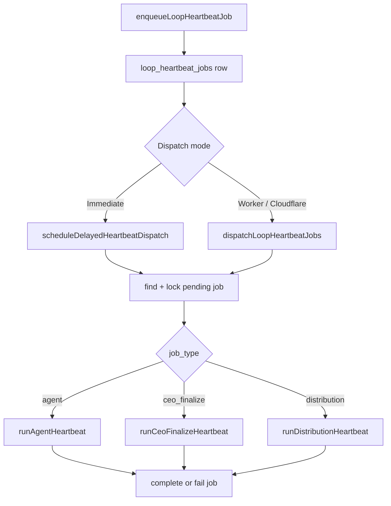

## Gates

Dynamic plans can pause at human gates.

Gate types:

- `approval_gate`
- `input_gate`

Simple flow:

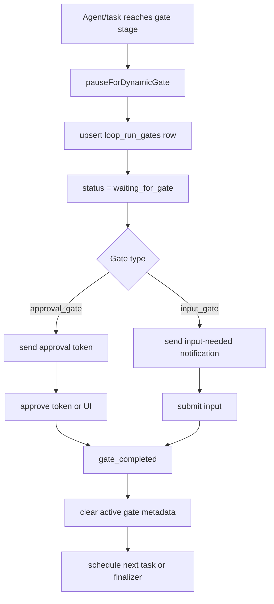

Gate routes currently exposed by backend are token-centric through workflow approval URLs. Gate service functions are exported, but explicit authenticated gate list/approve/reject/input routes are still a gap.

## Approval Tokens

Approval tokens now live in `src/services/approval-tokens.ts`.

Functions:

- `createWorkflowApprovalRequest()`
- `resolveWorkflowApprovalToken()`
- `consumeWorkflowApprovalToken()`

Supported loop targets:

- `workflow_run`
- `workflow_gate`

Simple flow:

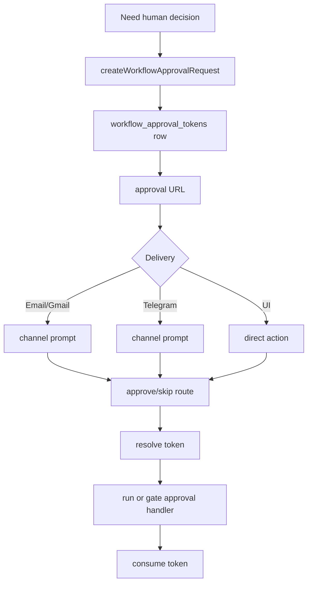

Approval routes:

- `GET /api/workflows/approvals/:token`
- `GET /api/workflows/approvals/:token/approve`
- `POST /api/workflows/approvals/:token/approve`
- `POST /api/workflows/approvals/:token/skip`
- `GET /api/workflows/loops/approvals/:token`
- `GET /api/workflows/loops/approvals/:token/approve`
- `POST /api/workflows/loops/approvals/:token/approve`

The generic approval route no longer falls back to legacy workflow suggestions or legacy workflow runs.

## Publicist / Newsletter Approval

The newsletter path uses `internal.email_approval_request`.

Simple flow:

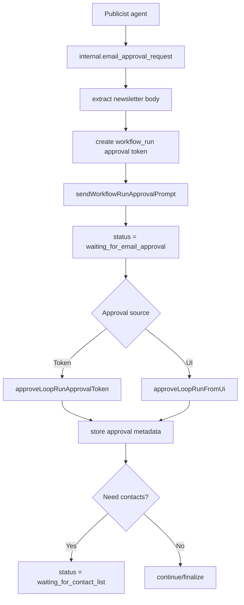

Contact upload:

- `POST /api/workflows/runs/:runId/contacts`

Draft approval is required before contact upload.

## Distribution

Distribution is handled by `runDistributionHeartbeat()`.

Simple flow:

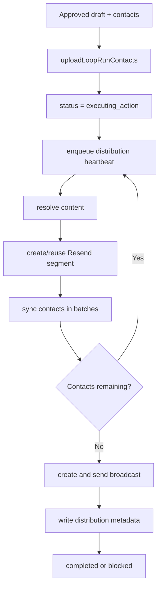

## Finalization

CEO finalization is handled by `runCeoFinalizeHeartbeat()`.

Simple flow:

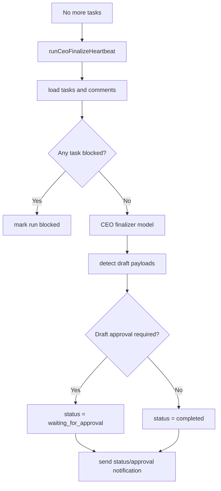

## Connectors and Composio

Composio integration now lives in `src/services/connectors/composio.ts`.

Connector routes:

- `GET /api/connectors`
- `DELETE /api/connectors/:id`
- `POST /api/connectors/:provider/auth-sessions`
- `GET /api/connectors/auth-sessions/:id`
- `POST /api/connectors/auth-sessions/:id/continue`
- `GET /api/connectors/composio/toolkits`
- `POST /api/connectors/composio/webhook`
- `GET /api/connectors/resend`
- `POST /api/connectors/resend`
- `DELETE /api/connectors/resend`
- `DELETE /api/connectors/resend/:id`

Simple Composio auth flow:

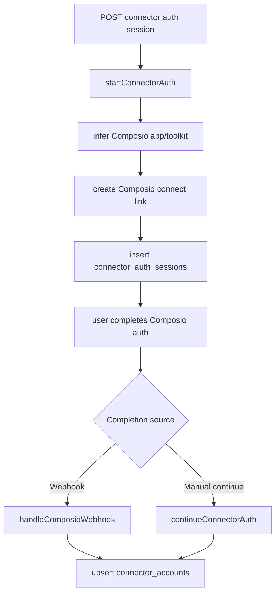

Composio tool execution is still available through the connector adapter, but loop agent execution treats Composio Gmail tools as approval-gated draft/action payloads rather than blind sends.

## Notification Channels

Channel code lives in `src/services/channels.ts`.

Supported kinds:

- `email`
- `gmail`
- `telegram`
- `whatsapp`

Simple flow:

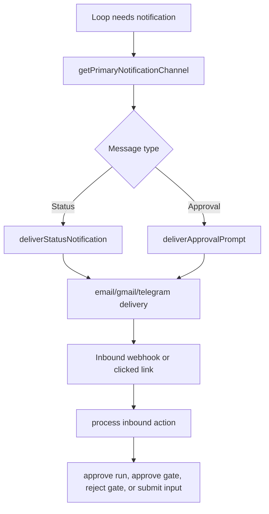

## HTTP Route Map

Loop lifecycle:

- `GET /api/workflows`
- `GET /api/workflows/internal/loops`
- `POST /api/workflows/internal/loops`
- `GET /api/workflows/internal/loops/:workflowId`
- `GET /api/workflows/internal/loops/:workflowId/runs`
- `POST /api/workflows/internal/loops/:workflowId/run`

Scheduler:

- `POST /api/workflows/internal/loops/scheduler/wake`
- `POST /api/workflows/internal/loops/heartbeat/dispatch`

Workspaces:

- `GET /api/workflows/workspaces`
- `POST /api/workflows/workspaces`
- `POST /api/workflows/workspaces/assign-loop`

Runs:

- `GET /api/workflows/runs/:runId`
- `GET /api/workflows/runs/:runId/tasks`
- `GET /api/workflows/runs/:runId/comments`
- `POST /api/workflows/runs/:runId/comments`
- `GET /api/workflows/runs/:runId/roster`
- `PUT /api/workflows/runs/:runId/roster`
- `POST /api/workflows/runs/:runId/approve`
- `POST /api/workflows/runs/:runId/approve-strategy`
- `POST /api/workflows/runs/:runId/resume`
- `POST /api/workflows/runs/:runId/tasks/:taskId/rerun`
- `POST /api/workflows/runs/:runId/contacts`

Approval links:

- `GET /api/workflows/approvals/:token`
- `GET /api/workflows/approvals/:token/approve`
- `POST /api/workflows/approvals/:token/approve`
- `POST /api/workflows/approvals/:token/skip`
- `GET /api/workflows/loops/approvals/:token`
- `GET /api/workflows/loops/approvals/:token/approve`
- `POST /api/workflows/loops/approvals/:token/approve`

## Status Lifecycle

Common run statuses:

- `running`
- `waiting_for_strategy_approval`
- `strategy_approved`
- `waiting_for_gate`
- `waiting_for_email_approval`
- `waiting_for_approval`
- `waiting_for_contact_list`
- `waiting_for_input`
- `executing_action`
- `distributing`
- `completed`
- `blocked`

Task statuses:

- `todo`
- `in_progress`
- `done`
- `blocked`

Gate statuses:

- `pending`
- `approved`
- `submitted`
- `rejected`

Heartbeat job statuses:

- `pending`
- `processing`
- `done`
- `failed`

## Dashboard Surfaces

Relevant dashboard paths:

- `dashboard/app/dashboard/loops/page.tsx`: loop list.
- `dashboard/app/dashboard/loops/[workflowId]/runs/[runId]/page.tsx`: run detail.
- `dashboard/app/dashboard/loops/[workflowId]/runs/[runId]/components/*`: agent rows, chat drawer, strategy roster editor.
- `dashboard/app/dashboard/channels/page.tsx`: notification channels.

The removed workflow builder pages under `dashboard/app/dashboard/workflows/*` are no longer part of the product surface.

## Current Gaps

- Explicit authenticated gate list/approve/reject/input routes are not exposed yet, even though service functions exist.
- Composio Gmail catalog tools are approval-gated and primarily prepare draft/action payloads from agent execution.
- `internal.resend_broadcast` is a dynamic external-action path, not a normal `runLoopAgent()` tool path.
- Contact upload requires prior draft approval.
- Heartbeat scheduling uses both immediate dispatch and durable queue rows; the queue remains the idempotency/audit mechanism.
- `schedulerTarget` is stored on loop definitions, but actual scheduling is controlled by config plus internal or Cloudflare wake routes.
