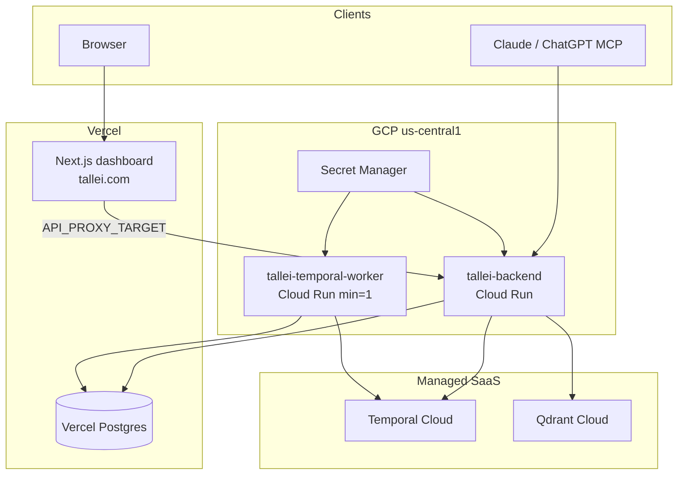

# Minimal Stack Migration Spec

**Status:** Draft  
**Last updated:** 2026-06-19  
**Owner:** Engineering  
**Supersedes (partially):** split-dashboard-on-Cloud-Run model in [`cloudrun/README.md`](./cloudrun/README.md)

This document is the execution spec for migrating Tallei production to the **minimal stack**:

| Layer | Target |
|-------|--------|
| Frontend | **Vercel** — `tallei.com` |
| API + MCP | **GCP Cloud Run** — `api.tallei.com` (`tallei-backend`) |
| Loop orchestration | **Temporal Cloud** |
| Temporal worker | **GCP Cloud Run** — `tallei-temporal-worker` (`min-instances = 1`) |
| App database | **Vercel Postgres** (Neon) |
| Vector search | **Qdrant Cloud** (unchanged) |
| Cache | **None** (Redis removed; fail-open mode) |
| Legacy schedulers | **Removed** (Cloudflare workers, in-process `spec-scheduler`) |

---

## 1. Goals and non-goals

### Goals

- Fewer moving parts: one frontend host, one API host, one worker host, managed Postgres, managed Temporal.
- Durable loop scheduling and headless runs via Temporal Cloud (no cron pollers).
- Stable MCP latency (`min-instances ≥ 1` on backend).
- Canonical `TALLEI_*` env vars in all deploy paths.

### Non-goals (out of scope for this migration)

- Moving vectors from Qdrant to Postgres/pgvector.
- Moving the Express backend to Vercel serverless.
- Adding Redis / Vercel KV (can be a follow-up if rate limits become a problem).
- Multi-region or active-active failover.

---

## 2. Target architecture



### Request paths (unchanged semantics)

| Path | Handler |
|------|---------|
| `tallei.com/*` (pages, local `/api/collab`, `/api/workflows`, …) | Vercel |
| `tallei.com/api/*` (proxied routes) | Vercel rewrite → `api.tallei.com` |
| `tallei.com/mcp` | Vercel rewrite → `api.tallei.com/mcp` |
| `api.tallei.com/*` | Cloud Run backend |
| Loop cron + headless runs | Temporal Schedule → `loopRunWorkflow` → worker activity |
| Interactive loop chat (`streamSpecRunChat`) | Cloud Run backend (not Temporal) |

---

## 3. Current state vs target

| Component | Today | Target | Action |
|-----------|-------|--------|--------|
| Dashboard | Cloud Run `tallei-dashboard` | Vercel | Migrate + decommission Cloud Run service |
| Backend | Cloud Run `tallei-backend` | Cloud Run (same) | Retune env, `min-instances=1`, fix env names |
| Temporal | Disabled; local docker only | Temporal Cloud | Provision namespace; code change for TLS |
| Temporal worker | Manual script, not in CI | Cloud Run `tallei-temporal-worker` | Add to `deploy.yml` |
| Postgres | External connection string | Vercel Postgres | Dump/restore + cutover |
| Qdrant | External (assumed Qdrant Cloud) | Qdrant Cloud | Keep; verify collection + API key |
| Redis | Optional / may be set | **Unset** | Remove `TALLEI_REDIS__URL` from prod |
| Cloudflare workers | Example configs only | **Deleted** | Remove `deploy/cloudflare/` |
| Loop cron fallback | In-process `spec-scheduler` (60s) | **Off** when Temporal enabled | Automatic via `workers.ts` |
| Env var naming | Mixed legacy + `TALLEI_*` in deploy scripts | `TALLEI_*` only | Fix deploy scripts |

---

## 4. Prerequisites

### Accounts and access

- [ ] GCP project `actionlog-487112` (or successor) with Cloud Run, Cloud Build, Artifact Registry, Secret Manager
- [ ] Vercel team/project with domain `tallei.com`
- [ ] Temporal Cloud account + namespace (e.g. `tallei-prod`)
- [ ] Qdrant Cloud cluster with collection `memories_v1` (1536-dim for `text-embedding-3-small`)
- [ ] DNS access (GoDaddy per [`cloudrun/dns.md`](./cloudrun/dns.md))

### Code prerequisites (must land before prod cutover)

| Item | Why | Files |
|------|-----|-------|
| Temporal Cloud TLS connection | Current client uses plain `address` only | `src/temporal/client.ts`, `src/temporal/worker.ts`, `src/config/load.ts` |
| Deploy script env alignment | App reads `TALLEI_DB__URL`; deploy sets `DATABASE_URL` | `deploy/cloudrun/deploy-backend.sh` |
| Temporal worker in CI | Worker not deployed today | `.github/workflows/deploy.yml` |
| Vercel project config | Root directory `dashboard/`, env vars | `vercel.json` or Vercel dashboard settings |

Suggested Temporal Cloud config additions:

```bash
TALLEI_TEMPORAL__ENABLED=true
TALLEI_TEMPORAL__ADDRESS=<namespace>.<account-id>.tmprl.cloud:7233
TALLEI_TEMPORAL__NAMESPACE=<namespace>.<account-id>
TALLEI_TEMPORAL__TASK_QUEUE=tallei-loops
# New — store in Secret Manager:
TALLEI_TEMPORAL__API_KEY=<temporal-cloud-api-key>
```

Connection must use TLS + API key (or mTLS cert pair). See [Temporal Cloud TypeScript SDK docs](https://docs.temporal.io/cloud).

---

## 5. Migration phases

Execute in order. Each phase has a **staging gate** before touching production.

### Phase 0 — Prep and hygiene (no user impact)

**Duration:** 1–2 days

1. **Fix deploy env naming** in `deploy/cloudrun/deploy-backend.sh`:
   - Map plain env vars to canonical names (`TALLEI_HTTP__PUBLIC_BASE_URL`, `TALLEI_DB__URL`, etc.).
   - Remove unused legacy vars (`REDIS_URL`, `SUPABASE_*`) unless still required.
2. **Implement Temporal Cloud connection** (TLS + API key) in client and worker.
3. **Add `deploy-temporal-worker.sh` to GitHub Actions** `deploy.yml` (path filter: `src/temporal/**`, worker script).
4. **Delete dead Cloudflare artifacts:**
   - `deploy/cloudflare/loop-scheduler-worker.ts`
   - `deploy/cloudflare/loop-heartbeat-worker.ts`
   - `deploy/cloudflare/wrangler.*.example.toml`
5. **Document** Temporal + minimal-stack env in `.env.example`.

**Exit criteria**

- [ ] `npm run build` and unit tests pass
- [ ] Staging backend boots with `TALLEI_*` vars only
- [ ] Temporal worker connects to Temporal Cloud staging namespace locally

---

### Phase 1 — Provision managed services (staging)

**Duration:** 1 day

#### 1a. Vercel Postgres (staging)

1. Create Vercel Postgres database in staging project (e.g. `tallei-staging`).
2. Enable connection pooling; copy **pooled** connection string for Cloud Run.
3. Run schema init against staging DB:
   ```bash
   TALLEI_DB__URL="<staging-pooled-url>" \
   TALLEI_DB__AUTO_MIGRATE_ON_BOOT=true \
   NODE_ENV=production \
   npm run build && node dist/index.js
   # Confirm initDb() completes, then stop process.
   ```
4. Verify extensions: `pgcrypto` (app creates on boot). pgvector **not** required (vectors stay in Qdrant).

#### 1b. Temporal Cloud (staging)

1. Create namespace `tallei-staging`.
2. Create API key with read/write on namespace.
3. Store API key in GCP Secret Manager as `TEMPORAL_API_KEY`.
4. Deploy staging worker to Cloud Run with `min-instances=1`.

#### 1c. Qdrant Cloud (verify)

1. Confirm `TALLEI_QDRANT__URL` and `TALLEI_QDRANT__API_KEY` point at production cluster.
2. Confirm collection `memories_v1` vector size = **1536** (`TALLEI_EMBED__DIMS` / `text-embedding-3-small`).
3. No migration needed if cluster already in use.

#### 1d. Redis removal (staging)

1. Unset `TALLEI_REDIS__URL` on staging backend.
2. Confirm `/health` reports `redis_mode: "disabled"`.
3. Smoke-test MCP `recall_memories` and `save_memory` (slower recall is acceptable).

**Exit criteria**

- [ ] Staging API healthy on new Postgres
- [ ] Temporal worker polling `tallei-loops` queue
- [ ] Test loop: activate workflow → schedule fires → headless run completes
- [ ] Developer dashboard `/dashboard/developer/workflows` shows Temporal executions

---

### Phase 2 — Staging full stack integration

**Duration:** 2–3 days

#### 2a. Deploy backend to staging Cloud Run

```bash
# Key overrides vs today:
MIN_INSTANCES=1
TALLEI_TEMPORAL__ENABLED=true
# Unset TALLEI_REDIS__URL
```

#### 2b. Deploy dashboard to Vercel (staging)

| Vercel env var | Value |
|----------------|-------|
| `NEXTAUTH_URL` | `https://staging.tallei.com` (or Vercel preview URL) |
| `AUTH_URL` | same |
| `AUTH_TRUST_HOST` | `true` |
| `NEXTAUTH_SECRET` | (secret) |
| `GOOGLE_CLIENT_ID` | (same OAuth client) |
| `GOOGLE_CLIENT_SECRET` | (secret) |
| `BACKEND_URL` | staging API URL |
| `API_PROXY_TARGET` | staging API URL |
| `INTERNAL_API_SECRET` | must match backend |
| `NEXT_PUBLIC_APP_URL` | staging frontend URL |
| `UPLOADTHING_TOKEN` | (secret) |

Vercel project settings:

- **Root directory:** `dashboard`
- **Framework:** Next.js
- **Node.js version:** 22.x

#### 2c. Staging validation checklist

| Test | Pass? |
|------|-------|
| Google OAuth login | |
| `/dashboard/setup` MCP URL copy | |
| MCP `recall_memories` via Claude connector | |
| MCP `save_memory` | |
| Loop builder → activate loop | |
| Scheduled loop run (Temporal) | |
| Composio webhook trigger | |
| Interactive loop run chat (SSE stream) | |
| LemonSqueezy webhook | |
| Billing / plan gates | |

**Exit criteria**

- [ ] All staging checks pass
- [ ] No `spec-scheduler` ticks in logs when Temporal enabled
- [ ] 24h soak with no scheduler errors

---

### Phase 3 — Production data migration (Postgres)

**Duration:** 2–4 hours maintenance window (or blue/green with read-only period)

#### Option A — Dump/restore (recommended for first migration)

1. **Announce** short maintenance or read-only window.
2. **Pause** loop schedules in Temporal (pause all schedules via API or dashboard).
3. **Drain** in-flight loop runs (wait for `loopRunWorkflow` completions).
4. **Dump** current production Postgres:
   ```bash
   pg_dump "$OLD_DATABASE_URL" \
     --format=custom \
     --no-owner \
     --no-acl \
     -f tallei-prod-$(date +%Y%m%d).dump
   ```
5. **Restore** to Vercel Postgres:
   ```bash
   pg_restore \
     --dbname="$NEW_TALLEI_DB__URL" \
     --no-owner \
     --no-acl \
     --clean \
     --if-exists \
     tallei-prod-*.dump
   ```
6. **Run** `initDb()` once against new DB (idempotent migrations).
7. **Verify** row counts on critical tables: `users`, `memory_records`, `workflows`, `workflow_runs`.

#### Option B — Logical replication (lower downtime)

Use only if team has replication experience. Out of scope for v1 unless downtime is unacceptable.

**Exit criteria**

- [ ] Row counts match within tolerance
- [ ] Spot-check encrypted memory decrypt + recall works against new DB + existing Qdrant

---

### Phase 4 — Production cutover

**Order matters.** Execute as a single runbook.

| Step | Action | Rollback |
|------|--------|----------|
| 1 | Deploy backend with new `TALLEI_DB__URL`, Temporal enabled, Redis unset, `MIN_INSTANCES=1` | Revert to previous Cloud Run revision |
| 2 | Deploy Temporal worker (`min-instances=1`) | Scale worker to 0; re-enable `spec-scheduler` only if Temporal broken |
| 3 | Deploy Vercel production dashboard | Re-point DNS to Cloud Run dashboard (old) |
| 4 | Update Google OAuth redirect URIs if domain changes | Revert OAuth config |
| 5 | Point `tallei.com` DNS to Vercel | Revert DNS to Cloud Run apex records |
| 6 | Keep `api.tallei.com` on Cloud Run (no DNS change) | — |
| 7 | Re-upsert Temporal schedules for active loops | `upsertLoopSchedule` on each active workflow (script or one-time admin task) |
| 8 | Unpause Temporal schedules | — |
| 9 | Decommission `tallei-dashboard` Cloud Run service | Redeploy if needed |

#### DNS changes

| Record | From | To |
|--------|------|-----|
| `tallei.com` apex | Cloud Run A/AAAA records | Vercel A/CNAME per Vercel docs |
| `api.tallei.com` | `ghs.googlehosted.com` | **No change** |

#### Post-cutover smoke tests (production)

```bash
curl -sf https://api.tallei.com/health | jq .
curl -sf https://tallei.com/health | jq .
```

Manual: login, MCP save/recall, activate + run one loop, check Temporal UI.

**Exit criteria**

- [ ] 48h stable operation
- [ ] No `spec-scheduler` log lines
- [ ] Temporal schedules executing on time
- [ ] Error rate unchanged in logs/PostHog

---

### Phase 5 — Decommission and cleanup

| Resource | Action |
|----------|--------|
| Cloud Run `tallei-dashboard` | Delete service |
| Old Postgres instance | Snapshot → delete after 30-day retention |
| `TALLEI_REDIS__URL` secret | Remove from Secret Manager |
| `deploy/cloudflare/` | Delete (if not done in Phase 0) |
| `deploy/cloudrun/deploy-dashboard.sh` | Mark deprecated or remove |
| GitHub Actions dashboard job | Remove or gate behind manual dispatch only |
| Docs | Update [`cloudrun/README.md`](./cloudrun/README.md) to point here |

---

## 6. Environment variable matrix (production)

### Cloud Run — `tallei-backend`

| Variable | Source | Notes |
|----------|--------|-------|
| `TALLEI_DB__URL` | Secret `DATABASE_URL` or Vercel pooled URL secret | **Pooled** connection for serverless |
| `TALLEI_HTTP__PUBLIC_BASE_URL` | `https://api.tallei.com` | |
| `TALLEI_HTTP__FRONTEND_URL` | `https://tallei.com` | CORS |
| `TALLEI_HTTP__MCP_URL` | `https://api.tallei.com/mcp` | |
| `TALLEI_HTTP__INTERNAL_API_SECRET` | Secret Manager | |
| `TALLEI_LLM__OPENAI_API_KEY` | Secret Manager | |
| `TALLEI_AUTH__JWT_SECRET` | Secret Manager | |
| `TALLEI_AUTH__MEMORY_MASTER_KEY` | Secret Manager | |
| `TALLEI_QDRANT__URL` | env | Qdrant Cloud endpoint |
| `TALLEI_QDRANT__API_KEY` | Secret Manager | |
| `TALLEI_QDRANT__COLLECTION` | `memories_v1` | |
| `TALLEI_TEMPORAL__ENABLED` | `true` | |
| `TALLEI_TEMPORAL__ADDRESS` | Temporal Cloud gRPC host | |
| `TALLEI_TEMPORAL__NAMESPACE` | Temporal Cloud namespace | |
| `TALLEI_TEMPORAL__TASK_QUEUE` | `tallei-loops` | |
| `TALLEI_TEMPORAL__API_KEY` | Secret Manager | **New** |
| `TALLEI_REDIS__URL` | **unset** | Fail-open |
| `TALLEI_DB__AUTO_MIGRATE_ON_BOOT` | `false` | Migrations run explicitly |
| `MIN_INSTANCES` | `1` | MCP cold-start avoidance |

### Cloud Run — `tallei-temporal-worker`

Same DB + Temporal + OpenAI secrets as backend (worker runs `executeSpecRunHeadless`). Minimum set:

- `TALLEI_DB__URL`
- `TALLEI_TEMPORAL__*`
- `TALLEI_LLM__OPENAI_API_KEY`
- `TALLEI_AUTH__JWT_SECRET`
- `TALLEI_HTTP__INTERNAL_API_SECRET`
- Plus any connector keys needed by loop tools in headless runs

Command: `npm run temporal:worker`  
`min-instances=1`, `max-instances=3`, `--no-allow-unauthenticated`

### Vercel — dashboard

See Phase 2b table. No database URL on frontend (server routes use backend proxy or local handlers only).

---

## 7. CI/CD changes

### `.github/workflows/deploy.yml`

```yaml
# Add job: temporal-worker
# Path filter: src/temporal/**, deploy/cloudrun/deploy-temporal-worker.sh
# Run: bash deploy/cloudrun/deploy-temporal-worker.sh

# Modify job: dashboard
# Option A: remove automatic deploy on main
# Option B: keep for rollback only via workflow_dispatch
```

### Vercel

- Connect GitHub repo; set production branch `main`.
- Enable automatic deploys for `dashboard/**` path (Vercel monorepo root `dashboard`).

---

## 8. Loop schedule re-registration

When Temporal is first enabled in production, existing active workflows need schedules in Temporal Cloud. The app calls `upsertLoopSchedule()` on **activation**, but workflows already active before cutover may lack schedules.

**One-time backfill script** (run after Phase 4 step 7):

```sql
SELECT id, tenant_id, user_id, schedule_rrule, name
FROM workflows
WHERE status = 'active'
  AND definition_version = 'loop_spec_v1'
  AND schedule_rrule IS NOT NULL;
```

For each row, invoke `upsertLoopSchedule()` with tenant/user/workflow IDs and cron (or build a small `tsx scripts/backfill-temporal-schedules.ts` admin script).

---

## 9. Rollback plan

| Failure | Rollback |
|---------|----------|
| Vercel dashboard broken | DNS `tallei.com` → Cloud Run dashboard; redeploy `tallei-dashboard` |
| Vercel Postgres issues | Point `TALLEI_DB__URL` back to old Postgres snapshot; redeploy backend revision |
| Temporal Cloud outage | Set `TALLEI_TEMPORAL__ENABLED=false` → `spec-scheduler` resumes (degraded but functional); scale worker to 0 |
| Backend regression | `gcloud run services update-traffic` to previous revision |
| Qdrant outage | No DB rollback; Qdrant is independent. Recall degrades via vector bypass |

Keep old Postgres snapshot and last Cloud Run dashboard revision for **30 days**.

---

## 10. Risks and mitigations

| Risk | Impact | Mitigation |
|------|--------|------------|
| No Redis → weak distributed rate limits | Abuse / quota bypass across instances | `MIN_INSTANCES=1` reduces instance count; add Vercel KV later if needed |
| Vercel Postgres connection limits | Cloud Run exhausts pool | Use **pooled** URL; limit `max-instances` on backend |
| Temporal Cloud TLS not implemented | Migration blocked | Phase 0 code change |
| Env var drift in deploy scripts | Silent misconfig | Phase 0 fix; boot-time `loadConfig()` throws on missing vars |
| SSE/streaming through Vercel proxy | Loop chat timeouts | Interactive chat proxies to `api.tallei.com` directly via rewrite; verify Vercel timeout limits on rewrites |
| Schedule backfill missed | Cron loops don't run | Run backfill script; monitor Temporal schedules UI |
| Qdrant + DB user_id mismatch after restore | Recall misses | Qdrant unchanged during Postgres migration; IDs preserved in dump |

---

## 11. Acceptance criteria (migration complete)

- [ ] `tallei.com` served from Vercel
- [ ] `api.tallei.com` served from Cloud Run with `min-instances ≥ 1`
- [ ] `tallei-temporal-worker` running with `min-instances = 1`
- [ ] Temporal Cloud shows schedules for all active cron loops
- [ ] No Redis configured; `/health` shows `redis_mode: "disabled"`
- [ ] No Cloudflare workers in repo or deployed
- [ ] Cloud Run `tallei-dashboard` deleted
- [ ] All deploy scripts and CI use `TALLEI_*` canonical env names
- [ ] Docs updated; team runbook tested

---

## 12. Follow-ups (post-migration)

| Item | Priority | Notes |
|------|----------|-------|
| Vercel KV for rate limiting | P2 | When traffic grows or abuse appears |
| Split background workers from API | P3 | Separate Cloud Run service for ingest/import workers |
| pgvector migration (drop Qdrant) | P4 | Large engineering effort |
| Temporal mTLS instead of API key | P3 | Security hardening |

---

## 13. Related docs

- Current Cloud Run guide: [`cloudrun/README.md`](./cloudrun/README.md)
- DNS reference: [`cloudrun/dns.md`](./cloudrun/dns.md)
- Loop + Temporal architecture: [`../loop-flow.md`](../loop-flow.md)
- Config conventions: [`../adr/005-config-schema-zod.md`](../adr/005-config-schema-zod.md)
- Temporal worker deploy script: [`../../deploy/cloudrun/deploy-temporal-worker.sh`](../../deploy/cloudrun/deploy-temporal-worker.sh)
