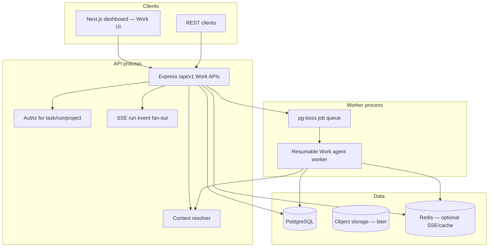

# Tallei Work — Architecture Contract (Stage 0)

**Status:** Draft — awaiting Stage 0 approval  
**Date:** 2026-07-13  
**Track:** Work feature only  
**Supersedes (partially):** the “execution engine TBD” portion of [ADR-015](adr/015-execution-engine-boundary.md) via [ADR-016](adr/016-work-execution-engine.md)  
**Background research:** [ChatGPT-like Work note](chatgpt-work-architecture.md)

This document is the canonical architecture for **Tallei Work**. Later stages expand from this contract one at a time. No Work product code ships before Stage 0 sign-off.

---

## 1. Product definition

### What Work is

Tallei Work is a **durable agent runtime inside Tallei**: the user states an outcome; the system plans, uses tools, shows progress, waits for input or approval when needed, and returns a reviewable result — across minutes or hours, surviving API and worker restarts.

It is the open-source sovereign alternative to ChatGPT Work / Copilot Cowork **for the Work loop itself**, not a clone of the entire Microsoft 365 or OpenAI ecosystem.

### What Work is not (this track)

| Out of scope for the Work track | Deferred to |
|---|---|
| Full multi-tenant workspace RBAC redesign | Separate foundation stage (documented later) |
| Spreadsheets / slides / Sites artifact suites | Post-Work-MVP artifact track |
| Remote MCP plugin marketplace | Plugin track after Work MVP |
| Browser automation / desktop companion | Security track after Work MVP |
| Scheduled / event-driven wakes | Schedule track after Work MVP |
| Rebuilding Conductor / Temporal / Composio | Never for Work |

### Modes

| Mode | Default behavior |
|---|---|
| **Quick Chat** | Short-lived run, low tool budget, streaming reply; same `task` / `run` model |
| **Work** | Higher budgets, visible plan/progress, approvals, multi-step tool use, checkpointed advances |

Both modes share one domain. Mode is a policy profile on the run, not a separate product.

### Golden journeys (Work MVP)

1. Start a Work task from a project, watch a multi-step plan advance, pause / steer / cancel.
2. Hit “needs input” or “needs approval”, respond, and continue the same run.
3. Kill the worker mid-tool or mid-model call; resume without duplicate side effects.
4. See which project instructions, memories, and files influenced the answer (context manifest).
5. Complete a research-style Work task with citations using built-in **read-only** tools only.

### North-star demo (approval target for Work MVP)

> Start a multi-step research Work task → restart the worker → steer once → approve one sensitive step (or reject) → receive a completed result with an auditable run timeline and no duplicated tool side effects.

---

## 2. Core invariants

1. **Postgres is the system of record.** Model text is never canonical state.
2. **Every run is resumable, auditable, bounded, and independently cancellable.**
3. **Commit-before-advance:** every model/tool step persists a `run_event` before execution continues.
4. **No silent provider failover** for sensitive Work; fallbacks require policy and appear in the trace.
5. **Local-first:** Work must run with Ollama / OpenAI-compatible local endpoints and **no OpenAI key**.
6. **Frozen contracts stay frozen:** existing memory, document, ChatGPT Action, and MCP HTTP surfaces are unchanged; Work APIs live under `/api/v1`.
7. **Authorization boundaries never leak:** personal / project / workspace context isolation is enforced in application code and (where present) RLS.
8. **Feature-flagged delivery:** each Work subsystem has an independent kill switch.

---

## 3. Target topology (Work)



### Processes

| Process | Owns |
|---|---|
| `dashboard` | Work UI, authenticated proxy |
| `api` | `/api/v1` Work CRUD, authz, SSE, enqueue |
| `worker` | Model/tool loop, leases, heartbeats, retries, budgets |

Self-host default for Work MVP: PostgreSQL (+ later pgvector), optional Redis, Ollama. Object storage and Qdrant adapters come with the documents/context stage — not required to prove the Work loop.

---

## 4. Domain model (Work)

```text
workspace (existing tenant boundary — thin dependency)
  └── project (Work container: instructions, files, memory mode)
        └── task (Quick Chat or Work thread the user resumes)
              ├── messages (immutable, ordered content parts)
              └── runs (bounded executions)
                    ├── run_events (append-only canonical history)
                    ├── run_commands (pause/resume/steer/cancel/approve/reject)
                    └── approvals (human decisions for sensitive tools)
```

### Entity responsibilities

| Entity | Responsibility |
|---|---|
| `project` | Shared instructions, attached sources, memory mode, membership |
| `task` | User-visible thread; title; mode; archive/pin; active run pointer |
| `message` | Immutable user/assistant/system content; parts (text, file refs, citations, tool summaries, artifact refs) |
| `run` | One bounded agent execution with budget, model, tool policy, state |
| `run_event` | Ordered, append-only progress + recovery log |
| `run_command` | Idempotent control plane input to a run |
| `approval` | Pending/resolved decision for a proposed tool call |
| `context_manifest` | Persisted snapshot of what context a run used |

### Run states

```text
queued → running → waiting_for_user | waiting_for_approval
                 → paused | succeeded | failed | cancelled
```

| State | Meaning |
|---|---|
| `queued` | Job accepted; worker has not leased it |
| `running` | Worker holds lease; advancing model/tool steps |
| `waiting_for_user` | Needs clarification / missing input |
| `waiting_for_approval` | Sensitive tool proposed; blocked until approve/reject |
| `paused` | User or policy paused; resumable |
| `succeeded` | Terminal success |
| `failed` | Terminal failure (budget, error, policy) |
| `cancelled` | Terminal cancel |

### Message vs run

- A **message** is what the user sees in the transcript.
- A **run** is the engine execution that produced assistant activity.
- Regeneration creates a **new run** (and usually a new assistant message), never mutates prior messages.

---

## 5. Run event contract

```ts
interface RunEvent {
  id: string;
  runId: string;
  sequence: number; // monotonic per run, dense, starts at 1
  type: string;
  visibility: "user" | "internal" | "audit";
  createdAt: string; // ISO-8601
  data: Record<string, unknown>;
}
```

### Initial event type catalog (Work MVP)

| Type | Visibility | Purpose |
|---|---|---|
| `run.created` | user | Run accepted with model/budget/policy snapshot |
| `run.started` | user | Worker leased the run |
| `run.heartbeat` | internal | Lease renewal |
| `plan.updated` | user | Goals / steps the agent is following |
| `progress.updated` | user | Human-readable status |
| `context.resolved` | user | Context manifest id + summary |
| `model.started` | internal | Provider/model/call id |
| `model.delta` | user | Streamed text/reasoning chunks (or compacted refs) |
| `model.completed` | internal | Token usage, finish reason |
| `tool.proposed` | user | Tool name + args (redacted if needed) |
| `tool.approval_required` | user | Links to `approval` |
| `tool.started` | user | Execution began (after policy/approval) |
| `tool.completed` | user | Result summary |
| `tool.failed` | user | Tool error |
| `input.required` | user | Waiting for user |
| `command.accepted` | user | pause/resume/steer/cancel applied |
| `budget.warning` | user | Approaching limit |
| `budget.exhausted` | user | Terminal or pause reason |
| `run.succeeded` | user | Terminal |
| `run.failed` | user | Terminal |
| `run.cancelled` | user | Terminal |

**Recovery rule:** on worker start, load run + last committed `sequence`. Replay only uncommitted work; never re-execute a tool whose `tool.started` (or completion) already committed with the same idempotency key.

---

## 6. Execution loop (Work)

```text
1. API creates message + run (queued), enqueues pg-boss job (idempotency key = runId).
2. Worker leases run → run.started.
3. Resolve context → persist context_manifest → context.resolved.
4. Loop until terminal / wait:
   a. Persist model.started → call model (stream deltas) → model.completed.
   b. If tool calls:
      validate schema → authz → policy →
      if approval required: tool.approval_required → waiting_for_approval (release lease) → stop.
      else: tool.started → execute with idempotency key → tool.completed/failed.
   c. If model asks user: input.required → waiting_for_user → stop.
   d. Apply any pending run_commands between steps.
5. Emit run.succeeded | run.failed | run.cancelled.
```

### Budgets (per run, snapshotted at create)

| Budget | Default Work profile (initial) |
|---|---|
| Max wall time | 2 hours (configurable) |
| Max model calls | 40 |
| Max tool calls | 60 |
| Max tokens (in+out) | profile-based |
| Max cost units | optional hosted meter |

Quick Chat uses a stricter profile (e.g. minutes, few tool calls).

### Commands

All commands require an **idempotency key**. Duplicate keys return the first result.

| Command | Effect |
|---|---|
| `pause` | Enter `paused` after current committed step |
| `resume` | Re-queue from `paused` / wait states when allowed |
| `steer` | Append steering message into run context; continue |
| `cancel` | Terminal `cancelled` |
| `approve` / `reject` | Resolve `approval`; resume or fail the tool branch |

---

## 7. Additive API (Work)

All new routes under `/api/v1`. Existing `/api/memories`, `/api/documents`, `/api/chatgpt`, `/mcp` unchanged ([ADR-008](adr/008-frozen-http-mcp-contract.md)).

### Primary resources (Work MVP)

| Method | Path | Purpose |
|---|---|---|
| CRUD | `/api/v1/projects` | Project shell for Work |
| CRUD | `/api/v1/tasks` | Quick Chat / Work tasks |
| CRUD | `/api/v1/tasks/:id/messages` | Append/list messages |
| GET | `/api/v1/runs/:id` | Run status + budgets |
| GET | `/api/v1/runs/:id/events` | Resumable SSE; `?after=<sequence>` |
| POST | `/api/v1/runs/:id/commands` | pause/resume/steer/cancel/approve/reject |
| CRUD | `/api/v1/approvals` | List/resolve approvals |

Mutations require `Idempotency-Key`. Provider credentials (later model stage) are write-only after create.

### SSE

- Event stream is the `RunEvent` envelope.
- Client reconnects with last seen `sequence`.
- Server never rewrites history; clients may compact UI locally.

---

## 8. Context for Work (minimal now, detailed later)

For Work MVP, context assembly is a dedicated `ProjectContextResolver` that produces a persisted **context manifest**:

```text
project instructions
+ memory recall (respecting memory mode)
+ selected prior messages (or compaction summary + recent turns)
+ attached file/document excerpts
+ active steering
+ tool result history for this run
```

**Rules:**

- Explicit task / steer instructions outrank remembered preferences.
- Shared / project-only tasks cannot read personal memory (enforced when scoped memory lands).
- Manifest is immutable for that run after `context.resolved` (steering appends are explicit subsequent events).

Deep memory scoping, pgvector dual-write, and chunk citations are a later stage. Work MVP may call existing memory/document services behind the resolver.

---

## 9. Tools for Work MVP

Built-in **read-only** tools only:

| Tool | Risk | Approval default |
|---|---|---|
| `memory_search` | read | none |
| `document_search` | read | none |
| `web_retrieve` | read / egress | workspace policy (default allow with audit) |
| `artifact_plan` | write-plan only | none (no binary export yet) |

No write-capable external tools in Work MVP. Approval machinery still exists so one gated path can be demonstrated (e.g. force-approval on `web_retrieve` in demo policy).

Tool pipeline:

```text
model proposal → schema validate → task/workspace permission →
policy / injection checks → approval if required →
execute with idempotency key → persist result → next model turn
```

---

## 10. Feature flags

| Flag | Controls |
|---|---|
| `work.enabled` | Master kill switch for Work UI + `/api/v1` Work routes |
| `work.quick_chat` | Quick Chat profile |
| `work.agent_runtime` | Worker loop / enqueue |
| `work.approvals` | Approval wait states |
| `work.sse` | SSE delivery (fallback: poll events) |

Rollout: `disabled → internal → allowlist → canary % → default on`.

---

## 11. Migration and rollback rules

### Migrations

- Work tables are **additive** (`projects`, `tasks`, `messages`, `runs`, `run_events`, `run_commands`, `approvals`, `context_manifests`).
- No destructive changes to memory/document tables in Work stages.
- Each migration ships with a tested down migration or an explicit “expand-only, drop later” note.

### Rollback

- Disable `work.enabled` — existing memory/MCP product unaffected.
- Worker drain: stop leasing new runs; cancel or pause in-flight per ops runbook.
- Do not delete `run_events` on rollback; retain for audit.

### Compatibility

- Existing users keep current dashboard routes.
- Work UI is new dashboard surfaces behind the flag.

---

## 12. Relationship to existing Tallei

| Keep / reuse | How Work uses it |
|---|---|
| Memory save/recall | Via context resolver; frozen APIs untouched |
| Documents | Read path for Work tools; ingestion stays as today |
| Model gateway (`src/model/`) | Per-run model selection; env defaults until Model Gateway v2 |
| Resilience policies | Wrap model/tool calls |
| `ai-elements` UI kit | Conversation, reasoning, tool, source components |
| Auth / OAuth / billing | Gate Work routes; billing meters later |

| Do not revive | Reason |
|---|---|
| Conductor nine-phase builder | Conversation-first Work replaces it |
| Temporal in-repo | pg-boss chosen for Work MVP ([ADR-016](adr/016-work-execution-engine.md)) |
| Composio | Plugins/MCP later; not required for Work loop |

---

## 13. Staged delivery (Work track only)

Expand **one stage at a time**. Each stage ends with an explicit approve / revise / stop decision.

| Stage | Focus | Depends on |
|---|---|---|
| **0 — this document** | Architecture contract, ADR-016, flags, gates | — |
| **1 — Project shell + authz baseline** | Projects, membership, task ownership, isolation tests | Stage 0 |
| **2 — Persistent Quick Chat** | Tasks, messages, simple runs, SSE, model pick | Stage 1 |
| **3 — Durable Work runtime** | Worker, pg-boss, state machine, commands, approvals, budgets | Stage 2 |
| **4 — Context + citations** | Scoped memory mode, context manifest UI, document search tool | Stage 3 |
| **5 — Work MVP hardening** | Kill/resume demos, load/SSE tests, security checklist, docs | Stage 4 |

**Post-MVP tracks (not expanded until Work MVP approved):** artifacts, plugins/MCP apps, schedules, browser/sandbox/desktop, collaboration/GA.

---

## 14. Stage 0 approval package

### Deliverables

- [x] Canonical Work architecture (this doc)
- [x] ADR-016 Work execution engine (pg-boss worker)
- [x] Baseline test report (build / unit / contract / dashboard) recorded below
- [x] Feature flags + migration/rollback rules
- [x] Stage approval checklist
- [ ] Explicit Stage 0 approve / revise / stop decision

### Baseline commands

```bash
npm run build
npm run test:unit
npm run test:contract
# integration / architecture / dashboard as available in package scripts
cd dashboard && npx tsc --noEmit
```

### Baseline results

Captured 2026-07-13 on current `main`-line workspace (pre-Work code).

| Suite | Command | Result | Date | Notes |
|---|---|---|---|---|
| Build | `npm run build` | **pass** | 2026-07-13 | packages + `tsc` |
| Unit | `npm run test:unit` | **pass** (170/170) | 2026-07-13 | ~10.3s |
| Contract | `npm run test:contract` | **pass** (2/2) | 2026-07-13 | MCP + HTTP frozen surfaces |
| Dashboard types | `cd dashboard && npx tsc --noEmit` | **pass** | 2026-07-13 | |
| Integration | `npm run test:integration` | _not run in Stage 0_ | | Requires live services; capture before Stage 1 coding |

### Stage 0 decision

| Decision | Owner | Date |
|---|---|---|
| Approve / Revise / Stop | | |

**Approval criteria:**

1. Work product boundary and anti-goals accepted.
2. Domain model + run state machine accepted.
3. pg-boss worker decision accepted (ADR-016).
4. Frozen API non-negotiable accepted.
5. Stage 1 scope (project shell + authz) accepted as next expansion.

---

## 15. References

- [ADR-015: Execution engine boundary](adr/015-execution-engine-boundary.md)
- [ADR-016: Work execution engine](adr/016-work-execution-engine.md)
- [ADR-008: Frozen HTTP/MCP contract](adr/008-frozen-http-mcp-contract.md)
- [ADR-014: Loops teardown](adr/014-loops-teardown.md)
- [Product scope](product-scope.md)
- [Archived Conductor / Loops](archived/conductor-loops-architecture.md)
- [ChatGPT Projects](https://help.openai.com/en/articles/10169521-projects-in-chatgpt)
- [ChatGPT Scheduled Tasks](https://help.openai.com/en/articles/10291617-tasks-in-chatgpt)
- [Copilot Cowork overview](https://learn.microsoft.com/en-us/microsoft-365/copilot/cowork/)
