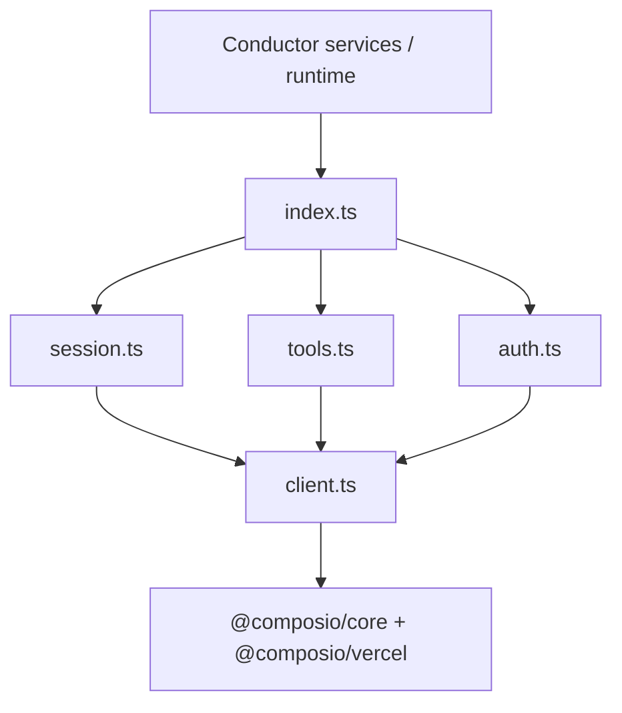

# Composio agent integrations (conductor guide)

Conposio connector logic for Tallei agents lives in [`src/integrations/composio/`](../../integrations/composio/). Conductor (loop builder, spec-run, verification) should import from there — not call `@composio/core` directly.

This layer implements Composio v3 **sessions**: agents discover tools at runtime via meta tools (`COMPOSIO_SEARCH_TOOLS`, connection management, workbench) instead of loading every action up front.

**References:** [Configuring Sessions](https://docs.composio.dev/docs/configuring-sessions) · [Fetching Tools](https://docs.composio.dev/docs/tools-direct/fetching-tools)

---

## Layout

```
src/integrations/composio/
  types.ts      Shared view types + CreateSessionOptions
  client.ts     Singleton SDK client, entity ID, HTTP fallback
  session.ts    Session lifecycle + toolkit discovery
  tools.ts      Direct catalogue + session.search wrappers
  auth.ts       session.authorize helpers
  index.ts      Public barrel — import from here
```



---

## Two discovery paths

| Path | When to use | Entry points |
|------|-------------|--------------|
| **Agentic (session)** | Loop builder, spec-run agents, anything that should search/connect at runtime | `createSession`, `listSessionToolkits`, `searchToolsViaSession`, `getSessionTools`, `authorizeToolkit` |
| **Direct (catalogue)** | Dashboard toolkit browser, builder UI that needs full schemas without meta tools | `listToolkits`, `getAllTools`, `searchTools` |

Prefer the session path for agents. Use direct catalogue only when you already know the toolkit or need offline-style listing.

---

## Session lifecycle

### Entity ID

Composio `user_id` is derived from Tallei auth:

```
{tallei_prefix}:{tenantId}:{userId}[:workspaceId]
```

Default prefix: `tallei` (`TALLEI_CONNECTORS__COMPOSIO_ENTITY_PREFIX`).

```typescript
import { createSession, getOrCreateSession, useSession } from "../../integrations/composio/index.js";

// New builder session
const session = await createSession(auth, {
  toolkits: { disable: ["exa"] },
  connectedAccounts: { gmail: ["ca_work_gmail"] },
  preload: { tools: ["GMAIL_FETCH_EMAILS"] }, // optional; keep < 20
});

// Resume persisted composio_session_id from workflow_builder_sessions
const session = await getOrCreateSession(auth, row.composio_session_id);

// Low-level resume
const session = await useSession("sess_abc");
```

Sessions are cached in-memory for 1 hour (`sessionId` → `ComposioAgentSession`).

### Toolkit discovery

```typescript
import { listSessionToolkits, listToolkitsForUser } from "../../integrations/composio/index.js";

const toolkits = await listSessionToolkits(session, { isConnected: true });
// { slug, name, logo, connected, connectedAccountId? }

const { session, toolkits } = await listToolkitsForUser(auth);
```

Maps to Composio `session.toolkits()`.

### Agent tools + MCP

```typescript
import { getSessionTools, getSessionMcpUrl, getSessionMcpHeaders } from "../../integrations/composio/index.js";

const tools = await getSessionTools(session);
// Vercel-wrapped tools incl. COMPOSIO_SEARCH_TOOLS + preloaded tools

const mcpUrl = getSessionMcpUrl(session);
const mcpHeaders = getSessionMcpHeaders(session);
```

---

## Tool search

### Session search (preferred for agents)

```typescript
import { searchToolsViaSession } from "../../integrations/composio/index.js";

const hits = await searchToolsViaSession(session, "fetch unread gmail threads");
// ComposioToolSearchResult[] from session.search + toolSchemas
```

Uses `primaryToolSlugs` / `relatedToolSlugs` from the search response. Schemas come from `response.toolSchemas` when available.

### Direct catalogue search

```typescript
import { searchTools, getAllTools, listToolkits } from "../../integrations/composio/index.js";

const results = await searchTools("send email", 12);
const gmailTools = await getAllTools("gmail");
const catalogue = await listToolkits();
```

Direct fetch uses the SDK **raw tools client** (`composio.client.tools.list`) to avoid Zod parse failures when `output_parameters` is `{}` ([composio#3354](https://github.com/ComposioHQ/composio/issues/3354)). Falls back to `/api/v3.1/tools` and `/api/v3.1/toolkits` HTTP endpoints.

---

## Auth

Session-scoped OAuth only (no `connector_auth_sessions` DB in this layer):

```typescript
import { authorizeToolkit, authorizeToolkitForUser } from "../../integrations/composio/index.js";

const { redirectUrl, waitForConnection } = await authorizeToolkit(session, "github", {
  callbackUrl: "https://app.tallei.ai/connect/callback",
});
// Redirect user to redirectUrl, then:
const account = await waitForConnection(30_000);

// One-shot: create session + authorize
const { session, redirectUrl, waitForConnection } = await authorizeToolkitForUser(auth, "gmail");
```

Toolkit slug aliases: `google_calendar` → `googlecalendar`, `google-mail` → `gmail`, `resend_email` → `resend`.

---

## Conductor integration map

| Conductor concern | Suggested integration import | Notes |
|-------------------|------------------------------|-------|
| Builder session bootstrap | `createSession` | Persist `session.sessionId` as `composio_session_id` on `workflow_builder_sessions` |
| Tool discovery during build | `searchToolsViaSession` | Replace legacy `discoverToolsForLoopBuild` session.search path |
| Connected-app checklist UI | `listSessionToolkits` or `listToolkitsForUser` | `connected` + `connectedAccountId` for status badges |
| Toolkit catalogue (developer page) | `listToolkits`, `getAllTools` | Direct path; no session required |
| OAuth connect flow | `authorizeToolkit` / `authorizeToolkitForUser` | Wire redirect + `waitForConnection` in dashboard |
| Spec-run agent tool surface | `getSessionTools` | Pass wrapped tools to Vercel AI SDK runner |
| MCP exposure | `getSessionMcpUrl`, `getSessionMcpHeaders` | Optional; not registered in Tallei MCP server yet |

### Tool ref convention (unchanged)

Conductor tool contracts still use:

```
composio.{toolkit}.action.{ACTION_SLUG}   // uppercase slug
composio.{toolkit}.search
```

Map `ComposioActionView.actionSlug` / search results into `tool-spec` contracts when hydrating definitions.

---

## Configuration

From [`src/config/load.ts`](../../config/load.ts):

| Env var | Purpose |
|---------|---------|
| `TALLEI_CONNECTORS__COMPOSIO_API_KEY` | Required for all Composio calls |
| `TALLEI_CONNECTORS__COMPOSIO_BASE_URL` | Default `https://backend.composio.dev` |
| `TALLEI_CONNECTORS__COMPOSIO_ENTITY_PREFIX` | Default `tallei` |
| `TALLEI_CONNECTORS__COMPOSIO_AUTH_CONFIG_ID` | Optional global auth config override |
| `TALLEI_CONNECTORS__COMPOSIO_WEBHOOK_SECRET` | Webhooks (not in this layer yet) |
| `TALLEI_CONNECTORS__COMPOSIO_STRICT_MODE` | Strict connector mode |

Check availability before calling:

```typescript
import { isComposioConfigured } from "../../integrations/composio/index.js";
if (!isComposioConfigured()) { /* degrade gracefully */ }
```

---

## CreateSessionOptions

Mirrors Composio session config:

```typescript
type CreateSessionOptions = {
  toolkits?: string[] | { enable?: string[]; disable?: string[] };
  preload?: { tools?: string[] | "all" };
  authConfigs?: Record<string, string>;
  connectedAccounts?: Record<string, string | string[]>;
  workbench?: { enable?: boolean; sandboxSize?: "standard" | "medium" | "large" | "xlarge" };
  manageConnections?: { enable?: boolean };
};
```

Default: full catalogue, workbench enabled, meta tools available. Narrow with `toolkits` or preload a small tool set for hot paths.

---

## Out of scope (wire separately)

These were in the old `src/services/connectors/` monolith and are **not** in `integrations/composio` yet:

- `connector_auth_sessions` / dashboard OAuth session CRUD
- `executeApprovedComposioAction` (spec-run execution)
- Composio webhooks + trigger registration
- Local `generated/composio-catalog/` hydration
- `platform-integrations` (Exa → internal web search swap)
- HTTP routes in [`src/transport/http/routes/connectors.ts`](../../transport/http/routes/connectors.ts)

Add `accounts.ts`, `execution.ts`, `webhooks.ts` under `integrations/composio/` when restoring those flows.

---

## Tests

Unit tests: `test/unit/integrations/composio/`

- `client-entity-id.test.ts` — entity ID formatting
- `tools-normalize.test.ts` — catalogue normalizers
- `session-smoke.test.ts` — mocked `session.toolkits()` / `session.search()`

Run: `NODE_ENV=test npx tsx --test test/unit/integrations/composio/*.test.ts`

---

## Full agent example

```typescript
import {
  authorizeToolkit,
  createSession,
  getSessionTools,
  listSessionToolkits,
  searchToolsViaSession,
} from "../../integrations/composio/index.js";

const session = await createSession(auth, {
  toolkits: { disable: ["exa"] },
  connectedAccounts: { gmail: ["ca_..."] },
});

const toolkits = await listSessionToolkits(session);
const github = toolkits.find((t) => t.slug === "github");
if (!github?.connected) {
  const authReq = await authorizeToolkit(session, "github");
  // redirect user to authReq.redirectUrl
}

const hits = await searchToolsViaSession(session, "list open pull requests");
const agentTools = await getSessionTools(session);
// feed agentTools to Vercel AI SDK / conductor runner
```
